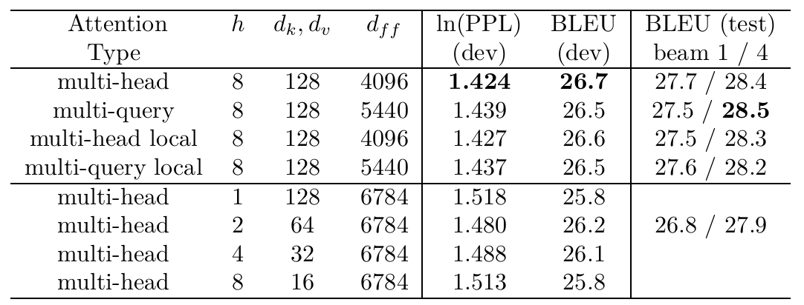
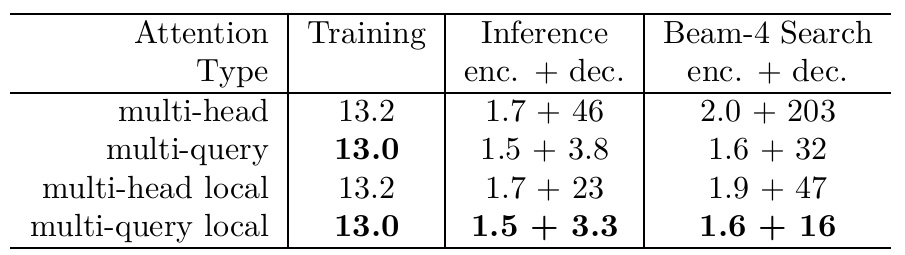
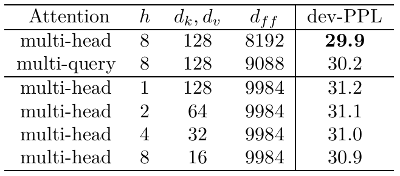

# 快速Transformer解码：一个Write-Head就是你所需的一切

<https://arxiv.org/pdf/1911.02150>

Google 2019年11月7日

- [快速Transformer解码：一个Write-Head就是你所需的一切](#快速transformer解码一个write-head就是你所需的一切)
  - [**摘要**](#摘要)
  - [**1 引言**](#1-引言)
  - [**2 背景：神经注意力**](#2-背景神经注意力)
    - [**2.1 点积注意力（Dot-Product Attention）**](#21-点积注意力dot-product-attention)
    - [**2.2 多头注意力（Multi-head Attention）**](#22-多头注意力multi-head-attention)
    - [**2.3 多头注意力（批处理版）（Batched）**](#23-多头注意力批处理版batched)
    - [**2.3.1 批处理多头注意力的性能分析**](#231-批处理多头注意力的性能分析)
    - [**2.4 多头注意力（增量式）（Incremental）**](#24-多头注意力增量式incremental)
      - [**2.4.1 性能分析**](#241-性能分析)
  - [**3 多查询注意力（Multi-Query Attention）**](#3-多查询注意力multi-query-attention)
    - [**3.1 增量式多查询注意力的性能分析**](#31-增量式多查询注意力的性能分析)
  - [**4 实验与结果**](#4-实验与结果)
    - [**4.1 实验设置**](#41-实验设置)
    - [**4.2 模型质量**](#42-模型质量)
    - [**4.3 速度**](#43-速度)
  - [**5 结论**](#5-结论)

## **摘要**

多头注意力层（Multi-head attention layers），如用于Transformer神经序列模型中，是一种强大的替代RNN的方法，用于在序列之间和跨序列移动信息。虽然由于序列长度上的可并行性，训练这些层通常快速且简单，但增量推理（incremental inference）（其中这种并行化是不可能的）通常很慢，这是由于重复加载大型“键”（"keys"）和“值”（"values"）张量的内存带宽成本。我们提出了一种称为多查询注意力（multi-query attention）的变体，其中键和值在所有不同的注意力“头”（"heads"）之间共享，大大减少了这些张量的大小，从而减少了增量解码的内存带宽需求。我们通过实验验证，所得模型确实可以更快地解码，并且与基线相比仅导致轻微的质量下降。

## **1 引言**

Transformer神经序列模型[Vaswani et al., 2017]已成为循环序列模型的一种流行替代方案。Transformer依靠注意力层在序列之间和跨序列传递信息。Transformer的一个主要挑战是增量推理的速度。正如我们将讨论的，在现代计算硬件上，增量Transformer推理的速度受到重新加载编码注意力层状态的大型“键”和“值”张量所需的内存带宽的限制。在以下部分中，我们将回顾Transformer使用的多头注意力层，提供性能分析，并提出一种架构变化（多查询注意力），该变化以仅轻微的质量下降为代价极大地提高了推理速度。

## **2 背景：神经注意力**

神经注意力（Neural Attention），由[Bahdanau et al., 2014]引入，是一种操纵可变长度表示的强大工具。神经注意力函数接受一个单个查询向量 q 和一组 m 个不同的（键向量，值向量）对（由矩阵 K 和 V 表示），并产生一个输出向量 y。输出 y 计算为不同值向量的加权和，其中权重通过将查询与键进行比较得出。

### **2.1 点积注意力（Dot-Product Attention）**

以下代码描述了一种常见的公式，其中权重计算为查询与不同键的点积的softmax。

```python
def DotProductAttention(q, K, V):
    """一个查询上的点积注意力。
    参数：
        q: 一个形状为 $[k]$ 的向量
        K: 一个形状为 $[m, k]$ 的矩阵
        V: 一个形状为 [m, v] 的矩阵
    返回：
        y: 一个形状为 $[v]$ 的向量
    """
    logits = tf.einsum("k,mk->m", q, K)
    weights = tf.softmax(logits)
    return tf.einsum("m,mv->v", weights, V)
```

我们的代码示例使用einsum表示法（如在TensorFlow和numpy中定义的），用于任意维度张量之间的广义收缩（generalized contractions）。在此表示法中，一个方程命名输入和输出张量的维度。该计算在数值上等同于将每个输入广播（broadcasting）到具有所有维度的并集，逐分量相乘（multiplying component-wise），并对所有不在期望输出形状中的维度求和（summing across）。

### **2.2 多头注意力（Multi-head Attention）**

"Transformer"序列到序列模型[Vaswani et al., 2017]并行使用 h 个不同的注意力层（头），作者称之为“多头注意力”。这 h 个不同层的查询向量源自输入向量 x 的 h 个不同的学习线性投影 $P_{q}$。类似地，键和值源自 m 个不同输入向量的集合 M 的 h 个不同的学习线性投影 $P_{k}, P_{v}$。这 h 个层的输出本身通过不同的学习线性投影 $P_{o}$ 传递，然后求和。为简单起见，我们赋予输入和输出向量相同的维度 d。计算可以表示如下：

```python
def MultiheadAttention(x, M, P_q, P_k, P_v, P_o):
    """一个查询上的多头注意力。
    参数：
        x: 一个形状为 $[d]$ 的向量
        M: 一个形状为 $[m, d]$ 的矩阵
        P_q: 一个形状为 $[h, d, k]$ 的张量
        P_k: 一个形状为 [h, d, k] 的张量
        P_v: 一个形状为 $[h, d, v]$ 的张量
        P_o: 一个形状为 [h, d, v] 的张量
    返回：
        y: 一个形状为 [d] 的向量
    """
    q = tf.einsum("d,hdk->hk", x, P_q)
    K = tf.einsum("md,hdk->hmk", M, P_k)
    V = tf.einsum("md,hdv->hmv", M, P_v)
    logits = tf.einsum("hk,hmk->hm", q, K)
    weights = tf.softmax(logits)
    o = tf.einsum("hm,hmv->hv", weights, V)
    y = tf.einsum("hv,hdv->d", o, P_o)
    return y
```

注意：[Vaswani et al., 2017]在logits上包含一个常数缩放因子。我们在代码中省略了这一点，因为它可以折叠到线性投影 $P_{q}$ 或 $P_{k}$ 中。

### **2.3 多头注意力（批处理版）（Batched）**

在实践中，将多个查询批量处理在一起效率要高得多。下面的代码添加了两种类型的批处理。首先，我们从序列中的 n 个不同位置生成查询。这些查询都与相同的键和值交互。此外，我们一次处理一批 b 个不同的不交互的序列。遵循[Vaswani et al., 2017]，在自回归模型（autoregressive model）中，我们可以通过向logits添加一个“掩码”（"mask"）（在非法位置包含值 -∞）来防止向后信息流。

```python
def MultiheadAttentionBatched(X, M, mask, P_q, P_k, P_v, P_o):
    """多头注意力。
    参数：
        X: 一个形状为 [b, n, d] 的张量
        M: 一个形状为 [b, m, d] 的张量
        mask: 一个形状为 $[b, h, n, m]$ 的张量
        P_q: 一个形状为 [h, d, k] 的张量
        P_k: 一个形状为 [h, d, k] 的张量
        P_v: 一个形状为 $[h, d, v]$ 的张量
        P_o: 一个形状为 [h, d, v] 的张量
    返回：
        Y: 一个形状为 [b, n, d] 的张量
    """
    Q = tf.einsum("bnd, hdk->bhnk", X, P_q)
    K = tf.einsum("bmd, hdk->bhmk", M, P_k)
    V = tf.einsum("bmd, hdv->bhmv", M, P_v)
    logits = tf.einsum("bhnk, bhmk->bhnm", Q, K)
    weights = tf.softmax(logits + mask)
    O = tf.einsum("bhnm, bhmv->bhnv", weights, V)
    Y = tf.einsum("bhnv, hdv->bnd", O, P_o)
    return Y
```

### **2.3.1 批处理多头注意力的性能分析**

为了简化性能分析，我们将做几个简化假设：
· $m=n$
· $k=v=\frac{d}{h}$，如[Vaswani et al., 2017]所建议
· $n\leq d$
算术运算的总数是 $\Theta\left(b n d^{2}\right)$。（鉴于上述简化假设，上面每个tf.einsum操作的复杂度是 $O\left(b n d^{2}\right)$）。
要访问的内存总大小等于所涉及的所有张量的大小之和：$O\left(bnd+bhn^{2}+d^{2}\right)$。第一项是由于X, M, Q, K, V, O 和 Y，第二项是由于logits和weights，第三项是由于投影张量 $P_{q}, P_{k}, P_{v}$ 和 $P_{o}$。
将两者相除，我们发现内存访问与算术运算的比率是 $O\left(\frac{1}{k}+\frac{1}{bn}\right)$。这个低比率对于在现代GPU/TPU硬件上获得良好性能是必要的，因为其计算能力可能比内存带宽高两个数量级。

### **2.4 多头注意力（增量式）（Incremental）**

在某些设置中，数据依赖性使得无法并行处理来自多个位置的查询。一个例子是自回归语言模型（如Transformer[Vaswani et al., 2017]）中的自注意力层（self-attention layer）。在每个位置产生的查询会关注（attend to）在该位置及之前所有位置产生的键值对。在训练期间，真实目标序列（ground-truth target sequence）是已知的，我们可以使用类似于第2.3节中的高效并行实现。然而，当从训练好的模型生成时，自注意力层在特定位置的输出会影响在下一个位置生成的词元（token），这又会影响该层在下一个位置的输入。这阻止了并行计算。增量计算此自注意力层的代码如下所示。

```python
def MultiheadSelfAttentionIncremental(x, prev_K, prev_V, P_q, P_k, P_v, P_o):
    """多头自注意力（一步）。
    参数：
        x: 一个形状为 [b, d] 的张量
        prev_K: 一个形状为 [b, h, m, k] 的张量
        prev_V: 一个形状为 [b, h, m, v] 的张量
        P_q: 一个形状为 [h, d, k] 的张量
        P_k: 一个形状为 $[h, d, k]$ 的张量
        P_v: 一个形状为 [h, d, v] 的张量
        P_o: 一个形状为 [h, d, v] 的张量
    返回：
        y: 一个形状为 $[b, d]$ 的张量
        new_K: 一个形状为 [b, h, m+1, k] 的张量
        new_V: 一个形状为 $[b, h, m+1, v]$ 的张量
    """
    q = tf.einsum("bd, hdk->bhk", x, P_q)
    new_K = tf.concat([prev_K, tf.expand_dims(tf.einsum("bd, hdk->bhk", x, P_k), axis=2)], axis=2)
    new_V = tf.concat([prev_V, tf.expand_dims(tf.einsum("bd, hdv->bhv", x, P_v), axis=2)], axis=2)
    logits = tf.einsum("bhk, bhmk->bhm", q, new_K)
    weights = tf.softmax(logits)
    o = tf.einsum("bhm, bhmv->bhv", weights, new_V)
    y = tf.einsum("bhv, hdv->bd", o, P_o)
    return y, new_K, new_V
```

#### **2.4.1 性能分析**

我们做出与第2.3.1节相同的简化假设。
在 n 次调用中，算术运算的总数再次是 $\Theta\left(b n d^{2}\right)$。
在 n 次调用中，内存访问的总量是 $\Theta\left(b n^{2} d+n d^{2}\right)$，第一项是由于 K 和 V，第二项是由于 $P_{q}, P_{k}, P_{v}$ 和 $P_{o}$。
用内存除以计算量，我们发现内存访问与算术运算的比率是 $\Theta\left(\frac{n}{d}+\frac{1}{b}\right)$。当 $n\approx d$ 或 $b\approx 1$ 时，该比率接近 1，导致内存带宽成为现代计算硬件上的主要性能瓶颈。为了使增量生成高效，我们必须将这两项都减少到 $\ll 1$。$\frac{1}{b}$ 项是较容易的——我们只需使用更大的批大小（batch size），前提是内存大小允许。
减少 $\frac{n}{d}$ 项更难。这一项与每一步重新加载表示记忆的 K 和 V 张量的开销有关，这些张量的大小为 $b h m k = b n^{2}$。一种解决方案是限制序列长度 n。另一种是减少被关注的位置数量，要么通过关注局部邻域，要么通过其他方式压缩记忆位置的数量，如[Liu et al., 2018], [Zhang et al., 2018], [Povey et al., 2018]。在本文中，我们提出了一种减少 K 和 V 张量大小的正交方法——即移除它们的“头”维度，同时在查询中保留“头”维度。

## **3 多查询注意力（Multi-Query Attention）**

我们引入多查询注意力，作为[Vaswani et al., 2017]中描述的多头注意力的一个变体。多头注意力由多个并行的注意力层（头）组成，这些层对查询、键、值和输出使用不同的线性变换。多查询注意力是相同的，只是不同的头共享同一组键和值。（增量式）多查询（自）注意力的代码与上面列出的多头注意力的代码相同，只是我们从代表 K、V、Pk 或 Pv 的“头”维度的 tf.einsum 方程中移除了字母“h”。

```python
def MultiqueryAttentionBatched(X, M, mask, P_q, P_k, P_v, P_o):
    """多查询注意力。
    参数：
        X: 一个形状为 [b, n, d] 的张量
        M: 一个形状为 [b, m, d] 的张量
        mask: 一个形状为 [b, h, n, m] 的张量
        P_q: 一个形状为 [h, d, k] 的张量
        P_k: 一个形状为 [d, k] 的张量
        P_v: 一个形状为 [d, v] 的张量
        P_o: 一个形状为 [h, d, v] 的张量
    返回：
        Y: 一个形状为 [b, n, d] 的张量
    """
    Q = tf.einsum("bnd, hdk->bhnk", X, P_q)
    K = tf.einsum("bmd, dk->bmk", M, P_k)
    V = tf.einsum("bmd, dv->bmv", M, P_v)
    logits = tf.einsum("bhnk, bmk->bhnm", Q, K)
    weights = tf.softmax(logits + mask)
    O = tf.einsum("bhnm, bmv->bhnv", weights, V)
    Y = tf.einsum("bhnv, hdv->bnd", O, P_o)
    return Y
```

```python
def MultiquerySelfAttentionIncremental(x, prev_K, prev_V, P_q, P_k, P_v, P_o):
    """多查询自注意力（一步）。
    参数：
        x: 一个形状为 [b, d] 的张量
        prev_K: 一个形状为 [b, m, k] 的张量
        prev_V: 一个形状为 [b, m, v] 的张量
        P_q: 一个形状为 [h, d, k] 的张量
        P_k: 一个形状为 [d, k] 的张量
        P_v: 一个形状为 $[d, v]$ 的张量
        P_o: 一个形状为 [h, d, v] 的张量
    返回：
        y: 一个形状为 [b, d] 的张量
        new_K: 一个形状为 [b, m+1, k] 的张量
        new_V: 一个形状为 [b, m+1, v] 的张量
    """
    q = tf.einsum("bd, hdk->bhk", x, P_q)
    new_K = tf.concat([prev_K, tf.expand_dims(tf.einsum("bd, dk->bk", x, P_k), axis=1)], axis=1)
    new_V = tf.concat([prev_V, tf.expand_dims(tf.einsum("bd, dv->bv", x, P_v), axis=1)], axis=1)
    logits = tf.einsum("bhk, bmk->bhm", q, new_K)
    weights = tf.softmax(logits)
    o = tf.einsum("bhm, bmv->bhv", weights, new_V)
    y = tf.einsum("bhv, hdv->bd", o, P_o)
    return y, new_K, new_V
```

### **3.1 增量式多查询注意力的性能分析**

我们做出与第2.3.1节相同的简化假设。
在 n 次调用中，算术运算的总数再次是 $\Theta\left(b n d^{2}\right)$。
在 n 次调用中，内存访问的总量是 $\Theta\left(b n d+b n^{2} k+n d^{2}\right)$，第一项是由于 $x, q, o$ 和 y，第二项是由于 K 和 V，第三项是由于 $P_{q}, P_{k}, P_{v}, P_{o}$。
用内存除以计算量，我们发现内存访问与算术运算的比率是 $\Theta\left(\frac{1}{d}+\frac{n}{d h}+\frac{1}{b}\right)$。我们将令人不快的 $\frac{n}{d}$ 项减少了一个因子 h。理论上，给定大的批大小 b，这应该显著提高增量生成的性能。在我们的实验部分，我们将展示性能提升是真实的，并且模型质量保持很高。

## **4 实验与结果**

### **4.1 实验设置**

遵循[Vaswani et al., 2017]，我们在WMT 2014英语-德语翻译任务上进行评估。作为基线，我们使用一个编码器-解码器Transformer模型，具有6层，使用 $d_{model}=1024$， $d_{ff}=4096$， $h=8, d_{k}=d_{v}=128$，学习的位置嵌入（learned positional embeddings），以及词元嵌入（token-embedding）和输出层之间的权重共享（weight-sharing）。基线模型及其所有变体都有2.11亿个参数。所有模型都训练了100,000步（20个周期（epoch））。每个训练批次由128个示例组成，每个示例由一个256个词元的输入序列和一个256个词元的目标序列组成（多个训练句子被连接在一起以达到此长度）。模型在32核TPUv3集群上训练，每个模型大约需要2小时训练。我们使用了tensor2tensor和mesh-tensorflow库中的实现。

所使用的配置可以在[待出版前添加]找到，包括学习率、dropout、标签平滑（label smoothing）等细节。
在我们的“多查询”模型中，我们将模型中的所有注意力层替换为多查询注意力。这包括编码器自注意力（encoder-self-attention）、解码器自注意力（decoder-self-attention）和编码器-解码器注意力（encoder-decoder-attention）层。我们将前馈隐藏层（feed-forward hidden layers）从4096拓宽到5440，以使总参数计数与基线相等。
为了证明局部注意力（local-attention）和多查询注意力是正交的，我们还训练了基线和多查询模型的“局部”版本，其中解码器自注意力层（但不是其他注意力层）将注意力限制在当前位置和前31个位置。
减少 K 和 V 大小的一种更简单的替代方法是减少头数 h 和/或减少键和值的维度 k 和 v。我们训练了几个这样的模型进行比较，再次拓宽前馈隐藏层以使总参数计数与基线相等。
我们使用“transformer-decoder”语言模型在Billion-Word语言建模基准[Chelba et al., 2013]上进行了类似的一组实验。对于基线，我们使用一个具有6层的模型，$d_{model}=1024$， $d_{ff}=8192, h=8, d_{k}=d_{v}=128$。基线和所有变体的总参数计数为1.92亿。我们以64K词元的批次大小训练了136K步（10个周期）。同样，我们使用32核TPUv3集群，每个模型大约训练3小时。

### **4.2 模型质量**

表1显示了机器翻译实验的结果。我们使用贪婪最大似然解码（greedy maximum-likelihood decoding）解码开发集（dev set），并使用sacrebleu的"sacrebleu -t wmt13 -l en-de --tok intl"计算BLEU分数。我们还列出了开发集上每个子词词元（subword-token）的困惑度（perplexity）。根据这两个指标，多查询注意力模型似乎比基线稍差，但比任何涉及减少 h、dk 和 dv 的替代方案都要接近得多。
我们通过使用贪婪解码和束搜索（beam search）（束宽4，α=0.6）解码测试集来验证结果，并使用sacrebleu的"sacrebleu -t wmt14 -l en-de --tok intl"进行评估。再次，多查询模型的表现与基线相似，并且实际上在束宽为4的解码中获得了最高的BLEU分数（28.5）。
表3显示了十亿词语言建模基准的结果。通过在开发集上的每词（非每子词词元）困惑度来评估模型。结果描绘了与翻译结果相似的画面。多查询注意力模型比基线稍差，但显著优于任何涉及减少 h、$d_{k}$ 和 $d_{v}$ 的替代方案。

表1：WMT14 (EN-DE) 结果



### **4.3 速度**

表2显示了各种模型的训练和推理时间。训练和推理速度均在单个TPUv2（8核）上评估。一个训练步骤（包括32,768个输入词元和32,768个目标词元，如上所述）基线模型耗时433毫秒，多查询模型耗时425毫秒。除以32,768，我们发现训练时间是每个（输入词元 + 目标词元）13.2微秒，如表2所列。
我们在一批1024个序列（每核128个）上运行增量贪婪推理，使用128个词元的源序列长度和128个词元的目标序列长度。¹ 对于基线模型，模型的编码器部分耗时222毫秒，解码器的每个增量步骤耗时47毫秒。除以各自的词元数量，我们发现分摊的推理时间（amortized inference time）编码器每词元1.7微秒，解码器每词元46微秒（大得多），如表2所列。对于多查询模型，编码器耗时195毫秒，解码器每步耗时3.9毫秒，分摊每词元成本分别为1.5微秒和3.8微秒。表2显示了这些值以及束搜索的类似结果。
¹由于系统限制要求固定形状，我们在解码器自注意力实现中使用了填充（padding）和掩码（masking）。因此，记忆张量被填充到最大长度（128），或者在局部注意力的情况下填充到窗口大小（32）。因此，每个解码步骤花费相同的时间。一种增量增长张量的替代实现可以在序列开始时节省时间。

表2：序列长度为128的WMT14 EN-DE翻译任务的分摊训练和推理成本。列出的值单位为TPUv2-微秒/输出词元



表3：十亿词LM基准结果



## **5 结论**

我们提出了多查询注意力——多头注意力的一种替代方案，它在增量设置中具有低得多的内存带宽需求。我们相信这使得基于注意力的序列模型能够在推理性能关键的应用中得到更广泛的采用。
