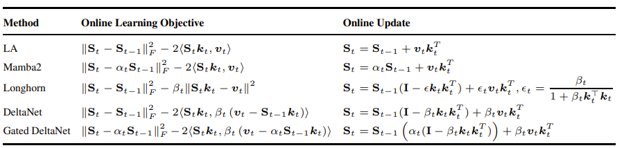
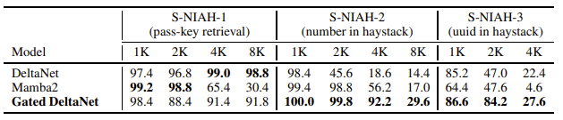
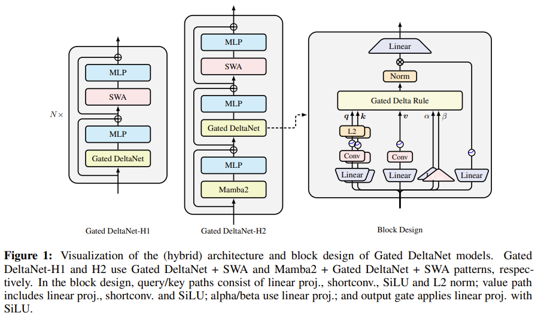
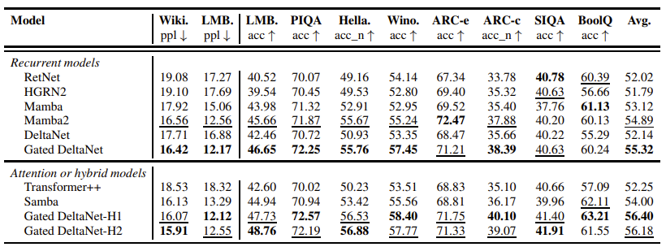
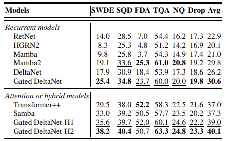
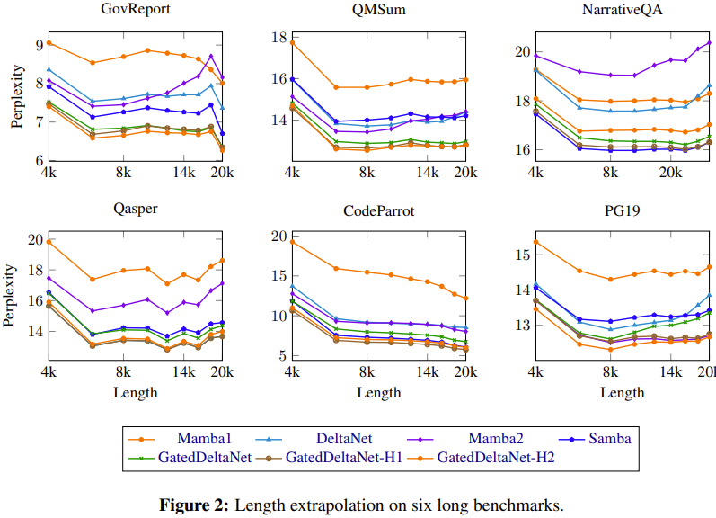
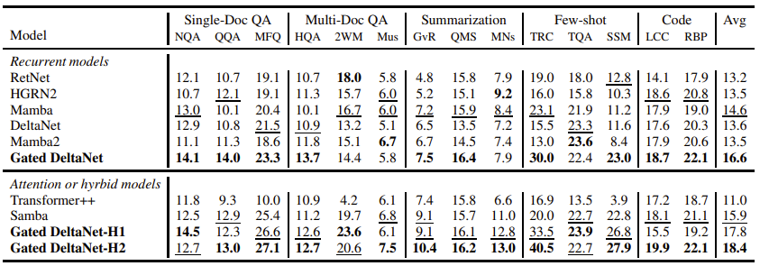
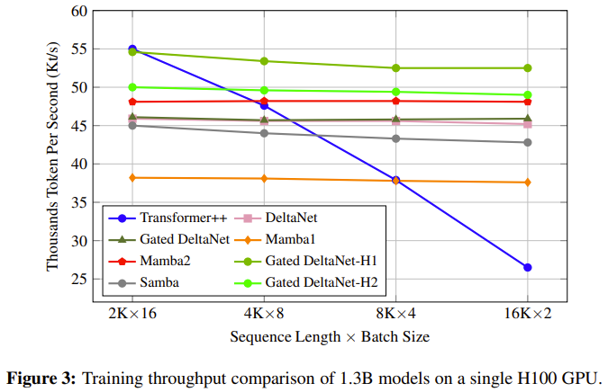

# Gated Delta Networks：通过Delta规则改进Mamba2

<https://arxiv.org/pdf/2412.06464>

麻省理工学院计算机科学与人工智能实验室, 英伟达

- [Gated Delta Networks：通过Delta规则改进Mamba2](#gated-delta-networks通过delta规则改进mamba2)
  - [**摘要**](#摘要)
  - [**1 引言**](#1-引言)
  - [**2 预备知识**](#2-预备知识)
    - [**2.1 MAMBA2：带衰减的线性注意力**](#21-mamba2带衰减的线性注意力)
    - [**2.2 Delta网络：带Delta规则的线性注意力**](#22-delta网络带delta规则的线性注意力)
  - [**3 门控Delta网络**](#3-门控delta网络)
    - [**3.1 公式：门控Delta规则**](#31-公式门控delta规则)
    - [**3.2 案例研究：单针在干草堆中（S-NIAH）**](#32-案例研究单针在干草堆中s-niah)
    - [**3.3 算法：硬件高效的分块训练**](#33-算法硬件高效的分块训练)
    - [**3.4 门控Delta网络和混合模型**](#34-门控delta网络和混合模型)
  - [**4 实验**](#4-实验)
  - [**5 相关工作**](#5-相关工作)
  - [**6 结论**](#6-结论)

## **摘要**

线性Transformer作为标准Transformer的高效替代方案获得了关注，但它们在检索和长上下文任务中的性能有限。为了解决这些局限性，最近的工作探索了两种不同的机制：用于自适应内存控制的门控机制和用于精确内存修改的delta更新规则。我们观察到这些机制是互补的——门控能够实现快速内存擦除，而delta规则有助于进行有针对性的更新。基于这一见解，我们引入了门控delta规则，并开发了一种针对现代硬件优化的并行训练算法。我们提出的架构，Gated DeltaNet，在多个基准测试中 consistently（持续稳定地）超越了现有模型，如Mamba2和DeltaNet，这些基准包括语言建模、常识推理、上下文检索、长度外推和长上下文理解。我们通过开发混合架构进一步提升了性能，该架构将Gated DeltaNet层与滑动窗口注意力或Mamba2层相结合，实现了改进的训练效率和卓越的任务性能。

代码：<https://github.com/NVlabs/GatedDeltaNet>

## **1 引言**

Transformer架构显著提升了大型语言模型（LLMs）的能力，由于其有效的注意力机制，在各种任务上展现出卓越性能。该机制擅长精确的序列建模，并在训练期间利用了现代GPU的并行处理能力。然而，自注意力组件随序列长度呈二次方缩放，导致了巨大的计算需求，给训练和推理都带来了挑战。

为了缓解这些问题，研究人员探索了诸如线性Transformer（Katharopoulos等人，2020a）等替代方案，它们用基于核化点积的线性注意力取代了传统的基于softmax的注意力，通过重新表述为具有矩阵值状态的线性RNN，显著减少了推理期间的内存需求。虽然早期版本的线性Transformer在语言建模任务上表现不如标准Transformer，但最近的增强——例如加入类似于LSTM中的数据依赖门控机制，以GLA（Yang等人，2024a）和Mamba2（Dao & Gu，2024a）为代表——已经显示出有希望的改进。然而，在管理长序列信息方面仍然存在挑战，特别是在上下文检索任务中，传统Transformer保持其优势（Arora等人，2023a；2024a；Jelassi等人，2024；Wen等人，2024；Akyirek等人，2024）。

这种现象并不令人惊讶：线性Transformer可以被解释为实现了一种基于外积的键值关联记忆，让人联想到张量积表示（Smolensky，1990）。然而，它们可以存储的正交键值对数量受模型维度的限制。当序列长度超过这个维度时，“记忆冲突”变得不可避免，阻碍了精确检索（Schlag等人，2021a）。

Mamba2通过引入一个简单的门控更新规则来解决这个限制：$S_{t}=\alpha_{t}S_{t-1}+v_{t}k_{t}^{\intercal}$，它通过一个动态比率 $\alpha_{t}\in(0,1)$ 在每个时间步统一衰减所有键值关联。

然而，这种方法没有考虑不同键值关联的不同重要性，可能导致低效的内存利用。如果模型需要忘记一个特定的键值关联，所有键值关联都会被同等程度地遗忘，使得这个过程缺乏针对性和效率。

相比之下，采用delta规则（Widrow等人，1960）的线性Transformer，称为DeltaNet（Schlag等人，2021a；Yang等人，2024b），通过（软性地）用传入的新键值对替换旧的键值对来选择性更新内存。这种方法在上下文检索的合成基准测试中展示了令人印象深刻的性能。然而，由于这个过程每次只修改一个键值对，模型缺乏快速清除过时或无关信息的能力，特别是在需要擦除先前数据的上下文切换期间。因此，DeltaNet在现实世界任务中表现中等（Yang等人，2024b），这可能是由于缺乏强大的内存清除机制。

认识到门控更新规则和delta规则在内存管理中的互补优势，我们提出了门控delta规则，这是一种简单直观的机制，结合了两种方法。这个统一的规则实现了灵活的内存控制：它可以通过设置 $\alpha_{t}\rightarrow 0$ 来迅速清除内存，同时通过设置 $\alpha_{t}\rightarrow 1$（有效地切换到纯delta规则）来选择性更新特定内容而不影响其他信息。

剩下的挑战在于以硬件高效的方式实现门控delta规则。基于Yang等人（2024b）使用WY表示（Bischof & Loan，1985）并行化delta规则计算的高效算法，我们仔细扩展了他们的方法以纳入门控项。我们的扩展保留了分块并行（Hua等人，2022b；Sun等人，2023a；Yang等人，2024a；b）的优势，实现了硬件高效的训练。

我们最终的架构，Gated DeltaNet，在一套全面的基准测试中 consistently 超越了Mamba2和DeltaNet，包括语言建模、常识推理、上下文检索、长度外推和长上下文理解。基于这些结果，我们还开发了混合架构，策略性地结合了Gated DeltaNet层与滑动窗口注意力或Mamba2层，进一步提高了训练效率和模型性能。

## **2 预备知识**

### **2.1 MAMBA2：带衰减的线性注意力**

已知线性Transformer（Katharopoulos等人，2020b）在排除归一化和查询/键激活的情况下可以表述为以下线性递归：

$$S_{t}=S_{t-1}+v_{t}k_{t}^{\intercal}\in R^{d_{v}\times d_{k}},\qquad\quad o_{t}=S_{t}q_{t}\in R^{d_{v}}$$

其中 $d_{k}$ 和 $d_{v}$ 分别代表查询/键和值的（头部）维度。通过展开递归，我们可以用向量形式（左）和矩阵形式（右）表示如下：

$$\begin{align*}o_{t}=\sum_{i=1}^{t}(v_{i}k_{i}^{\intercal})q_{t}=\sum_{i=1}^{t}v_{i}(k_{i}^{\intercal}q_{t})\in R^{d_{v}},\qquad O=(Q K^{\intercal}\odot M)V\in R^{L\times d_{v}}\end{align*}$$

其中L是序列长度，$M\in R^{L\times L}$ 是由 $M_{i j}=0$（当 $i<j$）和1 otherwise 定义的因果掩码。

然而，这种普通的线性注意力在语言建模上大幅落后于Transformer。为了解决这个问题，通常添加一个衰减项来忘记历史信息。这里我们以Mamba2（Dao & Gu，2024a）为例，它可以表示为以下线性递归（取决于具体的参数化）：

$$S_{t}=\alpha_{t}S_{t-1}+v_{t}k_{t}^{T},\qquad o_{t}=S_{t}q_{t}$$

其中 $\alpha_{t}\in(0,1)$ 是一个数据依赖的标量值衰减项，随时间t变化。定义累积衰减乘积 $\gamma_{j}=\prod_{i=1}^{j}\alpha_{i},$，并通过展开递归，我们可以用向量形式（左）和矩阵并行形式（右）表示结果：

$$\begin{align*}o_{t}=\sum_{i=1}^{t}\left(\frac{\gamma_{t}}{\gamma_{i}} v_{i}k_{i}^{\intercal}\right)q_{t}=\sum_{i=1}^{t}v_{i}\left(\frac{\gamma_{t}}{\gamma_{i}}k_{i}^{\intercal}q_{t}\right),\qquad O=\left(\left(Q K^{\intercal}\right)\odot\Gamma\right)V\end{align*}$$

这里，$\Gamma\in R^{L\times L}$ 是一个衰减感知的因果掩码，其中如果 $i\geq j$ 则 $\Gamma_{i j}=\frac{\gamma_{i}}{\gamma_{j}}$，否则 $\Gamma_{i j}=0$。这些并行形式和递归形式之间的等价性也被称为Dao & Gu（2024a）中描述的状态空间对偶（SSD）。这种递归结构出现在其他几个架构中，包括Gated RFA（Peng等人，2021）、xLSTM（Beck等人，2024）和Gated RetNet（Sun等人，2024b）。当 $\gamma_{t}$ 是数据无关时，该公式简化为RetNet（Sun等人，2023a）和Lightning-Attention（Qin等人，2024a）。此外，如果 $\gamma_{t}$ 扩展为矩阵值而不是标量值，当使用外积结构参数化时，高效的训练算法仍然是可能的，如Yang等人（2024a）所证明，并被Yang等人（2024a）；Peng等人（2024）；Qin等人（2024b）；Zhang等人（2024）；Chou等人（2024）；He等人（2025）；Lu等人（2025）使用。

**分块训练** 然而，递归形式和并行形式对于高效训练都不理想（Hua等人，2022b；Yang等人，2024a），这促使使用分块并行形式（Hua等人，2022b；Sun等人，2023a）进行硬件高效的线性时间训练，如下所述。总结来说，分块并行形式将输入和输出分割成几个大小为C的块，并根据前一个块的最终状态和当前块的查询/键/值块计算每个块的输出。遵循Sun等人（2023b）；Yang等人（2024a；b）的符号，我们以查询块q为例。我们将 $Q_{[t]}:=q_{t C+1:(t+1) C+1}$ 表示为块t的查询块，$q_{[t]}^{r}:=q_{t C+r}$ 表示为块t内的第r个查询。块t的初始状态定义为 $S_{[t]}:=S_{[t]}^{0}=S_{[t-1]}^{C}$。通过部分展开递归，我们有

$$S_{[t]}^{r}=S_{[t]}+\sum_{i=1}^{r} v_{[t]}^{i} k_{[t]}^{i\intercal}\in R^{d_{v}\times d_{k}},\quad o_{[t]}^{r}=S_{[t]}^{r} q_{[t]}^{r}=S_{[t]} q_{[t]}^{r}+\sum_{i=1}^{r} v_{[t]}^{i}\left(k_{[t]}^{i\intercal} q_{[t]}^{r}\right)\in R^{d_{v}}$$

等价地，用矩阵形式：

$$S_{[t+1]}=S_{[t]}+V_{[t]} K_{[t]}^{\intercal}\in R^{d_{v}\times d_{k}},\quad O_{[t]}=Q_{[t]} S_{[t]}^{\intercal}+\left(Q_{[t]} K_{[t]}^{\intercal}\odot M\right) V_{[t]}\in R^{C\times d_{v}}$$

其中 $M\in R^{C\times C}$ 是因果掩码。上述方程富含矩阵乘法（matmuls），允许基于张量核心的硬件优化。这个分块算法可以轻松扩展到带衰减的线性注意力：

$$S_{[t+1]}=\overrightarrow{S_{[t]}}+V_{[t]}^{\intercal}\overrightarrow{K_{[t]}}\in R^{d_{v}\times d_{k}},\quad O_{[t]}=\overleftarrow{Q_{[t]}} S_{[t]}^{\intercal}+\left(Q_{[t]} K_{[t]}^{\intercal}\odot\Gamma_{[t]}\right) V_{[t]}\in R^{C\times d_{v}}$$

其中 $\left(\Gamma_{[t]}\right)_{i j}=\frac{\gamma_{[t]}^{i}}{\gamma_{[t]}^{j}},\gamma_{[t]}^{j}=\prod_{j=t C+1}^{t C+j}\alpha_{j}.{}^{1}$ 这里我们使用左箭头 $(\overleftarrow{\cdot})$ 或右箭头 $(\overrightarrow{\cdot})$ 来表示衰减到每个块的第一个位置和最后一个位置的变量，

$$\begin{align*}\overleftarrow{q_{[t]}^{r}}&=\gamma_{[t]}^{r} q_{[t]}^{r}&&\text{ 将每个向量衰减到块t的第一个位置}\\ \overrightarrow{k_{[t]}^{r}}&=\frac{\gamma_{[t]}^{C}}{\gamma_{[t]}^{r}} k_{[t]}^{r}&&\text{ 将每个向量衰减到块t的最后一个位置}\\ \overrightarrow{S_{[t]}}&=\gamma_{[t]}^{C} S_{[t]}&&\text{ 在整个块t上衰减状态矩阵}&&\\ \end{align*}$$

其他变量（例如 $\overrightarrow{v}$ ）也类似。Mamba2中引入的SSD分解算法在很大程度上等同于这个分块算法。对于更通用的方法，Yang等人（2024a）提出了线性注意力的扩展分块算法，该算法包含了细粒度的衰减机制。

### **2.2 Delta网络：带Delta规则的线性注意力**

Delta更新规则（Widrow等人，1960；Schlag等人，2021b）动态擦除与当前输入键 $\left(k_{t}\right)$ 关联的值 $\left(v_{t}^{\text{old}}\right)$ 并写入一个新值 $\left(v_{t}^{\text{new}}\right)$，该新值是当前输入值和旧值的线性组合，基于“写入强度” $\beta_{t}\in(0,1)$。

$$ S_{t}=S_{t-1}-\underbrace{\left(S_{t-1} k_{t}\right)}_{v_{t}^{\text{old}}} k_{t}^{\top}+\underbrace{\left(\beta_{t} v_{t}+\left(1-\beta_{t}\right) S_{t-1} k_{t}\right)}_{v_{t}^{\text{new}}} k_{t}^{\top}=S_{t-1}\left(I-\beta_{t} k_{t} k_{t}^{\top}\right)+\beta_{t} v_{t} k_{t}^{\top}$$

如上所示，DeltaNet实现了一个一阶线性递归，其广义Householder转移矩阵为 $\left(I-\beta_{t} k_{t} k_{t}^{\top}\right)$。尽管在关联回忆和语言建模性能上展示了优越性（Schlag等人，2021a），但由于计算效率低，DeltaNet受到的关注有限，直到Yang等人（2024b）引入了一种硬件高效的分块训练算法，详情如下。

**分块并行形式。** 通过部分展开递归，我们有

$$S_{[t]}^{r}=S_{[t]}\underbrace{\left(\prod_{i=1}^{r} I-\beta_{[t]}^{i} k_{[t]}^{i} k_{[t]}^{i}\right)}_{:=P_{[t]}^{r}}+\underbrace{\sum_{i=1}^{r}\left(\beta_{[t]}^{i} v_{[t]}^{i} k_{[t]}^{i\intercal}\prod_{j=i+1}^{r}\left(I-\beta_{[t]}^{j} k_{[t]}^{j} k_{[t]}^{j\intercal}\right)\right)}_{:=H_{[t]}^{r}}$$

其中 $P_{[t]}^{j}$ 涉及广义Householder矩阵的累积乘积，这可以通过经典的WY表示（Bischof & Loan，1985）进行优化：

$$P_{[t]}^{r}=I-\sum_{i=1}^{r} w_{[t]}^{i} k_{[t]}^{i\intercal}\in R^{d_{k}\times d_{k}}$$

$$ w_{[t]}^r=\beta_{[t]}^r\left(k_{[t]}^r-\sum_{i=1}^{r-1}\left(w_{[t]}^i\left(k_{[t]}^i k_{[t]}^r\right)\right)\right)\in R^{d_k}$$

同样，$H_{[t]}^{r}$ 可以表示为：

$$H_{[t]}^{r}=\sum_{i=1}^{r} u_{[t]}^{i} k_{[t]}^{i\intercal}\in R^{d_{v}\times d_{k}}\quad u_{[t]}^{r}=\beta_{[t]}^{r}\left(v_{[t]}^{r}-\sum_{i=1}^{r-1}\left(u_{[t]}^{i}\left(k_{[t]}^{i\intercal} k_{[t]}^{r}\right)\right)\right)\in R^{d_{v}}$$

并且用矩阵形式：$P_{[t]}=I-W_{[t]}^{\top} K_{[t]}\in R^{d_{k}\times d_{k}}, H_{[t]}=U_{[t]}^{\top} K_{[t]}\in R^{d_{v}\times d_{k}}$。通过使用UT变换（Joffrain等人，2006），我们可以进一步用矩阵形式写出W和U：

$$T_{[t]}=\left[I+\operatorname{strictLower}\left( \operatorname{diag}\left( \beta_{[t]} \right) K_{[t]} K_{[t]}^{\top} \right) \right]^{-1} \operatorname{diag}\left( \beta_{[t]} \right) \in \mathbb{R}^{C \times C}$$

$$W_{[t]}=T_{[t]} K_{[t]}\in R^{C\times d_{k}},\quad U_{[t]}=T_{[t]} V_{[t]}\in R^{C\times d_{v}}$$

将这些代回方程3，得到了一个硬件高效的DeltaNet分块算法，该算法利用了matmuls，实现了基于张量核心的GPU优化：

$$ S_{[t+1]}=S_{[t]} P_{[t]}+H_{[t]}=S_{[t]}+\left(U_{[t]}-W_{[t]} S_{[t]}^{\top}\right)^{\top} K_{[t]}\quad\in R^{d_v\times d_k}$$

$$O_{[t]}=Q_{[t]} S_{[t]}^{\intercal}+\left(Q_{[t]} K_{[t]}^{\intercal}\odot M\right)\left(U_{[t]}-W_{[t]} S_{[t]}^{\intercal}\right)\quad\in R^{C\times d_{v}}$$

## **3 门控Delta网络**

### **3.1 公式：门控Delta规则**

提出的门控delta规则简单而有效：

$$ S_t=S_{t-1}\left(\alpha_t\left(I-\beta_t k_t k_t^{\top}\right)\right)+\beta_t v_t k_t^{\top}\qquad(10)$$

门控delta规则结合了门控机制和delta规则的优点：门控项实现了自适应内存管理，而delta更新结构促进了有效的键值关联学习。

我们通过Liu等人（2024）引入的在线学习框架的视角，对门控delta规则进行了正式分析。在这个框架中，循环状态更新作为在线学习问题的闭式解出现，如表1所示。最近的线性RNN架构通常在它们的在线学习目标中包含一个正则化项，以防止状态与前一个值偏离，从而实现记忆保留。然而，当状态被信息饱和时，这种保留机制变得有问题。在这种情况下，每个状态将编码多个信息片的叠加，使得精确检索具有挑战性。为了解决这个限制，Mamba2和Gated DeltaNet引入了一个自适应缩放因子 $\alpha_{t}$，它放松了正则化项，允许在 $S_{t}$ 和 $S_{t-1}$ 之间进行受控偏差。这种修改通过选择性遗忘实现了动态内存管理，这可能有助于过滤掉不相关的信息（见 $\S 3.2$）。

> 表1：使用Liu等人（2024）框架比较不同的线性RNN模型及其对应的在线学习目标。为方便起见，我们将Longhorn的向量值 $\beta$ 简化为标量 $\beta$

> 表2：1.3B模型在S-NIAH基准套件上的零样本性能比较（见§4设置）

另一方面，线性注意力（LA）和Mamba2使用一个简单的负内积损失- $\langle S_{t}k_{t},v_{t}\rangle$，而Longhorn（Liu等人，2024）使用一个更具表现力的在线回归目标 $\|S_{t}k_{t}-v_{t}\|^{2}$ 来更好地建模键值关联。由此产生的Longhorn更新规则与delta更新规则非常相似，³ 这表明（门控）delta规则在上下文关联回忆上优于Mamba2。

从快速权重编程（Irie等人，2022a）和测试时训练（Sun等人，2024a）以及回归（Wang等人，2025）的角度来看，隐藏状态S可以解释为一个（快速）权重矩阵，delta规则通过测试时随机梯度下降（SGD）优化在线回归目标 $\mathcal{L}(S_{t})=\frac{1}{2}\|S_{t}k_{t}- v_{t}\|^{2}$：

$$S_{t+1}=S_{t}-\beta_{t}\nabla\mathcal{L}(S_{t})=S_{t}-\beta_{t}(S_{t}k_{t}-v_{t})k_{t}^{\intercal}=S_{t}\left(I-\beta_{t}k_{t}k_{t}^{\intercal}\right)+\beta_{t}v_{t}k_{t}^{\intercal}$$

其中 $\beta_{t}$ 代表（自适应）学习率。从这个角度来看，门控delta规则可以被视为将自适应权重衰减项 $\alpha_{t}$ 纳入SGD更新，这是一种在深度学习中广泛使用的技术（Krough & Hertz，1991；Andriushchenko等人，2023）。同时，Titans（Behrouz等人，2024）证明了在RNN测试时SGD更新中加入权重衰减机制的有效性。

### **3.2 案例研究：单针在干草堆中（S-NIAH）**

为了更好地理解delta规则和门控规则之间的互补优势，我们提供了一个关于单针在干草堆（S-NIAH）基准套件的案例研究，该套件来自RULER（Hsieh等人，2024），其中一个键值对充当干草堆（上下文）中的针，模型必须在给定键时回忆出值。表2展示了结果，我们得出三个主要观察：

**衰减损害记忆保留。** 在最简单的S-NIAH-1设置中，具有重复的合成上下文，模型记忆最少的信息，测试长期保留。DeltaNet在所有序列长度上实现了近乎完美的性能。Mamba2在超过2K序列后显著下降，因为它衰减历史信息太快，而Gated DeltaNet的下降不那么严重，这要归功于使用了delta规则。

**门控有助于过滤。** 在具有真实世界论文上下文的S-NIAH-2/3中，模型存储所有潜在相关信息，测试高效的内存管理。在固定状态大小的情况下，缺乏清除会导致内存冲突——信息变得叠加且无法区分。DeltaNet的性能在较长序列时显著下降，这是由于内存清除能力差。Mamba2和Gated DeltaNet通过门控机制过滤不相关信息，保持了更好的性能。

**Delta规则有助于记忆。** 在S-NIAH-3中，值从数字变为UUID，测试复杂模式记忆。Mamba2的性能迅速下降，而Gated DeltaNet表现更好，验证了delta规则确实具有更好的记忆能力。

### **3.3 算法：硬件高效的分块训练**

在本小节中，我们推导了一种用于训练Gated DeltaNet的硬件高效分块算法。通过部分展开方程10中的递归，我们有

$$S_{[t]}^{r}=S_{[t]}\underbrace{\left(\prod_{i=1}^{r}\alpha_{[t]}^{i}\left(I-\beta_{[t]}^{i}k_{[t]}^{i}k_{[t]}^{i\intercal}\right)\right)}_{:=F_{[t]}^{r}}+\underbrace{\sum_{i=1}^{r}\left(\beta_{[t]}^{i}v_{[t]}^{i}k_{[t]}^{i\intercal}\prod_{j=i+1}^{r}\alpha_{[t]}^{j}\left(I-\beta_{[t]}^{j}k_{[t]}^{j}k_{[t]}^{j\intercal}\right)\right)}_{:=G_{[t]}^{r}}$$

很容易看出 $F_{[t]}^{r}=\gamma_{[t]}^{r} P_{[t]}^{r}=\overleftarrow{P_{[t]}^{r}}$。至于 $G_{[t]}^{r}$，我们调整方程5如下，

$$\begin{align*}G^{r}_{[t]}&=\sum_{i=1}^{r}\frac{\gamma_{[t]}^{r}}{\gamma_{[t]}^{i}}\tilde{u}_{[t]}^{i}k_{[t]}^{i}\in R^{d_{v}\times d_{k}}\qquad\tilde{u}_{[t]}^{r}=\beta_{[t]}^{r}\left(v_{[t]}^{r}-\sum_{i=1}^{r-1}\left(\tilde{u}_{[t]}^{i}(\frac{\gamma_{[t]}^{r}}{\gamma_{[t]}^{i}}k_{[t]}^{i\intercal}k_{[t]}^{r})\right)\right)\in R^{d_{v}}\end{align*}$$

（证明见 $\S$ A）。通过UT变换，我们得到矩阵形式：

$$\widetilde{U_{[t]}}=\left[I+\text{ strictLower}\left(diag\left(\beta_{[t]}\right)\left(\Gamma_{[t]}\odot K_{[t]}K_{[t]}^{\intercal}\right)\right)\right]^{-1}diag\left(\beta_{[t]}\right)V_{[t]}\qquad\in R^{C\times d_{v}}$$

类似于Mamba2扩展线性注意力的方式（方程1），我们可以调整DeltaNet的分块算法（方程8-9）用于Gated DeltaNet，以实现硬件高效的训练，如下所示：

$$\begin{align*}S_{[t+1]}&=\overrightarrow{S_{[t]}}+\left(\widetilde{U_{[t]}}-\overleftarrow{W_{[t]}}S_{[t]}^{\intercal}\right)^{\intercal}\overrightarrow{K_{[t]}}\\ O_{[t]}&=\overleftarrow{Q_{[t]}}S_{[t]}^{\intercal}+\left(Q_{[t]}K_{[t]}^{\intercal}\odot M\right)\left(\widetilde{U_{[t]}}-\overleftarrow{W_{[t]}}S_{[t]}^{\intercal}\right)\qquad\in R^{C\times d_{v}}\end{align*}$$

其中 $\overleftrightarrow{q_{[t]}^{r}}=\gamma_{[t]}^{r} q_{[t]}^{r},\overleftrightarrow{w_{[t]}^{r}}=\gamma_{[t]}^{r} w_{[t]}^{r},\overrightarrow{k_{[t]}^{r}}=\frac{\gamma_{[t]}^{C}}{\gamma_{[t]}^{r}} k_{[t]}^{r}$，以及 $\overrightarrow{S_{[t]}}=\gamma_{[t]}^{C} S_{[t]}$，就像我们在Mamba2中所做的那样（$\S 2.1$）。

### **3.4 门控Delta网络和混合模型**

**令牌混合器块。** 基本的Gated DeltaNet遵循Llama的宏观架构，堆叠令牌混合器层与SwiGLU MLP层，但用门控delta规则令牌混合替换了自注意力。图1（右）显示了其块设计。对于门控delta规则（方程10），查询、键和值 $\{q, k, v\}$ 通过线性投影、短卷积和SiLU生成，并对q, k应用L2归一化以确保训练稳定性。$\alpha,\beta$ 仅使用线性投影。${}^{4}$ 遵循Sun等人（2023a），输出在应用输出投影之前经过归一化和门控处理。

**混合模型。** 线性变换器在建模局部移位和比较方面存在局限性，并且其固定状态大小使得检索任务变得困难（Arora等人，2024a）。遵循最近的混合架构，如Griffin（De等人，2024）和Samba（Ren等人，2024），我们将线性循环层与滑动窗口注意力（SWA）相结合，产生了GatedDeltaNet-H1。我们还堆叠了Mamba2、GatedDeltaNet和SWA，产生了GatedDeltaNet-H2。

## **4 实验**

**设置** 我们的实验包括对最近最先进架构的全面比较，包括纯Transformer模型、基于RNN的方法和混合架构。我们针对以下基线进行评估：RetNet（Sun等人，2023a）、HGRN2（Qin等人，2024b）、Mamba（Gu & Dao，2023）、Mamba2（Dao & Gu，2024b）、Samba（Ren等人，2024）和DeltaNet（Yang等人，2024b）。为了公平比较，所有模型都在相同条件下训练，具有13亿参数，使用从FineWeb-Edu数据集（Penedo等人，2024）中采样的1000亿个令牌。我们使用AdamW优化器，峰值学习率为4e-4，权重衰减为0.1，梯度裁剪为1.0。学习率遵循余弦退火调度，具有10亿令牌的预热期，批次大小为50万令牌。所有模型都使用词汇量为32,000的Llama2分词器。对于序列建模，我们将训练长度设置为4K令牌，Samba和我们的混合模型使用2K的滑动窗口大小。评估设置见B.1，消融研究见B.2。

**常识推理** 在表3中，我们展示了具有4亿和13亿参数的模型在语言建模困惑度和零样本常识推理基准测试中的准确率。Gated DeltaNet在两个尺度上都持续优于其他线性模型，包括RetNet、HGRN2、Mamba、Mamba2和DeltaNet。正如预期的那样，混合变体进一步提升了性能。

> 表3：语言建模和零样本常识推理的性能比较。

**真实数据上的上下文检索** 表4展示了在Arora等人（2024b）使用的真实世界回忆密集型任务上的结果。正如预期的那样，与Transformer相比，线性循环模型显示出显著的性能差距，而结合线性循环和注意力的混合模型在检索任务上优于纯注意力模型。

> 表4：输入限制在2K令牌的真实世界检索任务准确率。SQD: SQUAD。TQA: Trivial QA

对于纯循环模型，尽管DeltaNet在合成上下文检索任务上表现出色（Yang等人，2024b），但其真实世界检索性能落后于Mamba2，这与我们在S-NIAH-2和S-NIAH-3中的观察一致（表2）。得益于其门控delta规则，Gated DeltaNet的性能优于DeltaNet和Mamba2，尽管改进幅度小于表2。我们将这种性能差距的缩小归因于未进行指令调优的小型语言模型容易产生重复错误，这是这些任务中错误的主要来源（参见Arora等人（2024b，附录E））。由于这个问题在很大程度上与更新规则的选择无关，因此模型之间的性能差异与表2相比不那么明显。

**长序列上的长度外推。** 如图2所示，我们评估了模型在六个长上下文基准测试上外推到长达20K令牌序列的能力。Gated DeltaNet在RNN模型中实现了跨任务的最低总体困惑度。虽然我们在长度外推中观察到混合的结果，但Gated DeltaNet表现出相对更稳健的性能，表明其具有更好的内存管理能力。混合模型通过利用注意力进行局部上下文建模进一步改善了这一点，这减轻了其循环组件上的内存管理负担。未来的工作将探索这些模型在更长序列上的能力。

**长上下文理解** 如表5所示，我们评估了模型在LongBench（Bai等人，2023）上的性能。在循环模型中，Gated DeltaNet显示出一致的优势，特别是在单文档问答、少样本上下文学习和代码任务中，分别展示了其在检索、上下文学习和状态跟踪方面的卓越能力。

> 表5：LongBench（Bai等人，2023）14个任务的准确率：Narrative QA, QasperQA, MultiField QA, HotpotQA, 2WikiMulti QA, Musique, GovReport, QMSum, MultiNews, TRec, Trivia QA, SamSum, LCC, 和 RepoBench-P 按顺序排列

**吞吐量比较。** 不同模型的训练吞吐量比较如图3所示。正如我们的分析所示，与原始delta规则相比，提出的门控delta规则仅引入了边际开销，Gated DeltaNet实现了与DeltaNet基本相同的吞吐量。由于它们更具表现力的转移矩阵，两者都比Mamba2（2-3K令牌/秒）稍慢。

Transformer++在2K上下文窗口领域实现了最佳性能，这要归功于高度优化的Flash-Attention-2内核（Dao，2023）。因此，结合2K窗口大小的SWA注意力与其他令牌混合器的混合方法比独立的混合器表现出更高的吞吐量：Samba优于Mamba，而Gated DeltaNet-H1和-H2优于Gated DeltaNet。值得注意的是，Gated DeltaNet-H1在所有序列长度上保持了引人注目的训练吞吐量，即使在短序列上也是如此。

## **5 相关工作**

**门控线性RNN。** 大型线性循环语言模型由于其训练和推理效率而引起了广泛关注。线性RNN领域已经从使用数据无关的衰减机制迅速发展，例如S4（Gu等人，2022）、S5（Smith等人，2023）、LRU（Orvieto等人，2023）、RWKV4/5（Peng等人，2023）和RetNet（Sun等人，2023a）等模型，到在更近的架构中引入数据依赖的衰减机制，例如HGRN1/2（Qin等人，2024b；2023b）、Mamba1/2（Gu & Dao，2023；Dao & Gu，2024a）、RWKV6（Peng等人，2024）、GSA（Zhang等人，2024）。这种转变源于门控/遗忘机制（在Mamba中称为选择性机制）的已证实优势——这是一个起源于门控RNN文献（Gers等人，2000）的经典概念，其重要性一直被反复确认（Greff等人，2015；van der Westhuizen & Lasenby，2018；Qin等人，2024b；2023b；Gu & Dao，2023）。

现代遗忘门与传统设计（如LSTM中的遗忘门）的不同之处在于移除了对隐藏状态的依赖，而是直接根据当前输入计算门控信号，从而在现代硬件上实现更并行化的计算。我们的门控delta规则通过将门控机制与delta更新规则相结合，以自然、有效且硬件高效的方式进一步推进了这一思路。我们还注意到最近的一项并行工作RWKV-7使用了类似的想法，但采用了更宽松的形式化方法，使用对角加低秩转移：$$S_{t}=S_{t-1}(diag(d_{t})-a_{t}b_{t}^{\top})+v_{t}k_{t}^{\top}\text{ 其中 }d_{t},a_{t},b_{t}\in R^{d_{k}}$$。分块算法可以类似地适用于这种情况，正如在Flash Linear Attention（Yang & Zhang, 2024）中所实现的那样。

**Delta规则。** Delta学习规则展示了优于Hebbian学习的记忆容量（Gardner, 1988; Prados & Kak, 1989），这是DeltaNet所利用的优势，而线性变换器依赖的是类Hebbian规则。这种记忆容量优势在合成的上下文学习任务中很明显，并延伸到语言建模（Irie等人，2021；Yang等人，2024b）、强化学习（Irie等人，2022b）和图像生成（Irie & Schmidhuber, 2023）。Yang等人（2024b）将delta规则计算并行化，并证明了DeltaNet的数据依赖单位加低秩结构（$I-\beta_{t}k_{t}k_{t}^{\top}$）比Mamba2的数据依赖对角矩阵（$\alpha_{t}I$）提供了更大的灵活性。这种结构优势可以实现复杂的推理，包括正则语言识别（Fan等人，2024；Grazzi等人，2024）和超越TC0复杂度的状态跟踪（Merrill等人，2024）——这对编码和推理应用至关重要。

尽管有这些显著优势，delta规则面临着理论上的局限性（Irie等人，2023），并且在现实世界数据集上仅表现出中等性能（Yang等人，2024b），表明还有改进的空间。先前通过非线性循环来增强表达力的尝试（Irie等人，2021；2022b）解决了一些局限性，但牺牲了训练并行性，造成了性能-效率的权衡。最近的工作提出了一些在不牺牲并行性的情况下增强状态跟踪性能的方法，包括使用负特征值（Grazzi等人，2024）和使用户主转移矩阵的多次乘积（Siems等人，2025），这些方法能够实现高秩变换。这些方法可以无缝应用于Gated DeltaNet。

从（在线）学习目标的角度来看，其他形式化方法可以进一步扩展表达力：非线性回归 $(\mathcal{L}(S_{t})\,=\,\frac{1}{2}||f_{S_{t}}(k_{t})\,-\,v_{t}||^{2})$，如TTT（Sun等人，2024a）和Titans（Behrouz等人，2024）中那样，其中 $f_S$ 是由 S 参数化的非线性函数；或者考虑整个历史的回归（$\mathcal{L}(S_{t})\,=\,\frac{1}{2}\sum_{i=1}^{t}||S_{t}k_{i}\,-\,v_{i}||^{2}$），如Mesa层（von Oswald等人，2024）中那样——类似于最小均方（LMS）和递归最小二乘（RLS）算法之间的区别。然而，这些更具表现力的变体引入了非线性循环，并且需要一些变通方法，例如仅在处理完整个分块后才执行非线性更新（如TTT和Titans中那样）；或者近似非线性循环方法，如Lim等人（2024）；Gonzalez等人（2024）；Schone等人（2025）。

**混合模型。** 在这项工作中，我们探索了在层间交错混合注意力层，这是一种常用的方法，例如在MiniMax-01（MiniMax等人，2025）和Hybrid Mamba2-Attention（Waleffe等人，2024）中。研究在单个层内混合线性/softmax注意力也很有趣（Hua等人，2022a；Zancato等人，2024；Munkhdalai等人，2024；Nunez等人，2024；Dong等人，2025；Zhang等人，2025）。

## **6 结论**

在这项工作中，我们介绍了Gated DeltaNet，与Mamba2相比，它能够实现更好的键值关联学习，与DeltaNet相比，它具有更强的自适应内存清除能力，从而在各种任务上 consistently（持续稳定地）获得了更好的实证结果。我们扩展了Yang等人（2024b）的并行算法，以实现Gated DeltaNet的硬件高效训练。我们的混合Gated DeltaNet模型实现了更高的训练吞吐量和整体性能，使其非常适合实际部署。
