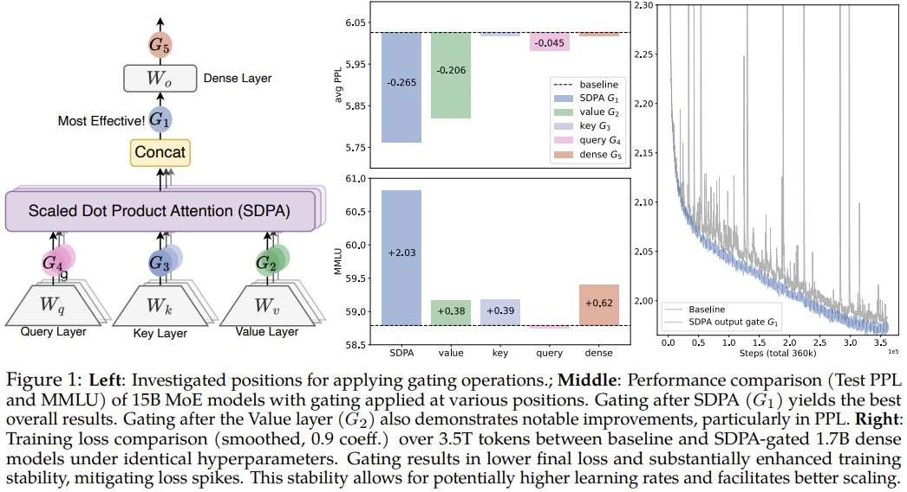
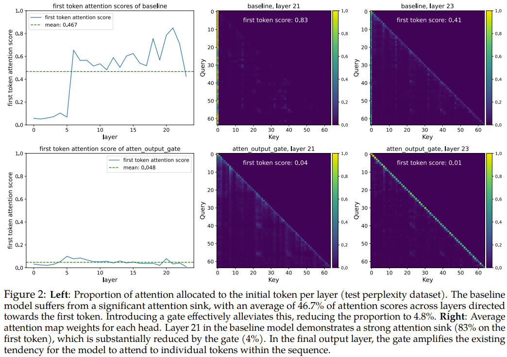
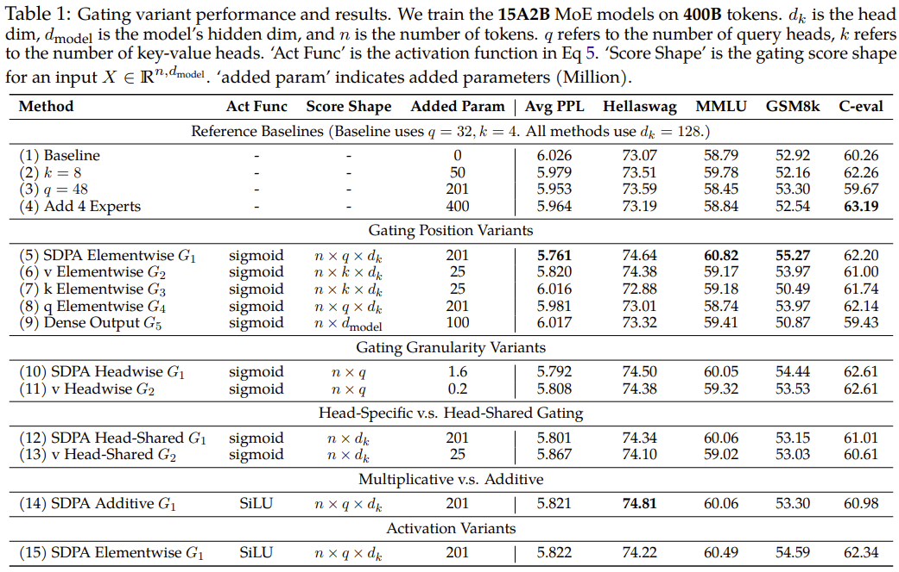
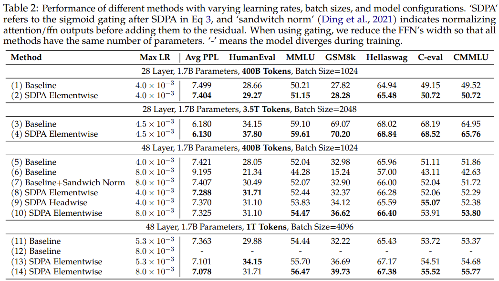
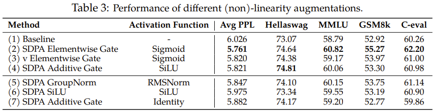
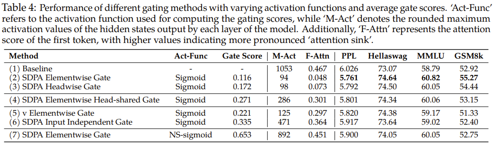
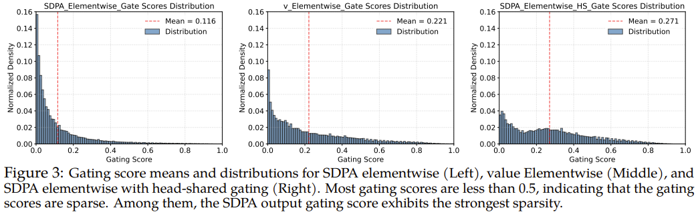
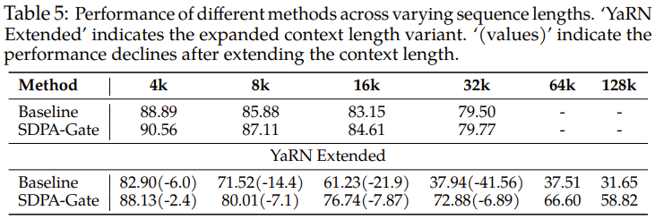

# Gated Attention 门控注意力用于大语言模型：非线性、稀疏性及无注意力沉没 (Attention-Sink-Free)

> `https://arxiv.org/pdf/2505.06708`

阿里集团 Qwen 团队，爱丁堡大学，斯坦福大学，麻省理工学院，清华大学

## 摘要

门控机制已被广泛应用，从早期的模型如 LSTM（Hochreiter & Schmidhuber, 1997）和 Highway Networks（Srivastava et al., 2015），到最近的状态空间模型（Gu & Dao, 2023）、线性注意力（Hua et al., 2022）以及 softmax 注意力（Lin et al., 2025）。然而，现有文献很少研究门控的具体效果。在这项工作中，我们进行了全面的实验，以系统地研究门控增强的 softmax 注意力变体。具体来说，我们对在 3.5 万亿 token 数据集上训练的 15B 专家混合（MoE）模型和 1.7B 密集模型的 30 个变体进行了全面比较。我们的核心发现是，一个简单的修改——在缩放点积注意力（SDPA）之后应用一个头部特定的（head-specific）sigmoid 门——能持续提升性能。此修改还增强了训练稳定性，容忍更大的学习率，并改善了缩放特性。通过比较不同的门控位置和计算变体，我们将这种有效性归因于两个关键因素：（1）在 softmax 注意力的低秩映射上引入了非线性，（2）应用查询依赖的稀疏门控分数来调制 SDPA 输出。值得注意的是，我们发现这种稀疏门控机制缓解了“注意力沉没”（attention sink）现象，并增强了长上下文外推性能，我们还发布了相关代码和模型以促进未来研究。

## 1 引言

门控机制在神经网络中已有坚实基础。早期架构，如 LSTM（Hochreiter & Schmidhuber, 1997）、Highway Networks（Srivastava et al., 2015）和 GRU（Dey & Salem, 2017），开创了使用门控来控制跨时间步或层的信息流并改善梯度传播的方法。这一原则在现代架构中得以延续。最近的序列建模工作，包括状态空间模型（Gu & Dao, 2023; Dao & Gu, 2024）和注意力机制（Hua et al., 2022; Sun et al., 2023; Qin et al., 2024a; Yang et al., 2024b; Lin et al., 2025），通常应用门控，通常用于调制 token 混合器（token-mixer）组件的输出。尽管门控机制被广泛采用并取得了经验上的成功，但其功能和影响除了最初的直觉之外，仍未得到充分探索。

理解不足阻碍了评估门控的真正贡献，尤其是当与其他架构因素混淆时。例如，虽然 Switch Heads（Csordas et al., 2024a; b）引入了 sigmoid 门控来选择 top-K 注意力头部专家，但我们的实验揭示了一个有趣的发现（附录 A.1）：即使减少到单个专家，性能增益仍然显著，此时门控仅仅调制值（value）输出。这强烈表明门控本身提供了显著的内在价值，与路由机制分开。类似地，在 Native Sparse Attention (NSA)（Yuan et al., 2025）中，虽然展示了整体性能改进，但并未将其门控机制的贡献与稀疏注意力设计本身的影响分离开。这些考虑强调了需要严格地将门控效应与其他架构组件分离开来。

在这项工作中，我们研究了标准 softmax 注意力（Vaswani, 2017）（第 2.2 节）中的门控机制。具体来说，我们在不同位置引入门控（图1）：查询（query）投影之后（G4）、键（key）投影之后（G3）、值（value）投影之后（G2）；缩放点积注意力（SDPA）输出之后（G1）；以及最终密集输出层之后（G5）。我们的探索涵盖了门控变体，包括逐元素（elementwise）和逐头部（headwise）、头部特定（head-specific）和头部共享（head-shared），以及加性（additive）和乘性（multiplicative）形式。我们发现：（i）在 SDPA 输出应用头部特定门控（G1）能产生最显著的性能改进（例如，困惑度（PPL）降低高达 0.2，MMLU 提升 2 分）；（ii）SDPA 输出门控还提高了训练稳定性，几乎消除了损失尖峰，允许更大的学习率并增强了模型可扩展性。

我们确定了导致门控有效性的两个主要因素：（i）非线性。两个连续的线性层——值投影（Wv）和密集投影（WO）——可以重写为一个低秩线性投影。因此，通过在第 G1 或 G2 位置的门控引入非线性，可以增加这种低秩线性变换的表现力（第 4.1 节）。（ii）稀疏性。虽然非线性门控变体持续增强性能，但我们观察到它们的增益各不相同。我们的分析进一步揭示，门控分数的显著稀疏性是另一个关键因素，它向 SDPA 输出引入了输入依赖的稀疏性（第 4.2 节）。此外，稀疏门控消除了注意力沉没（Xiao et al., 2023）：初始 token 不成比例地主导注意力分数（图2，第 4.3 节）。先前的工作（Xiao et al., 2023; Sun et al., 2024; Gu et al., 2024）将注意力沉没解释为由于非负的 softmax 归一化导致的冗余注意力的积累。根据经验，我们验证了当在 SDPA 输出应用查询依赖的稀疏门控时，我们的密集和 MoE 模型（在 3.5T token 上训练）均未出现注意力沉没。此外，这些模型在长度泛化方面表现出卓越的性能，在 RULER（Hsieh et al., 2024）上获得了超过 10 分的增益（第 4.4 节）。

总之，我们的工作强调了门控在标准注意力层中对模型性能和行为的影响。通过评估门控变体，我们揭示了它们引入非线性和稀疏性以及消除注意力沉没的能力。这些发现加深了我们对门控注意力机制的理解。我们将开源我们的无注意力沉没模型以推进未来研究。

## 2 门控注意力层

### 2.1 预备知识：多头 Softmax 注意力

给定输入 $X \in \mathbb{R}^{n \times d_{\text{model}}}$，其中 n 是序列长度，$d_{\text{model}}$ 是模型维度，Transformer 注意力层（Vaswani, 2017）的计算可分为四个阶段。

**QKV 线性投影**：输入 X 使用学习的权重矩阵 $W_{Q}, W_{K}, W_{V} \in \mathbb{R}^{d_{\text{model}} \times d_{k}}$ 线性变换为查询 Q、键 K 和值 V，且 $Q, K, V \in \mathbb{R}^{n \times d_{k}}$：

$$Q = X W_{Q}, \quad K = X W_{K}, \quad V = X W_{V}.$$

**缩放点积注意力（SDPA）**：计算查询和键之间的注意力分数，然后进行 softmax 归一化。输出是值的加权和：

$$\text{Attention}(Q, K, V) = \operatorname{softmax}\left(\frac{Q K^{T}}{\sqrt{d_{k}}}\right) V,$$

其中 $\frac{Q K^{T}}{\sqrt{d_{k}}} \in \mathbb{R}^{n \times n}$ 表示缩放点积相似度矩阵，$\operatorname{softmax}(\cdot)$ 确保注意力权重非负且每行总和为 1。

**多头拼接**：在多头注意力中，上述过程并行重复 h 次，每个头部有其自己的投影矩阵 $W_{Q}^{i}, W_{K}^{i}, W_{V}^{i}$。所有头部的输出被拼接：

$$\text{MultiHead}(Q, K, V) = \text{Concat}\left(\text{head}_{1}, \ldots, \text{head}_{h}\right),$$

其中 $\operatorname{head}_{i} = \operatorname{Attention}\left(Q W_{Q}^{i}, K W_{K}^{i}, V W_{V}^{i}\right)$。

**最终输出层**：拼接后的 SDPA 输出通过输出层 $W_{o} \in \mathbb{R}^{h d_{k} \times d_{\text{model}}}$：

$$O = \text{MultiHead}(Q, K, V) W_{o}. \qquad (4)$$

### 2.2 使用门控机制增强注意力层

门控机制形式化表示为：

$$Y^{\prime} = g(Y, X, W_{\theta}, \sigma) = Y \odot \sigma(X W_{\theta}), \qquad (5)$$

其中 Y 是要被调制的输入，X 是用于计算门控分数的另一个输入¹，$W_{\theta}$ 指门控的可学习参数，$\sigma$ 是一个激活函数（例如 sigmoid），$Y^{\prime}$ 是门控输出。门控分数 $\sigma(X W_{\theta})$ 有效地充当动态过滤器，通过选择性地保留或擦除其特征来控制来自 Y 的信息流。

¹ 通常 X 是注意力层的输入，或者在某些变体中，是注意力层内另一个组件的输出。

在这项工作中，我们全面研究了注意力层内门控机制的几种变体。我们的探索集中在五个关键方面：（1）**位置**。我们研究了在不同位置应用门控的效果，如图 1（左）所示：(a) 在 Q, K, V 投影之后（公式 1），对应图 1（左）中的位置 $G_{2}, G_{3}, G_{4}$；(b) 在 SDPA（公式 3）输出之后 $\left(G_{1}\right)$；(c) 在最终拼接的多头注意力输出之后（公式 4, G5）。（2）**粒度**。我们考虑门控分数的两个粒度级别：(a) **逐头部（Headwise）**：单个标量门控分数调制整个注意力头的输出。(b) **逐元素（Elementwise）**：门控分数是与 Y 维度相同的向量，支持细粒度的、逐维度的调制。（3）**头部特定或共享**。考虑到注意力的多头性质，我们进一步考虑：(a) **头部特定（Head-Specific）**：每个注意力头有其特定的门控分数，实现对每个头的独立调制。(b) **头部共享（Head-Shared）**：$W_{\theta}$ 和门控分数在头部之间共享。（4）**乘性或加性**。对于将门控分数应用于 Y，我们考虑 (a) **乘性门控（Multiplicative Gating）**：门控输出 $Y^{\prime}$ 计算为：$Y^{\prime} = Y \cdot \sigma(X \theta)$。(b) **加性门控（Additive Gating）**：$Y^{\prime} = Y + \sigma(X \theta)$。（5）**激活函数**。我们主要考虑两种常见的激活函数：SiLU（Shazeer, 2020）和 sigmoid。由于 SiLU 的无界输出范围，我们仅将其用于加性门控，而 sigmoid 只给出 $[0,1]$ 范围内的分数。此外，为了进一步剖析门控有效性背后的机制，我们还考虑了恒等映射（Identity Mapping）或 RMSNorm（Zhang & Sennrich, 2019）（详见第 4.1 节）。

除非另有说明，我们采用头部特定的、使用 sigmoid 激活函数 $(\sigma(x) = \frac{1}{1 + e^{-x}})$ 的乘性门控。

## 3 实验 (Experiments)

### 3.1 实验设置 (Experimental Setups)

**模型架构和训练设置 (Model Architecture and Training Settings)** 我们在 MoE 模型（总参数量 15B，激活参数量 2.54B，记为 15A2B）和密集模型（总参数量 1.7B）上进行实验。15A2B MoE 模型使用 128 个总专家，采用 top-8 softmax 门控、细粒度专家（Dai et al., 2024）、全局批处理 LBL（Qiu et al., 2025）和 z-loss（Zoph et al., 2022）。注意力部分我们采用分组查询注意力（GQA）（Ainslie et al., 2023）。我们在包含多语言、数学和通用知识内容的 3.5T 高质量 token 子集上训练模型。上下文序列长度设置为 4096。更详细的配置，例如学习率和批量大小（bsz），将在各部分介绍。其他超参数遵循 AdamW 优化器的默认值。由于门控引入的参数和浮点运算量很小，门控引入的墙钟时间延迟小于 2%。

**评估 (Evaluation)** 我们在流行的基准测试上测试少样本（few-shots）结果，包括用于英语的 Hellaswag（Zellers et al., 2019）、用于通用知识的 MMLU（Hendrycks et al., 2020）、用于数学推理的 GSM8k（Cobbe et al., 2021）、用于编码的 HumanEval（Chen et al., 2021）、用于中文能力的 C-eval（Huang et al., 2024）和 CMMLU（Li et al., 2023）。我们还报告了在不同保留测试集（包括英语、中文、代码、数学、法律和文学等领域）上的语言建模困惑度（PPL）。

### 3.2 主要结果 (Main Results)

#### 3.2.1 MoE 模型的门控注意力 (Gated Attention for MoE models)

> 表 1：门控变体性能和结果。我们在 400B token 上训练 15A2B MoE 模型。$d_{k}$ 是头部维度，dmodel 是模型的隐藏维度，n 是 token 数量。q 指查询头数量，k 指键值头数量。‘Act Func’ 是公式 5 中的激活函数。‘Score Shape’ 是对于输入 $X \in \mathbb{R}^{n, d_{\text{model}}}$ 的门控分数形状。‘added param’ 表示增加的参数（百万）。

我们首先比较了在训练高效的 MoE-15A2B 模型上不同门控注意力层的结果。所有模型使用一个调度器，在 1k 步内预热到最大学习率 2e-3，并使用余弦衰减到 3e-5。我们使用全局批量大小 1024，包含 100k 优化步。结果总结在表 1 中。为了提供公平的比较，我们为普通 MoE 基线（第 1 行）补充了参数扩展方法，包括增加键值头数量（第 2 行）、增加查询头数量（第 3 行）以及增加专家总数和激活数（第 4 行）。这些方法引入了与门控机制相当或更多的参数。

从表 1 中，我们观察到：（i）SDPA 和值输出门控是有效的。在 SDPA（G1）或值映射（G2）的输出处插入门控是最有效的，与其他变体相比，实现了更低的 PPL 和更好的整体基准性能。我们将在第 4.2 节进一步研究为什么在这两个位置应用门控是有效的。（ii）**头部特定门控很重要**。在 G1 和 G2 处应用逐头部门控引入了非常少的额外参数（对于 MoE-15A2B 模型小于 2M），但仍然带来了实质性的改进（第 10 和 11 行）。当在不同注意力头之间共享门控分数时（我们对查询头维度 q 求平均，从原始的 $n \times q \times d_{k}$ 分数获得一个 $n \times d_{k}$ 分数），基准测试的改进小于逐头部门控所实现的改进（第 12 行 vs. 第 10 行，第 13 行 vs. 第 11 行）。这强调了为不同注意力头应用不同门控分数的重要性。（iii）**乘性门控更受青睐**。加性 SDPA 输出门控的表现不如乘性门控，尽管它显示出相对于基线的改进。（iv）**Sigmoid 激活函数更好**。在最有效的门控配置（第 5 行）中用 SiLU 替换激活函数（第 15 行）会导致改进减少。

总的来说，在值层（G2）和 SDPA 输出（G1）添加门控使 PPL 降低了超过 0.2，优于各种参数扩展基线。然而，在 G1 处应用门控实现了更好的 PPL 和基准测试结果。只要不同的头部接收到不同的门控分数，门控的粒度和激活函数的选择的影响相对较小。我们将在分析（第 4.2 节）中进一步分析这些观察结果背后的原因。

#### 3.2.2 密集模型的门控注意力 (Gated Attention for Dense Models.)

我们还按照（Yang et al., 2024a）在密集模型上进行了实验，以验证 SDPA 输出 sigmoid 门控。当使用门控时，我们减小 FFN 的宽度以保持参数大小。大多数实验使用为基线优化的超参数。例如，对于在 400B token 上训练的 1.7B 模型，我们使用最大学习率 4e-3 和批量大小 1024。对于在 3.5T token 上训练，我们将最大学习率增加到 4.5e-3，批量大小增加到 2048。先前的工作已经确定，虽然增加网络深度、大的学习率和大的批量大小可以显著提高模型性能（McCandlish et al., 2018; Wang et al., 2022; D'Angelo et al., 2024）和分布式训练效率，但它们经常引入训练不稳定性（Wang et al., 2022; Zeng et al., 2022; Takase et al., 2023）。我们观察到应用门控机制显著减少了训练期间损失尖峰的发生（Chowdhery et al., 2023; Takase et al., 2023），这表明门控在增强训练稳定性方面具有前景。受此发现启发，我们引入了另一个实验设置，其特点是层数增加、最大学习率更高和批量大小更大，以进一步探究门控的稳定效果。

> 表 2：不同方法在不同学习率、批量大小和模型配置下的性能。'SDPA' 指公式 3 中 SDPA 之后的 sigmoid 门控，'sandwich norm'（Ding et al., 2021）指在将注意力/FFN 输出添加到残差之前对其进行归一化。使用门控时，我们减小 FFN 的宽度，使所有方法具有相同数量的参数。'-' 表示训练期间模型发散

表 2 显示：（i）**门控在各种设置下都有效**。在各种模型配置（第 1 行 vs. 第 2 行，第 5 行 vs. 第 8 行）、训练数据（第 3 行 vs. 第 4 行）和超参数（第 11 行 vs. 第 13 行）下，应用 SDPA 输出门控始终带来益处。（ii）**门控提高稳定性并促进缩放**。在 3.5T token 设置下，门控提高了训练稳定性，大大减少了损失尖峰（图 1，右）。当增加最大学习率时，基线遇到收敛问题（第 6 行，第 12 行）。虽然添加夹心归一化（sandwich norm）（Ding et al., 2021）恢复了收敛，但改进可以忽略不计。相比之下，在具有门控的模型中增加最大学习率会导致明显的改进。

总之，我们确定 SDPA 逐元素门控是增强注意力机制最有效的方法。将这种方法应用于密集 Transformer 进一步证明，门控能够实现更大批量大小和学习率的稳定训练，从而带来改进的性能。

## 4 分析：非线性、稀疏性及无注意力沉没 (Analysis: Non-Linearity, Sparsity, and Attention-Sink-Free)

在本节中，我们进行了一系列实验，以探索为何如此简单的门控机制能在性能和训练稳定性方面带来显著改进。根据我们的分析，要点如下：(1) 增强非线性的门控操作持续带来性能增益（第 4.1 节）；(2) 最有效的 SDPA 逐元素 $G_{1}$ 门控向 SDPA 输出引入了强大的输入依赖稀疏性（第 4.2 节），这继而有助于消除“注意力沉没”现象。

### 4.1 非线性提高注意力中低秩映射的表现力 (Non-linearity Improves the Expressiveness of Low-Rank Mapping in Attention)

> 表 3：不同（非）线性增强方法的性能

受到先前工作对 SDPA 输出使用组归一化（Sun et al., 2023; Ye et al., 2024）的启发，我们在第 3.2.1 节相同设置下，在拼接之前将 RMSNorm（Zhang & Sennrich, 2019）独立应用于每个注意力头的输出。如表 3 第 5 行所示，应用 RMSNorm 几乎不引入额外参数，但也导致了 PPL 的显著降低。

在多头注意力中，第 i 个 token 对应于第 k 个头的输出可以表示为：

$$o_{i}^{k}=\left(\sum_{j=0}^{i} S_{i j}^{k}\cdot X_{j} W_{V}^{k}\right) W_{O}^{k}=\sum_{j=0}^{i} S_{i j}^{k}\cdot X_{j}\left(W_{V}^{k} W_{O}^{k}\right),\qquad(6)$$

其中 $W_{O}^{k}$ 是输出层 $W_{O}$ 对应于第 k 个头的参数 $^{2}$。这里，$S_{i j}^{k}$ 表示第 k 个头中第 i 个 token 关注第 j 个 token 的注意力分数，$X_{j}$ 是 token j 的注意力层输入，$X_{j} W_{V}^{k}$ 代表 token j 在第 k 个头中的值输出。从公式 6，我们可以将 $W_{V}^{k} W_{O}^{k}$ 合并为一个应用于所有 $X_{j}$ 的低秩线性映射，因为 $d_{k}<d_{\text{model}}$。使用 GQA 时，$W_{V}$ 在同一组内的头部之间共享，进一步降低了表现力。

$^{2}$ 更准确地说，$W_{O}^{k}$ 是 $W_{O}$ 中对应于第 k 个头输出的部分。

鉴于在两个线性映射之间添加非线性可以提高它们的表现力（Montufar et al., 2014），我们有两种修改来缓解低秩问题：

$$\begin{align*} o_{i}^{k}&=\left(\sum_{j=0}^{i} S_{ij}^{k}\cdot \text{Non-Linearity-Map}(X_{j} W_{V}^{k})\right) W_{O}^{k},\end{align*}\qquad(7)$$

$$o_{i}^{k}=\text{ Non-Linearity-Map}\left(\sum_{j=0}^{i} S_{i j}^{k}\cdot X_{j} W_{V}^{k}\right) W_{O}^{k}.\qquad(8)$$

值得注意的是，在 $G_{2}$（表 3 第 3 行）位置添加门控对应于第一种修改（公式 7），而在 $G_{1}$ 位置添加门控（第 4 行）或组归一化（第 5 行）对应于第二种修改（公式 8）。这也解释了为什么在 $W_{O}$ 之后的 $G_{5}$ 位置添加门控或归一化没有效果（表 1 第 9 行）—— 它没有解决 $W_{V}$ 和 $W_{O}$ 之间缺乏非线性的问题。

对于 $G_{1}$ 处的加性门控，门控的输出经过 SiLU（表 3 第 4 行），也引入了一些非线性，这解释了观察到的性能增益，尽管小于乘性门控实现的增益。基于这些见解，我们进行了两个额外的实验：(i) 仅在 G1 位置添加 SiLU 而不引入额外参数（表 3 第 6 行）。注意这个简单的修改也导致了 PPL 的适度降低，但大多数基准测试分数保持不变。(ii) 从加性门控中移除 SiLU，使得门控后 $X_{j}$ 的输出直接在 $G_{1}$ 位置相加（表 3 第 7 行）。这进一步减少了加性门控的增益。

总之，与有效门控变体相关的性能提升可能归因于在 WV 和 WO 之间引入了非线性。尽管在 G1 和 G2 位置应用门控都可以引入这种非线性，但这些应用产生了不同的性能增益。这种观察到的差异促使我们进一步分析在这两个位置应用门控的影响。

### 4.2 门控引入输入依赖的稀疏性 (Gating Introduces Input-Dependent Sparsity)

> 表 4：不同门控方法的性能，包括不同的激活函数和平均门控分数。'Act-Func' 指用于计算门控分数的激活函数，'M-Act' 表示模型每层输出的隐藏状态的最大激活值的近似值。此外，'F-Attn' 代表第一个 token 的注意力分数，值越高表示“注意力沉没”越明显

我们分析了在值（G2）和 SDPA 输出（G1）位置应用门控的模型的门控分数（表 1，‘Gate Score’ 列），评估基于测试语言建模数据。所有层的平均门控分数呈现在表 4 中，分数分布可视化在图 3 中（分层分数见附录 A.2）。关键观察包括：

(i) **有效的门控分数是稀疏的**。SDPA 输出门控（逐元素/逐头部）表现出最低的平均门控分数。此外，SDPA 输出门控分数分布显示出高度集中在 0 附近，表明存在显著的稀疏性，这与其卓越的性能一致。(ii) **头部特定稀疏性很重要**。强制跨注意力头共享门控分数增加了整体门控分数并减少了性能增益。观察 (i) 和 (ii) 强调了头部特定门控的重要性，这与先前的研究表明单个注意力头捕获输入的不同方面相一致（Voita et al., 2019; Wang et al., 2021; Olsson et al., 2022; Wang et al., 2023）。

(iii) **查询依赖性很重要**。值门控（G2）的分数高于 SDPA 输出门控（G1）的分数，并且性能较差。这表明当门控分数稀疏性是查询依赖的，而不是由键和值决定时，更为有效。具体来说，SDPA 输出门控分数源自与当前查询对应的隐藏状态（例如，公式 8 中的非线性映射依赖于 $X_{i}$），而值门控分数源自与过去键和值相关的隐藏状态（例如，公式 7 中的非线性映射依赖于每个 $X_{j}$）。这意味着门控分数稀疏性可以为查询过滤掉不相关的上下文信息。为了进一步验证查询依赖性的重要性，我们引入了输入无关的门控，通过将可学习参数 $\left(q\times d_{k}\right)$ 初始化为零，应用 sigmoid 函数，并将其与 SDPA 输出相乘。如第 (6) 行所示，输入无关的门控比基线有所改进，这可能是由于引入了非线性。此外，高门控分数强化了有效的稀疏性应该是输入依赖的观点。

(iv) **稀疏性较低的门控效果较差**。为了进一步验证门控分数稀疏性的重要性，我们从门控公式中减少稀疏性。具体来说，我们用修改版的非稀疏（NS）sigmoid 函数替换 sigmoid 函数：

$$\text{ NS-sigmoid}(x)=0.5+0.5\cdot\operatorname{sigmoid}(x)\text{,}$$

它将门控分数限制在 $[0.5,1.0]$ 之间。这确保了引入非线性的同时移除了门控分数稀疏性。如表 4 第 (7) 行所示，NS-sigmoid 门控的增益逊于 SDPA 输出 sigmoid 门控。在附录 A.2 中，我们更详细地讨论了稀疏门控分数如何影响 SDPA 隐藏状态中的稀疏性（低于阈值的值比例）。我们将在下一节讨论不同稀疏度水平对模型行为的影响，包括减少“注意力沉没”。

### 4.3 SDPA 输出门控减少注意力沉没 (SDPA Output Gating Reduces Attention-Sink)

基于门控以输入依赖的方式向 SDPA 输出引入稀疏性的观察，我们假设这种机制可以过滤掉与当前查询 token 无关的上下文，从而缓解注意力沉没（Xiao et al., 2023; Sun et al., 2024）。为了验证这一点，我们分析了注意力分数（所有头平均）的分布以及分配给第一个 token 的注意力分数比例（图 2，表 4，‘F-Attn’ 列）。受到关于隐藏状态中大量激活值和注意力沉没的讨论（Sun et al., 2024）的启发，我们还计算了各层最大隐藏状态激活值的均值，如表 4 的 ‘M-Act’ 列所示。更详细的分层结果在附录 A.3 中提供。

我们可以观察到：(i) 在 SDPA 输出（G1）处应用逐头部和逐元素的查询依赖 sigmoid 门控，大大减少了分配给第一个 token 的注意力分数，并减少了大量激活。(ii) 强制跨头部共享门控分数或仅在值投影（G2）之后应用门控，减少了大量激活，但并未减少对第一个 token 的注意力分数。这强化了头部特定门控的重要性，并表明大量激活并非注意力沉没的先决条件。(iii) 降低门控的输入依赖性（第 6 行）或使用 NS-sigmoid 来减少稀疏性（第 7 行）会加剧大量激活和注意力沉没。

总的来说，这些观察表明，对 SDPA 输出进行输入依赖的、头部特定的门控引入了显著的稀疏性，从而缓解了注意力沉没。此外，SDPA 输出中的稀疏性减少了模型内的大量激活，稀疏性增加导致激活值变小。这可以解释门控提高训练稳定性的原因：通过减少大量激活，模型在 BF16 训练（Budzinskiy et al., 2025）期间更不容易受到数值错误的影响。我们还观察到，大量激活主要源自早期层（例如，第 5 层），其中 FFN 输出大值，这与（Yona et al., 2025）一致。一旦添加到残差流中，这些激活通过预归一化（pre-norm）机制传播到后续层。这与夹心归一化（Ding et al., 2021）在增强训练稳定性方面的有效性（表 2，第 7 行）一致：对 FFN 输出应用 LayerNorm 可以防止这些大的激活进入残差流。

### 4.4 SDPA 输出门控促进上下文长度扩展 (SDPA Output Gating Facilitates Context Length Extension)

> 表 5：不同方法在不同序列长度下的性能。'YaRN Extended' 表示扩展上下文长度的变体。'（数值）' 表示扩展上下文长度后的性能下降

SDPA 门控在长上下文设置中的效果。具体来说，我们扩展了在 3.5T token 上训练的模型的上下文长度。我们将 RoPE（Su et al., 2024）的基数从 10k 增加到 1M，并在序列长度为 32k 的数据上继续训练额外的 80B token。这为我们提供了上下文长度为 32k 的模型。随后，我们使用 YaRN（Peng et al., 2023）将上下文长度扩展到 128k。我们在 RULER 基准测试（Hsieh et al., 2024）上评估模型，并将结果总结在表 5 中。我们观察到以下情况：(i) 在 32k 设置下，带有门控的模型略优于基线。这表明在训练长度内，注意力沉没现象可能不会损害模型的长上下文性能。(ii) 当使用 YaRN 将上下文长度扩展到 128k 时，基线模型和带门控的模型在原始 32k 范围内的性能均出现下降。这一观察结果与先前通过修改 RoPE 来扩展上下文长度的工作一致（Chen et al., 2023; Peng et al., 2023; Dong et al., 2025）。尽管带有门控的模型下降幅度较小。(iii) 在 64k 和 128k 的上下文长度下，带有门控的注意力模型显著优于基线。从这些观察中，我们假设添加门控有助于模型适应上下文长度的扩展。一个可能的解释是基线模型依赖注意力沉没来调整注意力分数的分布。Dong et al.（2025）基于注意力和隐藏状态分布推导了改变 RoPE 的影响。当应用 YaRN 等技术修改 RoPE 基数时，注意力沉没模式可能难以以无需训练的方式适应，导致性能显著下降。相比之下，带有门控的模型主要依赖输入依赖的门控分数来控制信息流，使它们对此类更改更加鲁棒。

## 5 相关工作 (Related Works)

### 5.1 神经网络中的门控 (Gating in Neural Networks)

门控机制已在神经网络中得到广泛采用。早期的工作，如 LSTM（Hochreiter & Schmidhuber, 1997）和 GRU（Dey & Salem, 2017），引入门控来调节跨时间步或层的信息流，通过选择性地保留或丢弃信息来解决梯度消失/爆炸问题。Highway Networks（Srivastava et al., 2015）将这一概念扩展到前馈网络，使得能够成功训练非常深的架构。SwiGLU（Shazeer, 2020）将门控机制引入 transformer 的 FFN 层，增强了它们的表达能力，并成为许多开源 LLM 的标准组件（Grattafiori et al., 2024; Yang et al., 2024a）。

一些关于状态空间模型（Gu & Dao, 2023; Dao & Gu, 2024）和线性注意力（Linear Attention）的工作，例如 FLASH（Hua et al., 2022）、RetNet（Sun et al., 2023）、Lightning Attention（Qin et al., 2024a; b; Li et al., 2025）和 Gated Delta Networks（Yang et al., 2024b），也包含了门控模块来控制 token 混合器（token-mixer）模块的信息。Forgetting Transformer（Lin et al., 2025）将门控机制应用于 softmax 注意力的输出，观察到显著的性能改进。尽管这些工作证明了门控的有效性，但对其精确机制及其有效性背后原因的全面理解仍需探索。这可能有助于更广泛地认识门控在 RNN 之外的重要性，并促进更好地利用门控独特优势的设计。例如，虽然 Switch Heads（Csordas et al., 2024b; a）、NSA（Yuan et al., 2025）和 MoSA（Piekos et al., 2025）采用基于 sigmoid 的门控（Csordas et al., 2023）进行选择，但进一步研究分离门控的具体贡献可能会提供有价值的见解。与在标准 transformer 中 incorporated 类似门控机制的基线进行比较，可以为其提出的选择机制的有效性提供更精细的视角。与我们的工作最相关的是 Quantizable Transformers（Bondarenko et al., 2023），该工作也发现，在 softmax 注意力中应用门控可以缓解极端注意力集中和隐藏状态中的异常值，这些发现在 BERT 和 ViT 等编码器模型中得到验证。虽然该工作主要利用门控来消除异常值以实现模型量化，但我们提供了对各种门控变体的详细分析，通过增强的非线性和稀疏性以及改进的训练稳定性揭示了它们的益处。基于这些见解，我们扩展了门控注意力模型，证明了门控的广泛适用性和影响力。

### 5.2 注意力沉没 (Attention Sink)

Xiao et al.（2023）正式确定了“注意力沉没”现象，即特定 token 获得较大的注意力分数。类似地，Darcet et al.（2023）发现在视觉 transformer 中，一些冗余 token 充当“寄存器”来存储注意力分数。后来，Sun et al.（2024）表明，过度的注意力分数也会分配给与大量激活值相关的 token。然而，我们的工作揭示，在值投影输出处应用门控消除了大量激活，但注意力沉没仍然存在，表明大量激活并非注意力沉没的必要条件。类似地，Gu et al.（2024）将注意力沉没描述为存储冗余注意力分数的非信息性“键偏差”，认为 softmax 固有的归一化依赖性驱动了这种行为。实验尝试修改 softmax 注意力，例如用未归一化的 sigmoid 注意力替换 softmax（Ramapuram et al., 2024; Gu et al., 2024）、添加 softmax 注意力门或裁剪（Bondarenko et al., 2023）、以及修改 softmax 计算（Zuhri et al., 2025）和分母（Miller, 2023），在缓解注意力沉没方面显示出前景。我们的工作表明，在 SDPA 之后进行稀疏门控可以消除注意力沉没，这在密集（10 亿参数）和 MoE（150 亿参数）模型中均得到验证，即使是在 3.5T token 上训练的模型。此外，我们发现了消除注意力沉没对有益于上下文长度扩展的潜力。

## 6 结论 (Conclusion)

这项工作系统地研究了门控机制在标准 softmax 注意力中的作用，揭示了它们对性能、训练稳定性和注意力动态的显著影响。通过在高达 3.5T token 上训练的 15B MoE 和 1.7B 密集模型的 30 个变体上进行广泛的实验比较，我们证明了在缩放点积注意力之后应用一个 sigmoid 门控能产生最实质性的改进。这个简单的机制增强了非线性，引入了输入依赖的稀疏性，并消除了像“注意力沉没”现象这样的低效问题。此外，门控促进了上下文长度扩展，允许模型有效地泛化到更长的序列而无需重新训练。我们还发布了首批无注意力沉没的模型。我们相信这些实证验证将为工程化下一代先进基础模型铺平道路。

### 局限性 (Limitations)

我们的工作主要侧重于通过一系列消融研究来分析注意力门控的原因和影响。然而，我们承认几个局限性。非线性对注意力动态和整体训练过程的更广泛影响仍未得到充分探索。虽然我们观察到消除注意力沉没在长上下文扩展场景中提高了性能，但我们没有提供关于注意力沉没如何影响模型泛化到更长序列能力的严格理论解释。
