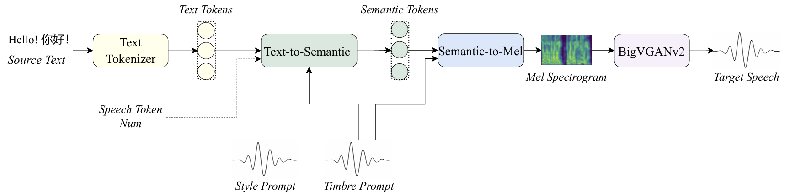
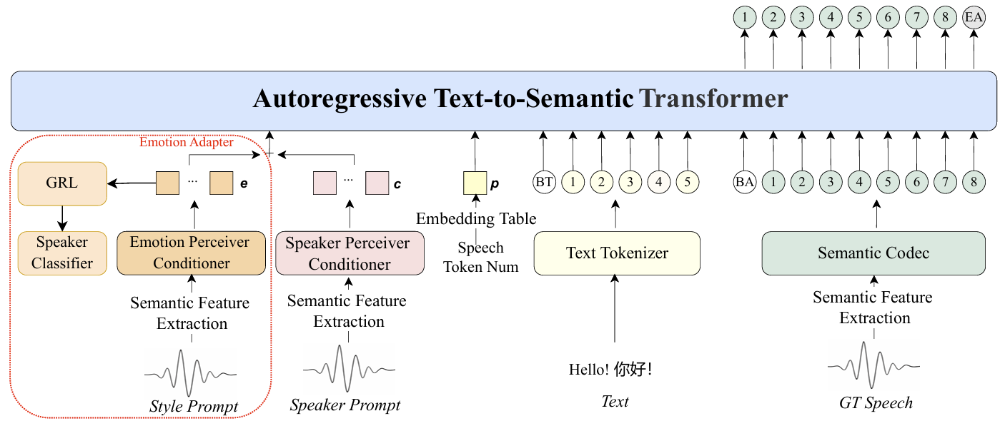
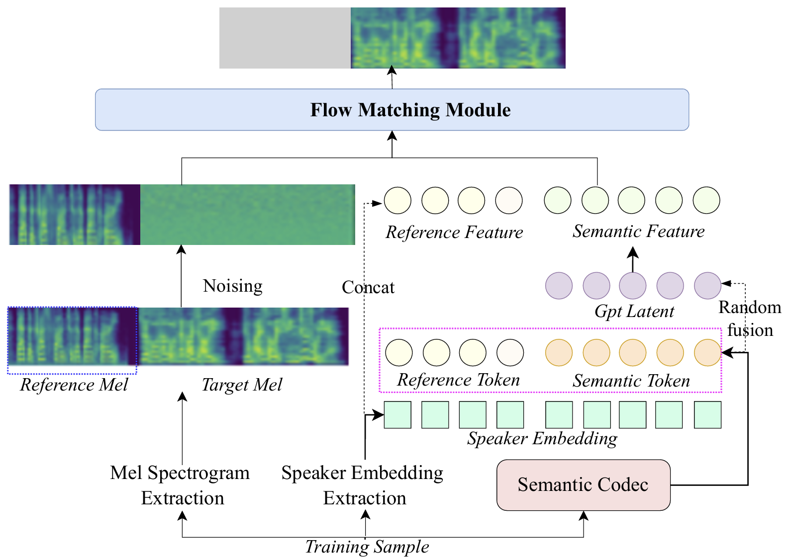
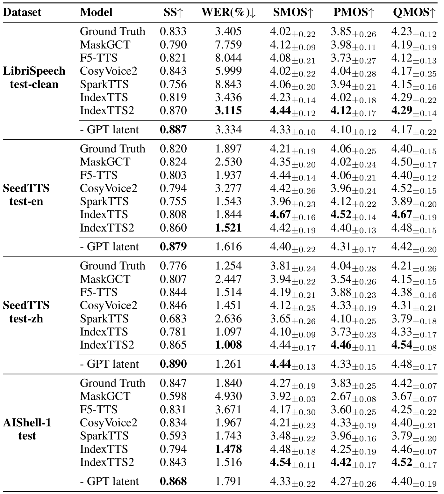
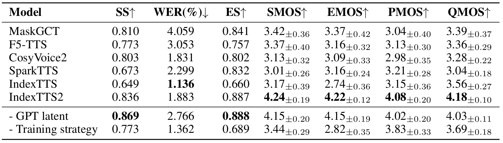
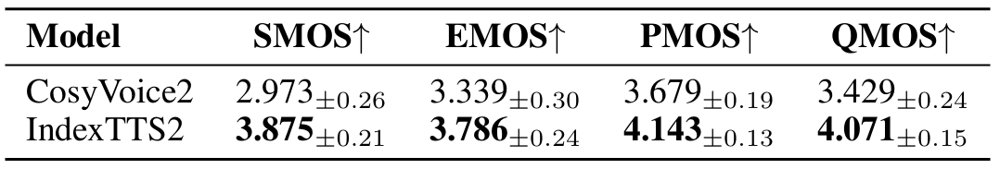
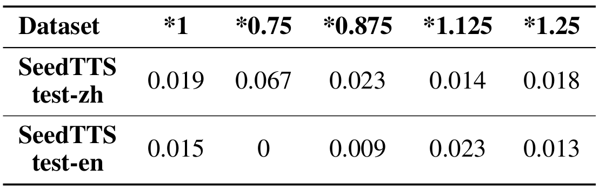
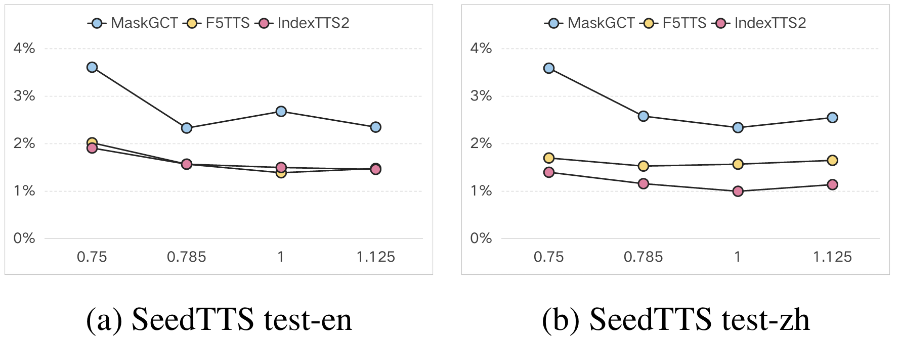
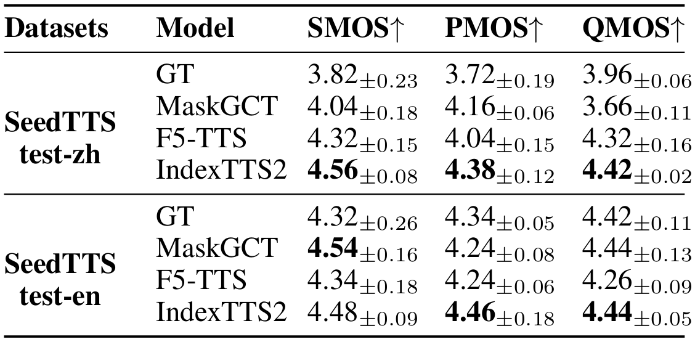

# IndexTTS2: 情感表达丰富且时长可控的自回归零样本文本到语音的突破

<https://arxiv.org/pdf/2506.21619>

哔哩哔哩公司，人工智能平台部

- [IndexTTS2: 情感表达丰富且时长可控的自回归零样本文本到语音的突破](#indextts2-情感表达丰富且时长可控的自回归零样本文本到语音的突破)
  - [摘要](#摘要)
  - [引言](#引言)
  - [相关工作](#相关工作)
  - [提出的方法](#提出的方法)
    - [自回归文本到语义模块 (T2S)](#自回归文本到语义模块-t2s)
    - [语义到梅尔频谱图模块 (S2M)](#语义到梅尔频谱图模块-s2m)
    - [文本到情感 (T2E)](#文本到情感-t2e)
  - [实验](#实验)
    - [实验设置](#实验设置)
    - [实验结果](#实验结果)
  - [结论](#结论)

## 摘要

现有的自回归大规模文本转语音（TTS）模型在语音自然度方面具有优势，但其逐令牌（token-by-token）的生成机制使得难以精确控制合成语音的时长。这在需要严格音画同步的应用（如视频配音）中成为一个显著的限制。本文介绍了 IndexTTS2，它提出了一种新颖、通用且对自回归模型友好的语音时长控制方法。该方法支持两种生成模式：一种明确指定生成的令牌数量以精确控制语音时长；另一种以自回归方式自由生成语音，无需指定令牌数量，同时能忠实再现输入提示（prompt）的韵律特征。此外，IndexTTS2 实现了情感表达与说话人身份的分离，使得能够独立控制音色和情感。在零样本（zero-shot）设置下，该模型能够准确重建目标音色（来自音色提示），同时完美复现指定的情感语调（来自风格提示）。为了增强高情感表达中的语音清晰度，我们引入了 GPT 潜在表征，并设计了一种新颖的三阶段训练范式来提高生成语音的稳定性。另外，为了降低情感控制的门槛，我们通过微调 Qwen3 设计了一种基于文本描述的软指令机制，有效引导生成具有所需情感取向的语音。最后，在多个数据集上的实验结果表明，IndexTTS2 在词错误率、说话人相似度和情感保真度方面优于最先进的零样本 TTS 模型。音频样本可在以下网址获取：

<https://index-tts.github.io/index-tts2.github.io/>

## 引言

矢量量化（vector quantization, VQ）、Transformer 架构和大规模数据方面的最新进展，使得零样本 TTS 模型能够从极少的音频提示中合成出具有音色、韵律和情感的语音。这些模型在自然度和灵活性方面优于传统系统，使得诸如 AI 配音等应用成为可能。当前的 TTS 模型可分为自回归（AR）和非自回归（NAR）系统。基于 AR 的零样本 TTS 模型，如 XTTS、Cosyvoice和 SparkTTS，凭借其随机采样策略和逐令牌生成，在自然度和表现力方面显示出卓越的性能。基于 NAR 的模型，如 MaskGCT 和 F5-TTS，通过并行解码实现快速推理，并支持通过人工干预或模型自主进行灵活的参数控制（例如，时长）。然而，AR 模型由于其顺序生成的性质，在时长控制方面面临挑战，限制了其在自动配音等时间敏感场景中的应用。此外，虽然 TTS 模型在音色复现方面表现出色，但其情感表达仍然受到训练数据稀缺的限制。现有的情感表达方法包括在训练数据中使用情感标签、通过 CLAP 将自然语言描述与情感音频映射、指令微调以及参考情感音频，但这些方法在情感范围和控制精度方面缺乏鲁棒性。

我们介绍了 IndexTTS2（图 1），一种新颖的零样本语音生成模型，它同时解决了固定时长语音生成和自然时长语音合成的问题，并增强了情感表现力。该模型包含三个核心模块：文本到语义（T2S）模块、语义到梅尔频谱图（S2M）模块和声码器（Vocoder）。T2S 模块采用自回归 transformer 框架，从文本、音色/风格提示以及可选的语音令牌计数生成语义令牌。在指定的令牌计数约束下，一种时长编码机制确保生成固定长度的令牌序列，同时保持语义完整性。对于情感建模，T2S 模块从风格提示中提取情感特征，并使用梯度反转层（GRL）在训练过程中消除与情感无关的信息。采用了多阶段训练策略来克服高质量情感数据的缺乏并增强表达能力。为了实现语音合成中的自然语言情感控制，我们进一步设计了一个文本到情感（T2E）模块，通过低秩适应（LoRA）将 Deepseek-r1 的情感分布预测能力蒸馏到 Qwen-3-1.7b 中，并将这些概率与预计算的情感嵌入相结合以条件化 T2S 的输出。S2M 模块通过非自回归架构生成梅尔频谱图，并引入 GPT 潜在表征以稳定强烈情感表达过程中的语音清晰度。声码器模块利用 BigVGANv2 将梅尔频谱图转换为音频波形。

**图 1：IndexTTS2 概览。**

本工作的关键贡献如下：

* 我们提出了一种适用于自回归 TTS 模型的时长适应方案。IndexTTS2 是第一个结合了精确时长控制和自然时长生成的自回归零样本 TTS 模型，并且该方法可扩展到任何自回归大规模 TTS 模型。
* 情感和说话人相关特征从提示中解耦，并设计了一种特征融合策略，以在情感丰富的表达过程中保持语义流畅性和发音清晰度。此外，开发了一个利用自然语言描述的情感控制工具，以方便用户使用。
* 针对缺乏高表现力语音数据的问题，我们提出了一种有效的训练策略，显著将零样本 TTS 的情感表现力提升至最先进（SOTA）水平。
* 我们将公开代码和预训练权重，以促进未来的研究和实际应用。

## 相关工作

**大规模 TTS 的精确时长控制**。当前的零样本大规模 TTS 模型采用自回归或非自回归范式，其中非自回归方法通过基于扩散、transformer 、流或语言模型的时长预测器，在时长控制方面表现出色。诸如 MaskGCT 等方法使用流建模进行音素级时长预测，而 F5-TTS 通过文本-语音长度比来估计时长。自回归模型（例如，VoxInstruct, Takin）依赖于自然语言指令，但面临精度限制。诸如 CosyVoice、Spark-TTS、DubWise 和 FleSpeech 等技术通过专门的提示、属性标签、跨模态融合或多模态嵌入来解决令牌生成控制问题。本工作引入了一种增强的自回归 TTS 模型，具有精确的令牌数量控制，以克服这些挑战。

**情感可控的大规模 TTS**。大规模 TTS 中的情感控制利用了自然语言描述（例如，Controlspeech），其中 CosyVoice 使用预设指令，而 EmoSphere++ (Cho et al. 2025) 生成可解释的风格嵌入。StyleTTS 2 采用基于扩散的风格向量，SC VALL-E 集成风格网络，Vevo 使用内容-风格令牌系统。多模态方法如 FleSpeech 将文本、音频和视觉线索嵌入到统一的表示中，以实现精确调控。本工作通过额外的情感特征增强了情感表现力，使得能够通过自然语言或参考音频输入进行灵活控制。

## 提出的方法

我们提出了 IndexTTS2，一个级联的自回归零样本 TTS 系统，包含三个模块：文本到语义（T2S）模块、语义到梅尔频谱图（S2M）模块和 BigVGANv2 声码器。每个模块单独训练，并采用量身定制的策略来增强情感表现力。T2S 模块从目标文本、风格/音色提示以及可选的语音令牌计数生成语义令牌，而 S2M 模块使用这些令牌和音色提示预测梅尔频谱图。BigVGANv2 声码器随后将梅尔频谱图转换为语音波形。为了实现基于自然语言的情感控制，我们引入了一个文本到情感（T2E）模块，该模块从输入文本生成情感向量，并通过专用的情感向量接口集成到 T2S 模块中。这种设计便于通过明确的自然语言指令或参考音频输入进行灵活、高质量的情感语音合成。

### 自回归文本到语义模块 (T2S)

我们将 T2S 表述为一个自回归语义令牌预测任务。如图 2 所示，输入序列构造为 $[c,p,e_{\langle BT\rangle},E_{text},e_{\langle BA\rangle},E_{sem}]$，其中 $c$ 表示说话人属性，$p$ 控制时长，$E_{text}$ 代表文本嵌入，$E_{sem}$ 代表通过语义编解码器从真实语音中提取的语义令牌的嵌入。$e_{\langle BT\rangle}$ 和 $e_{\langle BA\rangle}$ 作为专用的边界令牌，分别用于界定文本序列和语义序列的范围。我们的架构类似于 IndexTTS (Deng et al. 2025)，但在时长和情感控制方面有关键创新。

**图 2：自回归文本到语义模块。当指定语音令牌数量时，执行合成语义令牌数量的精确控制。情感适配器（红色虚线）用于从风格提示中提取情感特征，然后将其用作文本到语义过程的输入以进行情感重建。**

**时长控制**：时长调节通过一个专用的嵌入 $p$ 实现，该嵌入根据目标语义令牌长度 $T$ 计算得出，其中 $p = W_{\mathrm{num}} h(T)$。这里，$W_{\mathrm{num}} \in \mathbb{R}^{L_{\mathrm{speech}} \times D}$ 代表一个嵌入表，$L_{\mathrm{speech}}$ 表示最大语义序列长度，$D$ 是嵌入维度。函数 $h(T)$ 返回一个对应于 $T$ 的 one-hot 向量 (Rodríguez et al. 2018)。特别地，我们实现了一个特殊的技巧。我们施加了约束 $W_{\mathrm{sem}} = W_{\mathrm{num}}$，即在 $W_{\mathrm{num}}$ 和语义位置嵌入表 $W_{\mathrm{sem}}$ 之间。这个等式使得自回归系统在生成过程中能够精确地将位置信息与目标时长信息对齐，从而准确产生所需长度的序列。

**情感控制**：情感合成将情感嵌入 $e$ 通过输入序列 $[c + e, p, e_{\langle BT \rangle}, E_{\mathrm{text}}, e_{\langle BA \rangle}, E_{\mathrm{sem}}]$ 集成到条件特征中，其中 $e$ 是使用基于 Conformer 的情感感知调节器（emotion perceiver conditioner）从风格提示中提取的。为了有效捕捉情感韵律的表征，我们采用以下设计：说话人特征 $c$ 源自预训练的说话人感知调节器提取器，主要编码音色特征。为了最小化 $e$ 和 $c$ 之间的内容重叠，同时增强特征解耦，我们在训练过程中使用了 GRL。这种对抗机制强制 $e$ 仅捕捉情感和韵律属性，对说话人特定的音色特征保持不变，从而实现对全局情感韵律生成的更精确和鲁棒的控制。

**训练与推理**：我们的训练数据按说话人组织，每个说话人至少有两条语句。对于提示和目标划分，我们将同一说话人的不同语句划分为提示和训练目标。为了增强数据多样性，我们使用缩放系数 $r_1$ 和 $r_2$ 对真实语音和提示应用随机语速扰动。

我们为 T2S 模块采用了专门的三阶段训练策略：

**阶段 1**：模型在完整数据集上使用输入序列 $[c, p, e_{\langle BT \rangle}, E_{text}, e_{\langle BA \rangle}, E_{sem}]$ 进行训练，其中 $c$ 是说话人嵌入，$p$ 是时长嵌入。为了同时支持时长控制和自由形式生成，$p$ 以 $30\%$ 的概率随机设置为零。此阶段建立了模型的基础能力。

**阶段 2**：我们使用修改后的输入序列 $[c + e, p, e_{\langle BT \rangle}, E_{\mathrm{text}}, e_{\langle BA \rangle}, E_{\mathrm{sem}}]$ 精炼情感控制模块，其中 $e$ 表示情感嵌入。在此阶段，说话人感知调节器（产生 $c$）被冻结，而情感感知调节器保持可训练。为了将说话人身份与情感表达分离，应用了 GRL 和说话人分类器。训练在一个精选的 135 小时高质量情感语音子集上进行。联合损失函数定义为：

$$
L _ {\mathrm {A R}} = - \frac {1}{T + 1} \sum_ {t = 0} ^ {T} \log q \left(y _ {t}\right) - \alpha \log q (e), \tag {1}
$$

其中 $y_{T}$ 代表序列结束令牌 $\langle EA\rangle$，$q(y_{t})$ 表示语义令牌的后验概率，$q(e)$ 表示 $e$ 源自目标说话人的后验概率，$\alpha$ 是损失系数。

**阶段 3**：为了提高鲁棒性，我们冻结所有特征调节器，并在完整数据集上进行微调。

在推理过程中，通过设置 $p = W_{\mathrm{num}}h(T)$ 来实现时长控制，而通过使用 $p = 0$ 来启用自由形式生成。可以通过提供所需的情感向量 $e$ 作为输入来直接操纵情感韵律。

### 语义到梅尔频谱图模块 (S2M)

如图 3 所示，S2M 模块采用基于流匹配（flow matching）(Lipman et al. 2023; Liu 2024; Peebles and Xie 2023) 的非自回归生成框架。该模型通过结合提示梅尔频谱图、说话人嵌入和语义特征来合成目标梅尔频谱图。为了解决情感语音生成中的发音问题，我们引入了 GPT 潜在增强。

**图 3：基于流匹配的语义到梅尔频谱图模块。**

**GPT 潜在增强**：条件流匹配学习一个常微分方程（ODE）模型 (Chen et al. 2018)，该模型将噪声分布的样本映射到目标梅尔频谱图，条件是基于音色参考音频和由 T2S 模块生成的语义代码。

为了减轻语音合成中的语音含糊不清问题，特别是在合成情感语音时，我们引入了一种利用 GPT 模型潜在特征的新方法，记为 $H_{\mathrm{GPT}}$，这些特征是从 T2S 模块最终 transformer 层的输出中提取的。鉴于 T2S 模块经过训练，可以使用大规模数据集将文本转换为丰富的语义表示，我们假设 $H_{\mathrm{GPT}}$ 编码了大量的文本和上下文信息。为了利用这一点，我们通过向量加法将 $H_{\mathrm{GPT}}$ 与语义特征融合，形成一个增强的、上下文丰富的表示。然后，该融合特征被用作 S2M 训练过程的输入。消融研究验证了这种整合有效降低了高表现力语音合成中的词错误率。

**训练与推理**：S2M 模块在单阶段中训练。在训练期间，每个输入句子被随机分成提示段和目标段。与目标段对应的梅尔频谱图被完全加噪，形成扩散过程的源输入。由 T2S 模块生成的语义令牌记为 $Q_{sem}$。为了提高发音鲁棒性，采用多层感知器（MLP）(Rosenblatt 1958; Rumelhart, Hinton, and Williams 1986) 以 $50\%$ 的概率随机融合 GPT 隐藏状态 $H_{\mathrm{GPT}}$ 和语义令牌 $Q_{sem}$，形成最终的语义表示 $Q_{fin}$。说话人嵌入通过一个基于感知器的调节器提取，并与 $Q_{fin}$ 连接以确保音色一致性。使用预测的 $(y_{pred})$ 和目标 $(y_{tar})$ 梅尔频谱图之间的 L1 损失 (Koenker and Bassett Jr 1978) 来优化模型：

$$
\mathcal {L} _ {L 1} = \frac {1}{F \cdot D} \sum_ {f = 1} ^ {F} \sum_ {d = 1} ^ {D} | (y _ {p r e d}) _ {f, d} - (y _ {t a r}) _ {f, d} |, \tag {2}
$$

其中 $F$ 表示帧数，$D$ 表示梅尔频率仓的维度。在推理过程中，ODE 求解器从高斯噪声生成梅尔频谱图，条件是基于说话人嵌入和最终的语义表示 $Q_{fin}$。

### 文本到情感 (T2E)

我们通过以下步骤实现自然语言情感控制的效果。

首先，我们定义七种基本情感：$\mathcal{E} = \{\text{愤怒}, \text{快乐}, \text{恐惧}, \text{厌恶}, \text{悲伤}, \text{惊讶}, \text{中性}\}$。对于每种情感 $e_i \in \mathcal{E}$，我们使用 T2S 中预训练的情感感知调节器从几个相关的情感音频样本中提取嵌入，形成一个固定的情感嵌入集 $\mathcal{V}$。

然后，我们使用大型语言模型 Deepseek-r1 作为教师，将文本输入 $t$ 映射到一个 7 维情感概率分布：

$$
p = \text {D e e p s e e k - r} 1 (t) \in \Delta^ {7}, \tag {3}
$$

其中 $\Delta^7$ 是 7 维概率单纯形 $(\sum_{i=1}^{7} p_i = 1, p_i \geq 0)$。为了实现使用更小模型的高效推理，我们应用知识蒸馏将教师的行为转移到一个更小的学生模型 Qwen-3-1.7b。

我们使用两种类型的提示与 Deepseek-r1 构建了一个包含 1000 个文本-分布对的训练数据集：

* **描述性**："请生成表达{emotion}的描述性句子。"
* **脚本式**："请生成表达{emotion}的脚本式语句。"

对于每个生成的句子，我们使用一个分类提示来获得相应的情感分布：

"给定输入句子，返回一个 JSON 对象，其中包含每种 of the 7 种情感的概率。概率之和必须为 1，并四舍五入到两位小数。"

使用这个数据集，我们通过 LoRA 微调 Qwen-3-1.7b。训练目标是最小化学生模型预测与教师提供分布之间的交叉熵损失：

$$
\min  _ {\phi} \mathbb {E} _ {(t, p) \sim \mathcal {D}} \left[ \text {C r o s s E n t r o p y} \left(\operatorname {Q w e n -} 3 _ {\theta + \phi} (t), p\right) \right], \tag {4}
$$

其中 $\theta$ 表示 Qwen-3-1.7b 的原始参数，$\phi$ 代表 LoRA 参数。$t$ 指来自数据集 $\mathcal{D}$ 的输入文本样本，而 $p$ 表示教师模型生成的软概率分布。训练后，蒸馏后的 Qwen-3-1.7b 模型可以在推理期间以显著降低的计算成本有效替代 Deepseek-r1。

下一步，情感向量 $e_{\mathrm{input}}$ 计算为情感嵌入集 $\mathcal{V}$ 上的加权平均值：

$$
e _ {\text {i n p u t}} = \sum_ {e \in \mathcal {E}} p _ {e} \cdot \frac {1}{| \mathcal {V} _ {e} |} \sum_ {v \in \mathcal {V} _ {e}} v. \tag {5}
$$

最后，该情感向量作为提示输入到 T2S 模型中，从而能够生成具有所需情感特征的语音。

## 实验

### 实验设置

**数据集**：我们使用 55K 小时的数据训练我们的模型，包括 30K 中文数据和 25K 英文数据。大部分数据来自 Emilia 数据集 (He et al. 2024)，此外还有一些有声读物和购买的数据。总共 135 小时的情感数据来自 361 名说话人，其中 29 小时来自 ESD 数据集 (Zhou et al. 2021)，其余来自商业购买。为了验证 TTS 系统的基本能力，我们在四个基准测试上评估了我们的模型：(1) SeedTTS test-en (Anastassiou et al. 2024)，在 SeedTTS 中引入，包含来自 Common Voice 数据集的 1,000 条语句；(2) SeedTTS test-zh (Anastassiou et al. 2024)，2,000 条语句源自 DiDiSpeech (Guo et al. 2021)；(3) LibriSpeech-test-clean (Panayotov et al. 2015)，从 LibriSpeech 语料库中随机选择的 2,620 条语句；(4) AISHELL-1 (Bu et al. 2017)，从 AISHELL-1 数据集中随机采样的 1,000 条语句。为了更好地评估情感建模能力，我们招募了 12 名说话人（5 名男性和 7 名女性）录制了一个情感测试集。每个说话人为 7 个情感类别中的每一个录制了 3 个句子。

**评估指标**：客观方面，语音清晰度使用词错误率（WER）评估，中文内容使用 FunASR (Gao et al. 2023)，英文使用 Whisper (Radford et al. 2023)。说话人相似度（SS）计算为来自 FunASR 预训练说话人识别模型的说话人嵌入之间的余弦相似度，而情感相似度（ES）使用开源 emotion2vec (Ma et al. 2024) 模型的情感表示来计算。主观评估通过多维平均意见得分（MOS）框架进行，其中相似度 MOS（SMOS）、韵律 MOS（PMOS）、质量 MOS（QMOS）和情感 MOS（EMOS）分别评估说话人相似度、韵律、音频质量和情感保真度，每个指标按 1-5 分评分。

**基线模型**：我们将我们的模型与最先进的零样本 TTS 系统进行比较，包括 MaskGCT (Wang et al. 2024)、F5-TTS (Chen et al. 2024b)、CosyVocie2 (Du et al. 2024b)、SparkTTS (Wang et al. 2025) 和原始的 IndexTTS (Deng et al. 2025) 模型。此外，我们进行了两项消融实验以验证 IndexTTS2 的架构设计和训练方法：(1) **GPT 潜在增强移除**。此实验消融了 GPT 衍生的潜在特征增强，以评估其在 S2M 模块中的功能贡献。(2) **训练策略消融**。此实验消融了额外的训练策略，以评估其对高表现力情感语音合成的贡献。

**训练超参数细节**：我们在 8 个 NVIDIA A100 80GB GPU 上使用 AdamW 优化器和 2e-4 的初始学习率训练 IndexTTS2。我们的模型总共训练了三周。我们使用了与 IndexTTS 相同的文本分词器，并采用了 MaskGCT 模型的语义编解码器。

### 实验结果

**基本能力比较**：我们在标准测试集（LibriSpeech-test-clean, SeedTTS test-zh/en, 和 AISHell-1 test）上评估了 IndexTTS2 $^{1}$。如表 1 所示，与五个代表性模型（MaskGCT, F5-TTS, CosyVoice2, SparkTTS, 和原始 IndexTTS）相比，IndexTTS2 在大多数测试集的客观评估中实现了 SOTA 性能，仅在 AISHell-1 上相对于真实录音（Ground Truth）和 IndexTTS 表现稍逊。在主观评估中，IndexTTS2 优于所有基线模型，仅在 SeedTTS test-en 上略逊于 IndexTTS。消融实验的结果表明，移除 GPT 潜在增强在所有数据集上一致地提高了 SS 但降低了 WER，并且消融模型在所有主观指标上的得分均低于 IndexTTS2。值得注意的是，主观说话人相似度 MOS（SMOS）表明，尽管 SS 略有下降，增强后的模型被人类听众感知为与目标说话人更相似。这些发现证实了 GPT 潜在特征在增强语义清晰度方面的重要性。

**表 1：不同数据集上各种系统的零样本性能比较**

**情感性能比较**：我们使用相关指标在我们构建的情感数据集上评估了 IndexTTS2 的情感表现力。如表 2 所示，IndexTTS2 在所有四个主观评估维度上都获得了最高分，展示了卓越的情感渲染能力。检查客观指标，与五个基线模型相比，IndexTTS2 在 SS 和 ES 方面表现出领先性能，除了 WER 高于 IndexTTS。在消融设置中，虽然 IndexTTS2 的 SS 和 ES 略低于没有 GPT 潜在增强的变体，但 SS 的差距很小，ES 的差异（0.001）实际上微不足道；然而，它在 WER 方面保持明显优势，并在所有主观指标上实现了 superior 性能。这表明 S2M 模块中的 GPT 潜在增强在保持高情感表现力下的语音清晰度和发音方面起着至关重要的作用。相比之下，移除三阶段训练策略严重降低了情感表现力，导致除 WER 外的所有指标性能大幅下降。总体而言，这些结果表明，IndexTTS2 通过其包含基于 GRL 的情感解耦和 GPT 融合的多阶段训练，有效地平衡了情感表现力和语音清晰度，在情感语音合成中实现了最先进的性能，同时保持了卓越的文本准确性。

**表 2：各种系统在情感测试数据集上的性能比较**

**自然语言控制的情感合成评估**：我们使用一个构建的测试集评估了 T2E 模块对自然语言情感控制的有效性（表 3）。测试集包括一半手动分配情感提示的文本和一半使用目标文本作为提示的文本。通过跨四个指标（音色相似度、情感相似度、韵律和音频质量）的双盲人工评估，我们的方法在所有方面都优于 CosyVoice2，展示了卓越的基于自然语言的情感控制能力。这证实了其在保持一致性能的同时，增强了将语音合成与指定情感语境对齐的能力。

**表 3：与 CosyVoice2 的基于自然语言的情感控制比较**

**指定时长的语音合成评估**：我们在 SeedTTS test-zh 和 test-en 上使用五种时长缩放（原始，$0.75 \times$ , $0.875 \times$ , $1.125 \times$ , 和 $1.25 \times$）的实验设置评估了 IndexTTS2 的时长控制精度。表 4 的结果显示，令牌数量错误率极低（原始时长 $<0.02\%$，$0.875 \times / 1.125 \times$ 时 $<0.03\%$），仅在 SeedTTS test-zh 上对于较大的缩放因子（$0.75 \times$）略有增加至 $0.067\%$。这些发现表明生成令牌与目标时长之间的差距几乎可以忽略不计，证明了 IndexTTS2 对语音合成定时的精确控制。

**表 4：不同设置下时长控制的令牌数量错误率(%)**

我们通过比较 WER 进一步评估了时长控制下的语音质量。如图 4 所示，IndexTTS2 在 test-en 上与 F5-TTS 相当，并显著优于 MaskGCT。在 test-zh 上，IndexTTS2 比 F5-TTS 高出 0.5 个百分点（pp），比 MaskGCT 高出 2 pp，且在缩放时长下性能仅略有下降。为了研究固定时长控制下自回归建模的韵律优势，我们使用 SMOS、PMOS 和 QMOS 指标对 IndexTTS2 和非自回归 TTS 系统进行了比较。表 5 的结果表明 IndexTTS2 实现了卓越的韵律和语音质量。

**图 4：时长控制部分的 WER 比较。**

**表 5：时长控制下不同模型的 MOS 分数**

## 结论

在这项工作中，我们提出了 IndexTTS2，一个零样本语音合成系统，它通过创新的自回归架构和优化的训练，增强了时长建模、情感表现力和语音清晰度。其独特的时长控制实现了精确的定时，一种分离情感和说话人特征的机制促进了从参考音频生成特定情感的语音。一个 LLM 驱动的模块匹配情感向量以进行基于语言的调制，确保自然的表达。结合专门的训练和数据增强策略，该模型在高表现力情感恢复方面达到了 SOTA 水平的性能。IndexTTS2 在零样本设置下高效地产生具有可控时长和情感的表现力语音，推动了动画配音和视频旁白语音解决方案的边界，同时突破了语音合成技术的极限。
