# HGCA：用于长上下文LLM推理的混合GPU-CPU注意力机制

> https://arxiv.org/pdf/2507.03153

魏舒邓，杨宇杰，杜沛然，向凌峰，林震，钟晨，蒋松，卢辉，饶佳  
德克萨斯大学阿灵顿分校  

- [HGCA：用于长上下文LLM推理的混合GPU-CPU注意力机制](#hgca用于长上下文llm推理的混合gpu-cpu注意力机制)
  - [摘要](#摘要)
  - [1 引言](#1-引言)
  - [2 背景与动机](#2-背景与动机)
    - [2.1 标准全注意力](#21-标准全注意力)
    - [2.2 稀疏注意力](#22-稀疏注意力)
    - [2.3 注意力分析](#23-注意力分析)
    - [2.4 更多相关工作](#24-更多相关工作)
  - [3 HGCA](#3-hgca)
    - [3.1 系统概述](#31-系统概述)
    - [3.2 局部性感知KV缓存管理](#32-局部性感知kv缓存管理)
      - [3.2.1 GPU管理的KV保留和卸载](#321-gpu管理的kv保留和卸载)
      - [3.2.2 CPU管理的KV稀疏化](#322-cpu管理的kv稀疏化)
    - [3.3 混合注意力](#33-混合注意力)
  - [4 实现](#4-实现)
  - [5 评估](#5-评估)
    - [5.1 微基准测试](#51-微基准测试)
    - [5.2 端到端模型性能](#52-端到端模型性能)
    - [5.3 准确性](#53-准确性)
    - [5.4 长上下文推理](#54-长上下文推理)
  - [6 结论](#6-结论)

## 摘要  

扩展大语言模型（LLM）的推理越来越受到有限的GPU内存的制约，尤其是由于生成长上下文所需不断增长的键值（KV）缓存。虽然现有方法将KV缓存卸载到CPU内存或应用稀疏注意力以减少GPU负载，但它们往往未充分利用CPU计算资源并损害准确性。我们提出了HGCA，一种混合CPU-GPU注意力机制，能够实现可扩展、高吞吐量的LLM推理，并保持接近完整的注意力质量。HGCA对保留在GPU内存中最近生成的KV条目执行密集注意力，并对CPU内存中选定的显著KV条目执行并行稀疏注意力。注意力输出通过对数求和指数（log-sum-exp）融合高效合并，最小化PCIe传输开销。HGCA还引入了一种细粒度的、每头稀疏化策略，针对CPU执行进行了优化，在减少计算的同时保留上下文相关性。我们的实现无需模型重新训练即可无缝集成到现有LLM框架中。在多种模型和工作负载上的实验表明，HGCA实现了卓越的可扩展性，支持更长的序列和更大的批处理大小，并在性能和准确性上均优于现有的稀疏注意力基线——所有这些均在商用GPU硬件上实现。  

## 1 引言  

基于Transformer的大语言模型（LLM）在广泛的应用中展现出卓越的能力，包括聊天机器人[5]、代码辅助[26]、文本生成和摘要[23]。最近的研究[8, 32]表明，提供逐步的思维链（Chain-of-Thought, CoT）能够增强LLM解决涉及推理和数学问题求解的复杂任务的能力。此类推理时扩展技术，包括CoT提示、多数投票采样[14]和基于树搜索的序列生成[46]，在LLM推理期间需要大量的瞬态状态，通常以键值（KV）缓存的形式存在。KV缓存的大小随输入和输出序列长度以及批处理大小而变化，并可能超过模型权重大小，成为LLM服务中内存消耗的主要贡献者。随着研究人员努力使LLM更易于小型机构和个体用户使用，在单个或多个商用GPU上高效服务LLM推理变得越来越重要。  

虽然许多预训练的开源LLM可以将其模型权重容纳在商用GPU的内存容量内，例如NVIDIA A6000，但KV缓存可以无限增长，最终耗尽可用的GPU内存。为了支持长序列生成和并发推理请求，现代LLM服务系统[12]包含了将KV缓存卸载到CPU内存的机制。与模型权重不同（模型权重必须完全加载并用于在整个推理过程中转换输入表示），LLM注意力层的中间结果（键和值）可以存储在KV缓存中供重用，或为每个新生成的令牌重新计算。KV缓存管理的关键挑战在于当缓存超过可用GPU内存容量时，高效重用存储的键值条目。  

尽管大部分KV缓存可以卸载到CPU内存，但普遍认为KV缓存的注意力计算应在GPU上执行，以充分利用其计算能力。基于全注意力的KV管理[27]要求将CPU内存中的整个KV缓存传输到GPU进行注意力计算。然而，通过PCIe总线加载KV缓存——在具有16条PCIe 4.0通道的商用GPU上最高可达32 GB/s——会引入性能瓶颈并中断GPU上的注意力计算。相比之下，稀疏注意力[45]仅关注具有最高注意力分数的KV缓存子集，并且仅将这些条目保留在GPU内存中。虽然稀疏注意力减少了频繁从CPU内存加载KV缓存的需求，但它依赖于准确识别重要的KV条目。由于注意力范围减小而排除关键KV条目可能会降低LLM推理的准确性。随着LLM规模的扩大和内容生成变得更加复杂，对中间数据存储的需求日益超过可用的GPU内存，导致推理吞吐量降低和潜在的准确性下降。  

在本文中，我们致力于开发一种用于LLM推理的注意力机制，同时实现良好的吞吐量、高准确性以及对长序列输出和大批处理大小的（几乎）无限可扩展性。本文旨在回答一个基本问题——给定一个LLM模型，在单个消费级GPU上，在不损害模型准确性或不要求对注意力机制进行算法更改的情况下，可以实现的最佳性能是什么？我们的工作受到两个重要观察的推动。首先，与LLM训练不同，LLM推理通常表现出较低的操作密度[38]——定义为每字节内存流量的操作数——这提供了将部分注意力计算卸载到CPU而不会导致严重性能下降的机会。CPU和消费级GPU之间的计算能力（即TFLOPS）差距仍然显著，而内存带宽的差距要小得多。例如，在Intel Xeon Gold 6430处理器和NVIDIA A6000（一种广泛用于LLM服务的GPU）上，FP16的TFLOPS差距至少一个数量级（1.229 TFLOPS对比38.7 TFLOPS）。相反，CPU在所有32个DDR插槽完全 populated 时可实现高达500 GB/s的内存带宽，而NVIDIA RTX A6000 GPU的GDDR6内存只能提供最高768 GB/s的带宽。其次，CPU具有先进的控制逻辑，能够高效处理具有复杂控制流的稀疏化算法，有助于缩小注意力计算中的性能差距。  

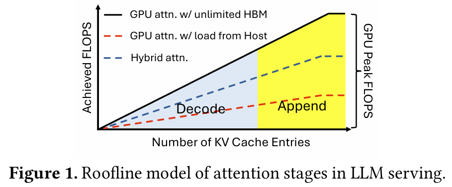

图1展示了LLM推理中注意力算子的屋顶模型[38]。解码和多数附加阶段是内存受限的，其中CPU在注意力计算期间有可能跟上GPU。理想情况下，最佳注意力性能是通过仅使用GPU且具有无限GPU内存的注意力实现的，始终低于峰值GPU带宽上限。具有CPU卸载的GPU注意力（由红色虚线表示）允许KV缓存大小超过GPU内存容量，但由于通过PCIe在CPU和GPU之间传输KV缓存而导致性能下降，使得GPU在传输期间空闲。 Alternatively，本工作探索混合注意力以利用CPU和GPU内存的组合带宽，实现两个设备的聚合计算能力。  

我们提出了HGCA，一种混合CPU-GPU注意力机制，它在具有不同运行时键值管理的设备上划分计算。为了在两个异构设备上简化注意力计算，HGCA分别在GPU和CPU上执行全注意力和稀疏注意力。全注意力操作存储在GPU内存中的KV条目，对应于最近生成的令牌，而稀疏注意力选择性地关注驻留在CPU内存中的高分KV条目。CPU上的注意力输出随后传输到GPU，其中两个部分注意力输出使用对数求和指数融合进行聚合。此外，HGCA利用多个CPU线程对仅最关键KV条目执行每头稀疏注意力，有效保留推理期间的上下文信息并保持高准确性。  

HGCA的混合注意力提供两个优势。首先，CPU注意力不仅对整体注意力计算贡献计算量，而且消除了跨设备数据传输瓶颈——部分注意力结果比原始KV缓存小几个数量级，可以通过零拷贝传输高效传输到GPU内存。其次，与广泛使用的Top-K稀疏注意力相比，HGCA的头部粒度稀疏注意力更准确地识别关键KV条目。在三个代表性LLM上的实验结果表明：1）HGCA可扩展到更大的LLM、更长的序列输出、更大的批处理大小，在单个或多个商用GPU上均能实现；2）HGCA实现的准确性接近或优于全注意力，同时显著优于现有的稀疏注意力方法；3）HGCA作为现有注意力层的即插即用替代实现，可以以最小的工程努力无缝集成到任何LLM中。  

## 2 背景与动机  

注意力机制是LLM的核心，使它们能够通过引用先前生成的中间结果来捕获复杂的语义关系。在自回归生成过程中，来自提示的输入嵌入通过多个层传递，每层的KV状态被缓存以供未来令牌生成重用。  

LLM生成可以正式分为三个阶段——预填充（prefill）、附加（append）和解码（decode）——基于查询令牌与KV缓存条目的比率。在预填充阶段，每个输入令牌仅关注新生成的KV状态，导致查询与KV的比率为1:1。这种配置最大化GPU利用率，使该阶段受计算限制。相反，附加和解码阶段的特点是查询与KV的比率显著较低，导致KV重用减少和内存访问增加，这将瓶颈转移到内存带宽。这些阶段在实践场景中很常见，例如提示扩展和自回归令牌生成，特别是在思维链推理中，输出的迭代细化对于实现更高准确性至关重要。在以下部分中，我们详细解释KV缓存的构建，并分析全注意力和稀疏注意力机制的性能特征，主要关注解码和追加操作。  

### 2.1 标准全注意力  

标准全注意力确保所有KV条目都参与注意力过程，防止任何重要信息被忽略。以下方程概述了LLM推理的解码和追加过程，如[38]所述。在推理过程中，传入的隐藏状态被投影为查询（query）、键（key）和值（value）向量，然后转置为形状 $R^{h\times N\times d}$ ，其中h、N和d分别表示注意力头的数量、传入序列的长度和隐藏维度。传入的KV随后与先前的 $K_{\text{cache}}$ 和 $V_{\text{cache}}$ 连接，导致扩展的 $K^{\prime} V^{\prime}$ 大小 $N^{\prime}=N+N_{\text{cache}}$ ，如下所示。  

$$K=concat(K_{cache},K)\quad V=concat(V_{cache},V)\in R^{h\times N^{\prime}\times d}$$  

每个查询向量通过计算归一化注意力分数来评估相应键值对的相关性，该分数使用softmax函数独立地在其头部维度上应用，其中较高的分数表示对输出的影响更大。这些注意力分数随后用于计算每个查询的值向量的加权和，产生与查询矩阵Q形状相同的输出矩阵O。  

$$S=Q K^{T}\quad A=softmax(S)\in R^{h\times N\times N^{\prime}},\quad O=AV\in R^{h\times N\times d}$$  

查询在处理后被丢弃，而键和值可以被缓存以供将来重用。在解码/追加阶段，仅生成N个输出令牌，但需要重复加载 $N^{\prime} KV$ 对用于softmax和累积操作。通常， $N\ll N^{\prime}$ ，导致内存带宽成为瓶颈，而计算资源未被充分利用。当 $N^{\prime}$ 增长超过GPU的内存容量时，将KV对卸载到主机内存成为一种自然的解决方案。然而，显著较低的PCIe带宽（比设备内存低几个数量级）阻碍了注意力效率。  

### 2.2 稀疏注意力  

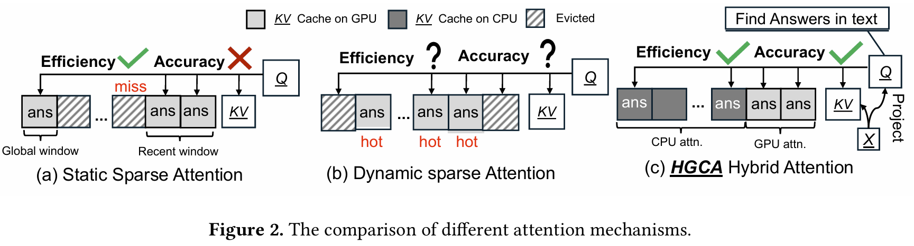

在注意力过程中，许多KV对接收的softmax权重可以忽略不计，可以省略而对准确性的影响最小。高效识别并关注最显著的KV条目减少了计算、内存使用和数据传输开销。如图2所示，现有方法分为两类：静态和动态稀疏注意力。静态稀疏注意力根据经验观察到的模式选择重要的KV条目，并仅将这些保留在GPU内存中。KV条目的相关性通常与其绝对和相对位置相关。Longformer[3]强调了固定窗口内最近条目的重要性，而StreamLLM[34]将早期序列令牌（“注意力汇聚点”）识别为生成准确输出的关键。如图2(a)所示，静态方法通常结合最近窗口和全局窗口来选择相关KV条目，而无需运行时开销。  

动态稀疏注意力在运行时识别显著KV条目，如图2(b)所示，实现了上下文感知自适应，并减少了排除重要令牌的可能性。H2O[45]采用最近最少使用（LRU）策略来跟踪最近访问的条目，假设注意力模式中存在时间局部性。Quest[29]执行块状扫描以平衡准确性和延迟，而Infinigen[13]利用先前的查询异步预测未来的KV访问。然而，运行时识别引入了计算开销，这可能抵消稀疏化带来的性能增益。  

大多数稀疏注意力方案固定所选KV条目的数量（top-k）。Twilight[16]通过动态选择每层的top-P条目对此进行了改进，适应上下文长度。然而，由于控制流效率低下和非合并内存访问，尤其是在大型模型中，在GPU上进行细粒度的每头KV跟踪是不切实际的。  

### 2.3 注意力分析  

接下来，我们使用WikiText数据集上的OPT-6.7B模型对注意力计算进行详细分析。在其他开源LLM和数据集上一致观察到类似的注意力模式。我们重点分析不同层和头上KV注意力分数的模式、KV之间的空间和上下文局部性，以及KV缓存卸载的性能影响。  

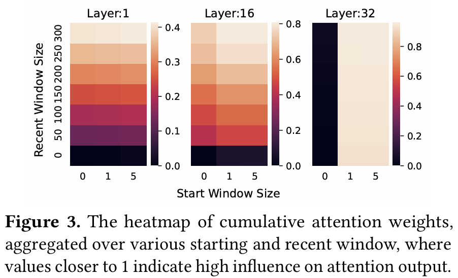

图3绘制了入口层、中间层和出口层的累积注意力分数的热力图。累积注意力分数在最近窗口和起始窗口上聚合，衡量了有限范围内稀疏注意力的有效性。如图3所示，注意力分数在入口层均匀分布，但在出口层变得越来越偏斜。例如，在OPT-6.7B模型中，输入提示中的第一个令牌在第32层成为主导令牌。这一观察表明，稀疏注意力应针对每层动态调整。此外，静态稀疏注意力和基于top-k KV的基线动态稀疏注意力很可能错过重要的KV条目。  

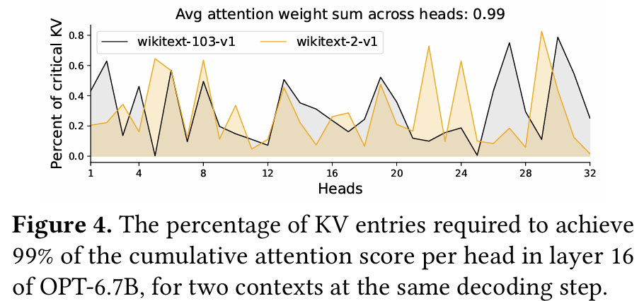

在基线全注意力机制中，每个注意力头内所有被关注键条目的注意力权重之和等于1。因此，累积注意力值衡量了稀疏注意力的有效性。图4显示了在OPT-6.7B模型第16层的32个注意力头中，实现0.99聚合注意力分数所需的KV条目百分比。该图包括来自WikiText数据集的两个文本的KV注意力分数模式，模拟用户的两个独立推理请求。如图4所示，不同头部的注意力分数分布存在很大差异。例如，虽然10%的偏斜KV条目占头12的注意力分数的99%，但头30需要接近80%的均匀分布KV才能达到相同的累积分数。此外，不同文本的注意力分布存在显著变化。这两个观察表明，稀疏注意力应在更细的粒度上应用，即在每头级别。统一的层 wise top-k选择策略可能导致某些头中排除关键KV条目，而其他头中包含冗余条目。  

**观察O-1：注意力分布在更深层变得越来越偏斜，并且在同层内的不同头之间表现出显著变化。**  

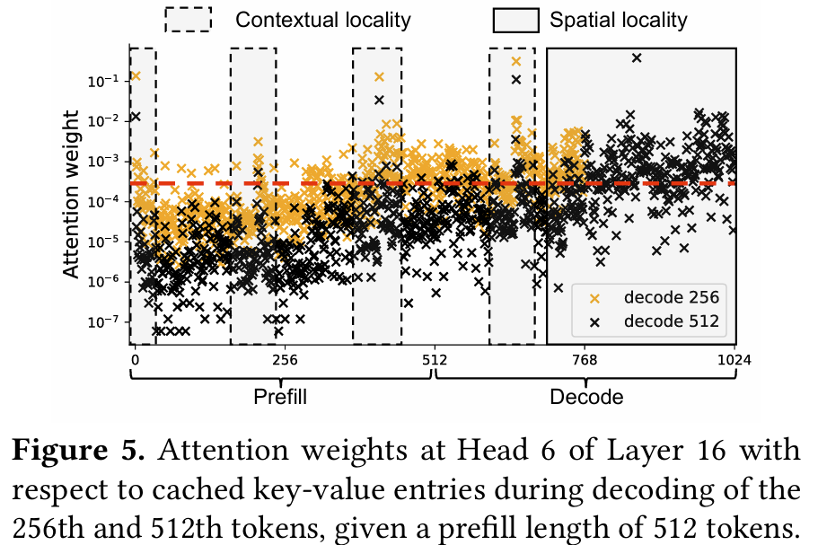

图5显示了单个推理请求在两个解码位置（第256和第512个令牌）的注意力分数分布。橙色点表示生成256个令牌后存在的KV条目，而黑点包括将KV缓存扩展到令牌512的额外条目。我们有两个观察。首先，注意力分数表现出空间局部性，集中在最近计算的KV条目（实线矩形内）以及预填充阶段的初始KV上，这两者都获得高注意力分数。分数也随着令牌远离当前令牌而衰减。其次，同一位置的注意力分数随着解码的进行而降低，因为令牌与解码前线的距离增加。然而，一些关键的KV条目表现出强大的上下文局部性，在整个解码过程中保持影响力，如虚线框内的几个高分橙色和黑点所示。这些是此特定提示的重要令牌。红色水平线划定了达到最新输出长度0.9累积注意力分数所需的KV条目集。可以清楚地看到，关键KV集包含空间局部性区域内的大部分KV以及较早生成的少数上下文重要KV。  

**观察O-2：注意力分布在给定上下文中表现出空间局部性和上下文局部性。**  

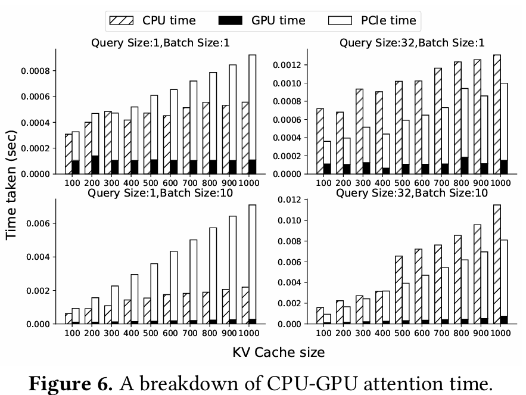

图6比较了从主机内存加载KV缓存条目到GPU时，基于CPU和基于GPU的注意力机制。尽管GPU通常提供比CPU更高的计算吞吐量和内存带宽，但它们在此设置中并不总是优于CPU。对于单令牌解码（查询大小为1），基于GPU的注意力较慢，这是由于在主机和GPU内存之间传输KV缓存条目的显著开销。在典型的追加操作大小（查询大小为32）下，基于GPU的注意力与CPU性能匹配，因为计算开销分摊了传输成本。随着批处理大小增加，GPU注意力由于能够利用并行性而更高效地扩展；然而，相关的PCIe传输开销也成比例增加。在所有配置中，通过PCIe传输KV缓存始终主导GPU注意力延迟，使其成为主要性能瓶颈。  

**观察O-3：当考虑通过PCIe总线将KV条目加载到GPU内存的开销时，基于CPU的注意力可以实现与基于GPU的注意力相当的性能。**  

**总结。** 我们对注意力计算的分析揭示了当KV缓存超过可用GPU内存时，CPU和GPU执行之间存在明显的权衡。我们还证明，细粒度的每头稀疏注意力有很强的潜力提供高准确性。这些观察激励我们开发一种混合CPU-GPU注意力机制。  

### 2.4 更多相关工作  

**选择性注意力：** 对关键中间结果的选择性注意力是一种广泛研究的策略，用于缓解LLM长上下文推理的挑战，尤其是在严格的硬件约束下。它还通过丢弃冗余或嘈杂的KV缓存条目来提高模型质量。先前的工作表明，KV条目的重要性因任务而异[3, 11, 43]，并提出了高效的方法来仅保留最相关的条目。由于其在NLP中的成功，选择性注意力已扩展到视觉和图处理等领域[7, 17, 42]。随着聊天机器人应用和测试时扩展[21]的兴起，对既硬件高效又可扩展的注意力机制的需求日益增长。作为回应，最近的工作引入了针对现代加速器优化的块状稀疏注意力内核[18,35, 41]。  

**KV缓存管理：** 高效的KV缓存管理是可扩展LLM推理的关键。早期方法通过基于页表的缓存管理解决GPU内存碎片问题，如vllm[1,12,24]以及自定义注意力机制。后来的工作提出了跨上下文重用KV条目以减少冗余[9, 36]，以及缓存合并以降低内存使用[10, 31]。KV重用已通过分解的预填充-解码执行扩展到分布式设置，其中预填充生成的KV条目被传输到解码集群以提高利用率[2, 25, 48]。  

**混合计算：** 长上下文推理的高计算和内存需求刺激了关于利用分层内存和多个计算设备的混合系统的工作[19, 40]。一些方法通过细粒度交换[27]或计算分区[28]动态扩展模型超出设备内存。随着更长的上下文将KV缓存大小推至设备内存限制之外，新兴系统将注意力计算卸载到具有更大内存的外部设备[22, 37, 47]。  

## 3 HGCA  

在本节中，我们介绍HGCA，一种新颖的GPU-CPU混合注意力机制，旨在LLM推理中提供高准确性和效率，尤其是对于长序列上下文和大批处理大小。我们首先给出HGCA的高级系统概述，并概述其核心挑战和我们的解决方案（§3.1）。然后我们详细说明HGCA的关键组件，包括局部性感知的KV缓存管理（§3.2）以及混合注意力机制（§3.3）。  

### 3.1 系统概述  

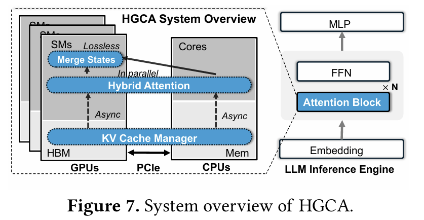

图7展示了HGCA的架构，该架构在LLM推理的注意力块内运行。HGCA在异构硬件上协调内存和计算，以解决LLM服务中不断增长的KV缓存内存占用。它选择性地将部分KV缓存卸载到CPU内存，从而克服长序列的GPU内存限制。与先前的仅卸载方法（例如InfiniGen[13]通过CPU扩展内存容量）不同，HGCA更进一步，利用CPU计算与GPU协同执行注意力操作。这种协同设计将标准的仅GPU推理管道转变为协作的CPU-GPU执行，从而实现高效且可扩展的LLM推理，而不牺牲性能或准确性。  

然而，在CPU和GPU上实现高效的联合注意力执行需要克服两个关键挑战：（1）计算差异：尽管配备具有与GPU相当内存带宽的高容量内存，CPU对矩阵密集型工作负载的吞吐量显著低于现代GPU。天真地将大部分注意力计算卸载到CPU会使端到端吞吐量出现瓶颈。系统必须仔细平衡工作负载，以便在卸载的KV数据上的CPU计算不会减慢GPU的进度。（2）有限且慢速的互连：连接CPU和GPU的PCIe总线具有受限的带宽和增加的延迟。频繁或大批量的KV缓存数据传输很容易成为瓶颈，淹没总线并使GPU停滞。最小化通信开销对于防止在卸载场景中严重的吞吐量下降至关重要。  

为了解决这些问题，HGCA引入了两种关键技术——即，局部性感知的KV缓存管理（§3.2）和带宽高效的混合注意力（§3.3）——共同管理数据位置和注意力计算方式。  

首先，HGCA的KV缓存管理器在GPU和CPU上分配和管理KV缓存，其指导观察是最近生成的令牌对下一个令牌具有最高的注意力相关性（§2）。管理器优先将最近的KV条目保留在GPU内存中，并在GPU内存受限时机会性地将较旧、影响力较小的条目卸载到CPU内存。这种近期感知的放置意味着在每个解码步骤中，GPU可以快速访问最相关的上下文，而大部分不常用的上下文存储在充足的CPU内存中。更重要的是，这种近期感知的卸载使HGCA能够更好地利用远距离令牌注意力计算中的稀疏性。由于这些令牌通常对最终注意力的贡献权重较低，它们的KV条目可以在CPU上通过稀疏注意力高效处理。利用CPU先进的控制逻辑和多核架构，HGCA发明了一种更细粒度的、每头稀疏化方法，显著减少计算负载而不影响准确性。这种稀疏化显著缩小了CPU和GPU之间的性能差距。  

此外，受分块注意力计算[6]的启发，HGCA在两个协调部分执行注意力，然后通过无损聚合组合结果。它将GPU驻留和CPU驻留的KV缓存条目视为两个独立的块进行注意力计算。GPU计算其本地最近KV条目块上的注意力（使用全注意力），而CPU并行计算卸载的较旧条目块上的注意力（使用稀疏近似）。每边产生一个部分结果以及必要的归一化统计信息，HGCA应用归一化在GPU上合并这些部分注意力输出。关键 insight 是合并结果所需的中间输出非常小—— essentially 是从CPU传输到GPU的部分注意力输出和归一化统计信息，即，比传输整个卸载的KV缓存小几个数量级。最终的注意力上下文反映了来自完整序列的贡献，即最近和远距离令牌。  

总之，HGCA将CPU用作大内存计算伙伴而非仅仅是存储设备，将其工作与GPU计算重叠。通过将局部性感知的KV放置与带宽高效的混合注意力机制集成，HGCA缓解了GPU内存压力，最小化了PCIe流量，并在单个消费级GPU上实现了长序列上下文和大批处理大小的可扩展、高吞吐量推理。  

### 3.2 局部性感知KV缓存管理  

HGCA的KV缓存管理器专注于两个主要任务：（1）管理GPU和CPU内存以保留和卸载KV缓存（图8中的1和2）和（2）跟踪KV缓存的相关性以进行CPU端稀疏化（3）。  

#### 3.2.1 GPU管理的KV保留和卸载  

HGCA中的KV缓存管理器在每个GPU设备上预分配一个连续的内存缓冲区作为本地KV缓存池，专门保存该GPU注意力层生成的KV条目。这通过为每个设备提供专用的内存块来避免频繁的GPU内存分配和碎片。为了使缓存布局与基于Transformer的LLM架构对齐——即由交错的注意力和前馈层组成——每个GPU的缓冲区进一步划分为与模型注意力层对应的子区域，即对于具有N个注意力层的Transformer，GPU的KV池被划分为N个固定大小的段，每个段缓存一层注意力的键和值。这种逐层分区反映了模型的结构，并允许独立管理每层的KV条目（例如，驱逐和卸载可以逐层进行而不影响其他层）。  

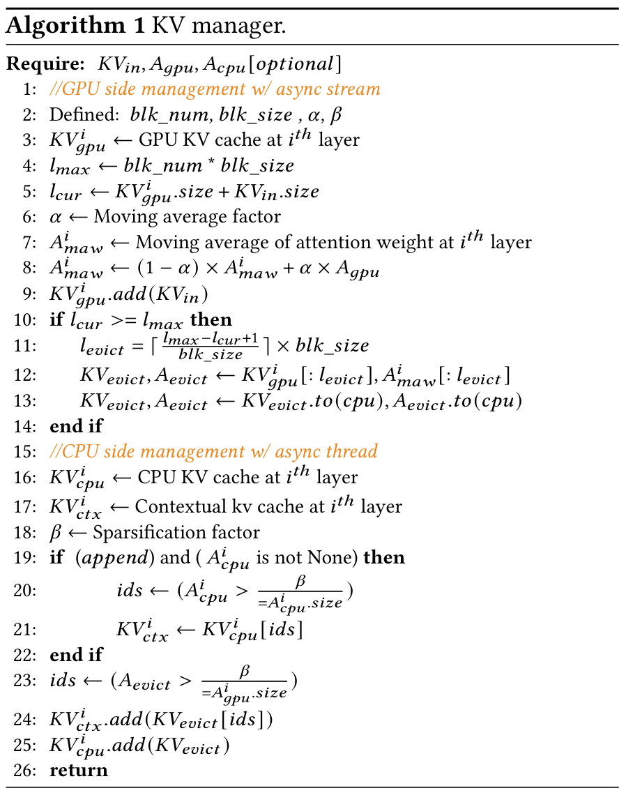

为了利用解码器注意力中固有的时间局部性（§2, O-3），每个层特定的子区域被组织为由固定大小KV块组成的循环缓冲区²。生成新令牌时，其KV条目插入缓冲区的头部（算法1，第9行），基于最近生成的令牌更可能在近未来解码步骤中被关注的观察。随着新条目积累，缓冲区以FIFO方式自然推进，逐渐覆盖较旧的块。当缓冲区达到容量时，位于尾部的最旧块被选择驱逐并卸载到CPU内存（第13行）。这将最相关的上下文保留在GPU内存中以进行全注意力，而较少引用或陈旧的上下文被卸载到CPU内存，在那里可以应用稀疏注意力机制。  

最后，为了实现卸载上下文的细粒度相关性估计，HGCA将每个KV条目与反映其在解码过程中历史重要性的注意力权重移动平均（MAW）相关联。具体地，每个GPU驻留的KV条目跟踪一个MAW值，在整个生成过程中更新（第8行），捕获其被关注的强度。驱逐时，相应的MAW与KV块一起传输到CPU内存（第13行）。这种轻量级元数据在GPU上产生最小开销，但允许CPU端运行时执行注意力感知的稀疏化，基于经验效用而非仅年龄选择性地保留或修剪上下文。  

#### 3.2.2 CPU管理的KV稀疏化  

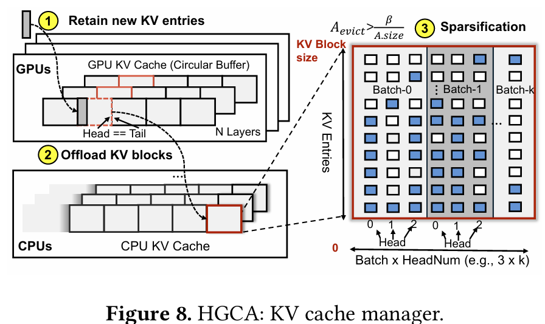

与GPU本地缓冲区相比，主机端缓存管理器维护对GPU上执行的所有注意力层的KV缓存的引用。它被设计为支持动态扩展，从而容纳卸载的KV块的存储（图8）。从这些卸载的块中，HGCA动态识别并检索最显著的KV条目以促进高效的稀疏注意力计算。  

现有的GPU端稀疏化方法通常依赖固定或预定的注意力预算来过滤KV条目，例如，H2O[45]保留具有最高累积注意力分数的前20%令牌。虽然此类top-k令牌保留方案在减少内存使用和加速注意力计算方面有效，但它们受GPU硬件限制：GPU擅长均匀、规则的工作负载，具有合并内存访问和简单控制流；相反，不规则、细粒度的操作在GPU上效率低下，使得需要额外运行时分析的自适应GPU端方法因添加的分析和复杂控制逻辑而产生高开销[10, 15]。不幸的是，粗粒度的固定预算策略可能忽略微妙但重要的注意力模式（§2）。  

**头部粒度稀疏化：** 相反，HGCA将KV缓存卸载到CPU内存并在CPU端执行稀疏化，在那里不规则控制流和细粒度过滤可以高效处理。  

将KV块及其MAW值卸载到主机后，异步CPU端稀疏化线程立即开始与GPU推理并行进行令牌选择。CPU的灵活性允许在每头粒度进行令牌选择（由O-2, §2激励），这是一个在GPU上难以实现的细粒度级别。在图8(3)中，HGCA独立评估每个注意力头的KV条目，应用自适应阈值机制决定保留哪些条目。让每个KV条目的累积注意力权重为Aevict（其MAW值），并让A.size表示GPU端KV条目的总数。我们定义一个可调阈值参数 $\beta$ 。一个KV条目被选择用于稀疏注意力当且仅当它满足： $A_{\text{evict}}>\frac{\beta}{A_{\text{gpu}}.size}$ ，即其注意力权重超过该头部总注意力计数的一个分数β。满足此条件的条目被视为“显著”并被保留，而低于阈值的条目则从稀疏注意力中丢弃。但它们仍保留在CPU内存缓冲区中以供未来重新评估。选择后，保留条目的MAW值被重新归一化，使其注意力权重在该头部内求和为1，为下游稀疏注意力计算保留有效的概率分布。

阈值参数β控制稀疏化的激进程度：较大的β强制执行更严格的过滤，减少保留的KV条目数量以降低CPU计算开销——可能以准确性为代价——而较小的β保留更多条目以优先考虑准确性但增加开销。这种自适应阈值在每个注意力头上运行，动态反映该头的注意力分布：具有尖锐、峰值注意力的头部保留较少的高价值KV条目，而具有平坦分布的头部保留更多。

β通常设置为1的实证评估表明，HGCA的每头稀疏化可以为某些头部选择高达30%的令牌，而对其他头部则低至不到1%——同时保持与全注意力相当的准确性。通过在相应头的上下文中评估每个令牌的MAW，HGCA基于CPU的策略捕获上下文局部性，保留具有显著注意力峰值的KV条目，如图5所示。

**重评估：** 一旦KV条目在CPU端被稀疏化，它们通常不需要重新评估，直到当前解码会话结束，因为上下文局部性已经建立。然而，当发出新提示时——通常称为追加操作（例如，在多轮交互中）——新追加的令牌可能会改变先前卸载条目的上下文相关性。先前被认为不重要的令牌可能随着上下文演变而变得显著，而先前重要的令牌可能相关性降低。例如，图4表明，显著KV条目的集合在不同上下文条件下可能显著变化。

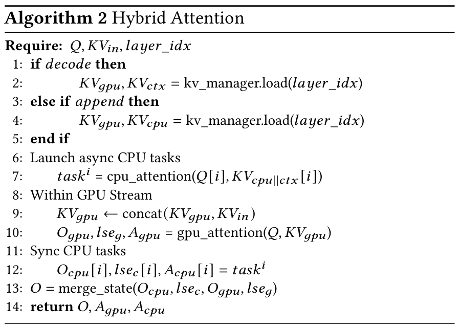

为了适应这种变化，每次追加操作后在CPU上启动一个异步评估线程。该线程重新评估CPU上存储的所有KV条目的上下文相关性，如第19行所述，使用从完整CPU端KV缓存计算的注意力分数Acpu（算法2，第4行）。不再满足显著性标准（定义为Aevict > $\frac{\beta}{A_{\text{gpu}}.size}$）的KV条目被驱逐，而先前修剪的现在超过阈值的条目被恢复。这种动态重新稀疏化机制确保CPU端KV缓存保持适应不断演变的上下文，从而保持计算效率并使模型能够合并新相关信息。

### 3.3 混合注意力

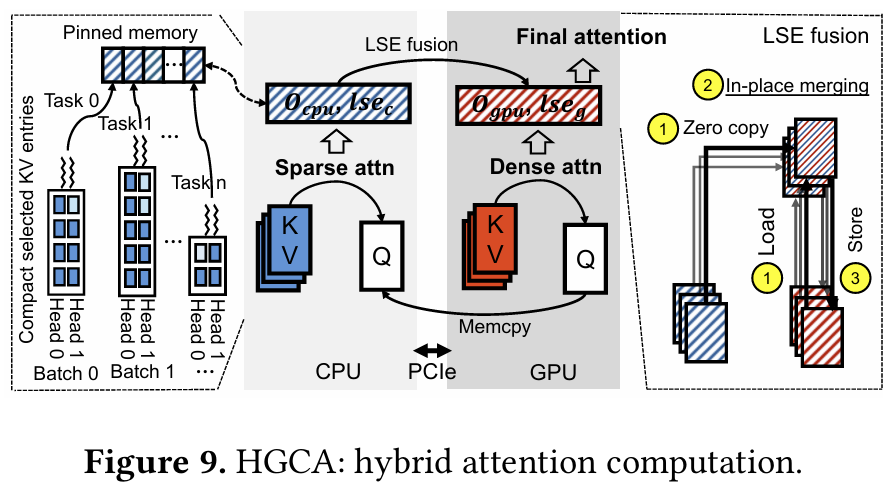

HGCA引入了一种联合混合注意力机制，如图9所示，将注意力计算在GPU和CPU之间拆分。GPU处理最近上下文的滑动窗口（使用全密集注意力），而CPU使用稀疏选择性注意力管理卸载的较旧上下文。最终的注意力是通过合并来自CPU和GPU的这两个部分注意力结果获得的。这种协同设计追求两个关键目标：（1）减少计算差异：GPU在小子集上执行重型密度计算，而CPU仅处理轻量稀疏子集，防止一方成为瓶颈。（2）实现高效协作：GPU和CPU工作负载并发执行，采用多核并行（例如，将稀疏注意力任务映射到多个CPU核心）、高效数据表示（例如，用于结果合并的局部注意力输出和缩放因子）和通信优化（例如，零拷贝数据传输）。通过这些，HGCA最大程度地利用CPU处理器的计算能力，并有效掩盖传输延迟。

**GPU本地密集注意力。** HGCA的KV缓存管理（§3.2）支持在GPU上进行滑动窗口密集注意力：它仅在GPU内存中保留最新的KV块，随着新令牌的生成，将较旧的块驱逐到CPU内存。这种设计形成了一个覆盖最近W个令牌的有界窗口，这些令牌使用标准密集注意力操作进行处理（算法2，第10行）。

**CPU本地稀疏注意力。** 回想一下，HGCA采用每头稀疏化机制来选择最显著的KV条目进行稀疏注意力（§3.2.2）。为了实现高效的稀疏注意力计算，HGCA按注意力头组织这些选定的KV条目，将每个头的条目连续存储在CPU内存中³。这种连续排列导致每头的KV条目紧凑子集，便于高效并行执行。此外，HGCA通过将这些子集分布在多个线程上（例如，每个在单独的CPU核心上运行）来利用现代CPU的多核。每个线程仅计算其指定子集（对应于特定注意力头）的注意力。由于不同线程处理的子集是不相交的，最终的注意力输出通过连接每个线程的计算结果获得，产生组合的多头注意力输出（例如，存储在固定内存中，如图9所示）。

然而，增加批处理大小带来了一个实际挑战：所需线程数量与批处理大小和注意力头数量的乘积成比例增长，可能导致CPU过载——即线程数量远多于可用CPU核心（即增加上下文切换开销）。为了缓解此问题，HGCA将来自多个相邻头的计算合并到单个稀疏注意力任务中，从而减少总线程数（图9）⁴。合并多个相邻头需要宽松的每头稀疏化方法，因为不同的头可能选择不同数量的KV条目。为了使合并头之间的选定KV条目对齐，HGCA允许填充额外的KV条目，即使它们不满足阈值条件。CPU灵活高效的控制逻辑使HGCA能够轻松管理此合并过程并处理不同大小的任务——这在GPU上更具挑战性，GPU偏爱刚性、统一的执行模式，并且通常在相同大小的任务上表现最佳。

**状态合并。** 在计算GPU滑动窗口和选定的CPU KV条目的注意力后，HGCA合并两个部分结果以获得最终的注意力输出。目标是将这些计算组合，就像它们来自令牌联合上的单个softmax一样，同时保持数值稳定性和计算效率。受FlashAttention[6]启发，HGCA采用就地聚合和对数求和指数（LSE）融合策略。在GPU计算其部分注意力输出 $O_{\text{gpu}}$ （算法2，第10行）且CPU计算其部分输出 $O_{cpu}$ （第12行）后，两个输出在各自域内局部归一化，并且必须适当重新缩放以获得统一结果。每个部分结果与一个对数求和指数项关联，形式为：

$$\operatorname{lse}_I=\log\left(\sum_{j\in I} e^{s_j}\right),$$

其中 $s_{j}=q\cdot k_{j}$ 表示对应于第 $j^{\text{th}}$ 个键的注意力分数。索引集I标识驻留在特定计算域（CPU或GPU）中的令牌子集。然后执行协调归一化步骤以计算跨越两个域的统一缩放因子：

$$ z=e^{lse_{c}}+e^{lse_{g}}.$$

使用这个共享因子z——通过合并CPU和GPU之间的两个标量（最大分数和指数和）导出——部分输出被缩放并就地组合：

$$ O=\frac{1}{z}\left(e^{lse_{c}}\cdot O_{cpu}+e^{lse_{g}}\cdot O_{gpu}\right).$$

这产生与在GPU和CPU令牌联合上执行单个softmax操作等效的输出。合并是通过将 $O_{cpu}$ 直接累加到GPU的输出缓冲区并应用共享归一化因子来就地执行的。LSE技巧的使用保证了在融合来自异构源的注意力分数时的数值稳定性。通信开销最小，因为只有向量 $O_{cpu}$ 和标量 $lse_{cpu}$ 从CPU传输到GPU，避免了传输完整KV张量的需要。在实践中，HGCA通过零拷贝内存访问促进此交换，使GPU能够直接访问CPU驻留数据。这种零拷贝策略绕过GPU内存层次结构，特别适用于小型或不规则数据结构，使其非常适合HGCA混合注意力机制的动态行为。合并过程在注意力层结束时发生，确保组合输出可以直接由后续前馈网络使用。

## 4 实现

我们使用大约1.5K行Python代码基于PyTorch v2.4+cu124实现了HGCA。

**KV缓存管理器：** KV缓存管理器处理CPU和GPU之间的缓存分配和移动。在GPU上，HGCA在初始化时静态将注意力层映射到设备，并通过torch.empty每设备预分配一个连续缓冲区。每个缓冲区由专用CUDA流管理，存储KV条目及其MAW元数据。层级别指针跟踪每个批次的开始/结束偏移，实现高效前缀访问、增量更新和驱逐检测。当容量超出时，最旧的块通过指定流异步卸载到CPU内存，避免中断推理。在CPU上，HGCA使用threading.Thread将每层KV缓存管理为可增长张量列表。上下文缓存每头保留选定的KV条目在单独的张量中，允许可变长度保留。专用线程执行稀疏化以更新此缓存。在每个查询之前，同步CUDA流以最终确定GPU更新。在每层结束时，CPU线程同步以确保过滤块被合并。所有操作保持不在推理关键路径上。

**混合注意力：** HGCA的混合注意力利用torch.jit优化GPU和CPU上的执行。在GPU上，密集注意力以最小修改集成，以计算对数求和指数（LSE）统计信息。在CPU上，通过torch.fork并行化对上下文KV缓存的稀疏注意力，为每个线程分配一个头子集。尽管上下文长度可变，固定输出形状允许预分配共享的固定缓冲区，线程写入预计算偏移。torch.wait确保在合并之前同步。我们扩展了FlashINfer[39]的merge_state以进行零拷贝CPU-GPU融合，并支持沿批处理和头维度进行批处理合并以实现可扩展性。

## 5 评估

**平台。** 所有实验均在双插槽服务器上进行，每个插槽配备一个Intel Xeon Gold 6430处理器（每插槽32核心）。系统配置了八个DDR5内存模块，提供总共512 GB的系统内存。服务器还配备了八个NVIDIA A6000 GPU，每个具有48 GB设备内存，通过PCIe 4.0互连。每个GPU连接提供最高32 GB/s的单向带宽。

**模型和工作负载。** 我们选择了三个具有不同参数规模和架构设计的代表性开源语言模型：LLaMA[30]、GPT-NeoX[4]和OPT[44]。为了评估推理性能，我们使用了WikiText数据集[20]，该数据集非常适合评估长上下文生成能力。

**基线。** 我们将HGCA集成到两个广泛使用的推理框架——FlexGen[27]和Hugging Face Transformers（HF）[33]中，并评估其与相关基线的性能。FlexGen针对内存受限的单GPU环境，通过交换模型组件（例如权重和KV缓存）在设备和主机内存之间利用分层内存层次结构。这种设计以延迟换取扩展容量以最大化吞吐量。我们将HGCA与基于FlexGen的替代方案进行比较，这些方案实现了稀疏注意力机制和KV卸载策略，包括Infinigen[13]（采用跨层的基于排练的KV预取）和H2O[45]（基于累积注意力分数驱逐KV条目）。

Hugging Face Transformers（HF）框架为多样化模型配置提供广泛支持，并在GPU内存不足时具有自动设备映射功能。我们通过与管理设备分配逻辑的框架协调管理KV缓存放置，将HGCA与HF集成。性能在两种配置下评估：1）GPU受限设置，其中KV缓存被卸载，和2）GPU丰富设置，其中所有KV缓存保留在高带宽设备内存中。

**性能指标。** 我们报告以下性能指标：1）作为输出序列长度和批处理大小函数的端到端任务完成时间，2）归因于KV注意力的峰值内存消耗加上静态模型权重，3）跨不同生成配置的推理吞吐量，以及4）每令牌生成延迟。为确保HGCA修改的注意力机制不损害模型准确性，我们还报告困惑度分数，即根据真实情况的每令牌生成准确性度量。

### 5.1 微基准测试

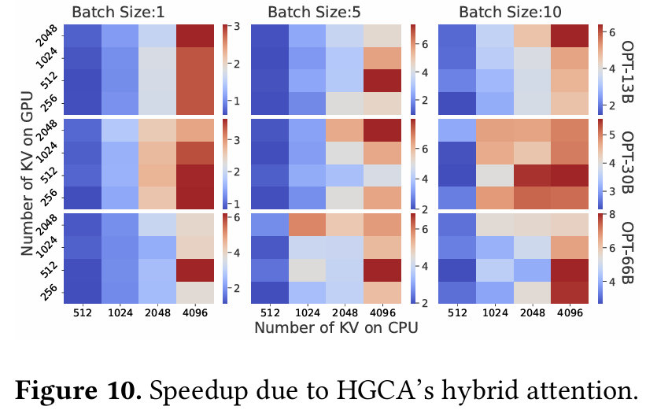

我们首先使用三个OPT LLM在不同批处理大小下评估HGCA混合注意力在单个注意力层上的好处。这些模型共享相同的隐藏维度大小128，但注意力头数量不同。图10显示了HGCA混合注意力与纯GPU注意力相比实现的加速比，后者需要将当前驻留在CPU内存中的KV条目加载到GPU内存中。相比之下，混合注意力在CPU上计算注意力，并且仅将中间结果传输到GPU。y轴显示已驻留在GPU内存中的KV条目数量，而x轴显示卸载到CPU内存的条目数量。图中较暖的颜色表示由于混合注意力带来的更高加速比。该图表明，随着更多KV条目驻留在CPU内存中且批处理大小增加，混合注意力变得越来越有益，使其特别适用于长上下文生成。图11进一步显示了这两种方法中注意力时间的细分，其中GPU上的KV条目数量设置为1024。该图表明，随着KV大小增长，KV条目的PCIe传输时间成为日益增长的瓶颈。尽管CPU注意力比GPU注意力慢几倍，但合并时间（涉及通过PCIe传输CPU注意力结果）可以忽略不计，从而导致整体加速。

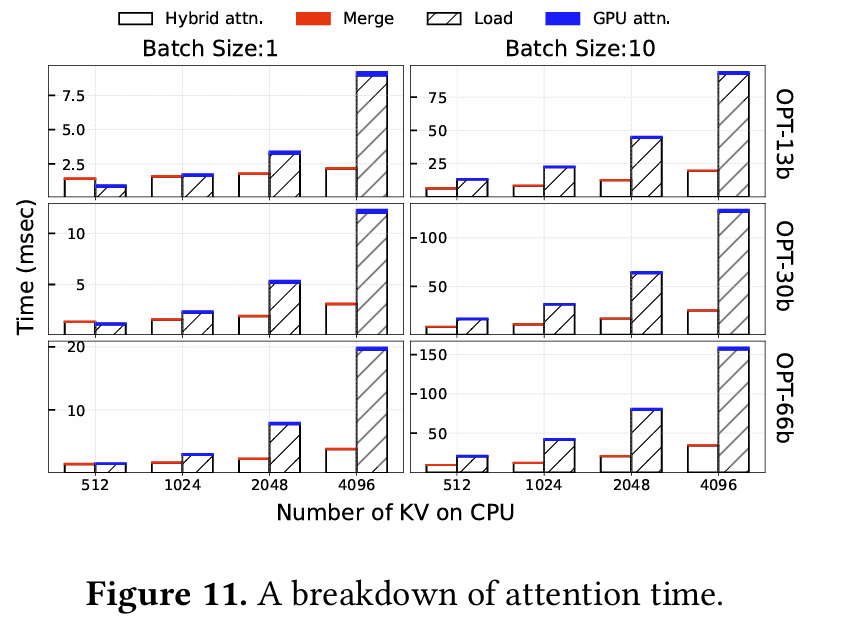

### 5.2 端到端模型性能

接下来，我们将HGCA的端到端推理性能与几种代表性方法进行比较，重点关注吞吐量、任务完成时间和内存使用情况。

首先，我们利用FlexGen框架在单个NVIDIA A6000 GPU上评估推理性能，使用OPT模型。我们测量了128个令牌的总生成时间，预填充长度为1920个令牌。FlexGen支持按需模型权重交换，因此可以容纳更大的模型。如图12所示，我们评估了三个OPT模型，并将批处理大小增加到每种方法支持的最大值——FlexGen、H2O、Infinigen和HGCA。由于OPT-30B和OPT-66B模型无法放入单个GPU，我们静态配置75%的模型权重驻留在GPU上用于OPT-30B，25%用于OPT-66B。此外，遵循Infinigen[13]的实验设置，100%的KV条目最初放置在CPU内存中，并在注意力期间按需加载到GPU内存。FlexGen执行全注意力，而其他方法使用稀疏注意力。根据其原始出版物中的设置，我们将Infinigen和H2O设置为对20%的KV执行稀疏注意力（top-k）。我们将HGCA中驻留GPU的KV百分比设置为5%，其余存储并在CPU上计算。

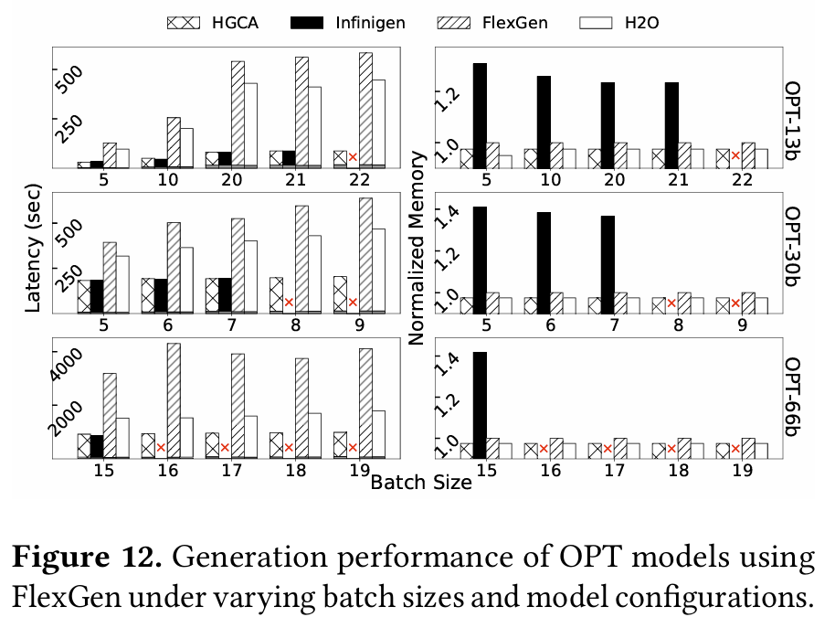

图12显示，HGCA在所有批处理大小上 consistently 优于FlexGen和H2O，主要由于这些方法中KV加载和基于LRU的KV驱逐的开销。相比之下，Infinigen实现了可比较的性能，但招致了显著更高的内存使用，因为其注意力排练需要额外的内存缓冲区来预测注意力分数。不幸的是，由于其高内存开销，Infinigen在所有模型上遇到内存不足（OOM）错误，在大型OPT-66B模型中失败尤其严重。

Hugging Face（HF）提供了一个直观、用户友好的框架，支持自动模型到设备映射，与更广泛的模型兼容。HF中的一个重要设计是自动在多个GPU上分区和分配模型权重，以协助模型部署和动态分配KV缓存以利用剩余GPU内存。与HGCA不同，HF执行全注意力，并且只能通过利用多个GPU进行扩展。相比之下，HGCA限制用于KV存储的GPU内存量，并预分配用于片上KV条目的内存。我们将HGCA的两个变体与HF进行比较。首先，我们按照HF的模型权重分区将HGCA扩展到使用多个GPU，但仅启用GPU（全）注意力（表示为GPU KV比率：1）。其次，HGCA配置为在扩展到第二个GPU之前启用混合注意力以充分利用单个GPU（表示为GPU KV比率：0.5）。

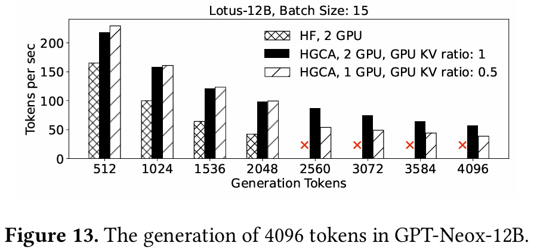

图13显示了使用模型GPT-Neox-12B生成4096个令牌的性能。HF将此模型扩展到两个A6000 GPU，并且可以在这些GPU上容纳最多2048个令牌的生成。相比之下，HGCA能够使用单个GPU和混合注意力服务所有令牌。我们进行了三个观察。首先，HGCA的仅GPU全注意力优于具有动态KV分配的HF注意力。HGCA的KV缓存预分配避免了潜在的内存碎片，并且更高效。这突出了HGCA在卸载KV条目而没有耗尽GPU内存风险方面的优势，使用户可以舒适地为KV缓存保留GPU内存。其次，由于缺乏KV卸载，HF无法扩展到2048个令牌之外，而HGCA能够扩展到完整生成长度。第三也是最重要的，虽然HGCA的混合注意力导致令牌吞吐量相比其全GPU注意力略有减少，但它仅使用一半的GPU资源实现了此性能。我们进一步将实验扩展到更大的Llama-33B模型和4个GPU，如图14所示。观察结果类似，除了HGCA使用2个GPU的混合注意力性能低于其使用4个GPU的全注意力。性能差异是由于涉及模型权重的推理并行化。对于更大模型，HGCA的全注意力和混合注意力之间的差距在长序列生成结束时缩小。

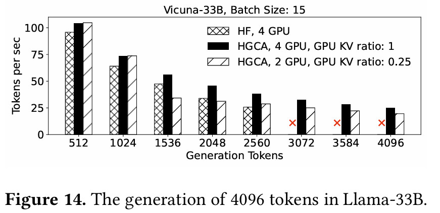

### 5.3 准确性

作为语言建模中的标准指标之一，困惑度量化了模型预测令牌序列的程度，较低值表示更好的预测性能。在较长序列上评估困惑度提供了对模型捕获长距离依赖能力的更深入洞察。然而，关于推理服务的现有工作缺乏对长序列生成困惑度的全面评估。例如，Infinigen仅测量第一个生成令牌的困惑度而不是完整文本。为此，我们将HGCA的模型准确性与Hugging Face的全注意力进行比较，后者不丢弃任何KV，并被视为参考性能。

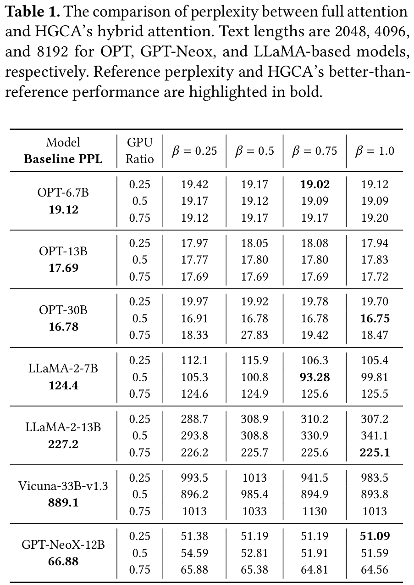

回想一下，HGCA在CPU端采用利用上下文KV局部性的稀疏注意力。我们改变了过滤因子β和在GPU上执行的KV注意力比例，这被认为是无损的。通过调整β，我们控制HGCA丢弃较不重要KV条目的激进程度。较高的β值表示更具选择性的过滤。如表1所示，HGCA的混合注意力在所有模型上实现了与全注意力接近相同的模型准确性，甚至在某些情况下甚至优于全注意力。最有趣的是，GPU KV比率似乎对准确性没有明显影响，突显了稀疏注意力的有效性。此外，HGCA的最佳模型性能通常导致较大的β值和更具选择性的KV过滤。这一发现激励我们追求更激进的稀疏注意力，作为未来工作，以在资源受限的环境中进一步改进推理性能。

### 5.4 长上下文推理

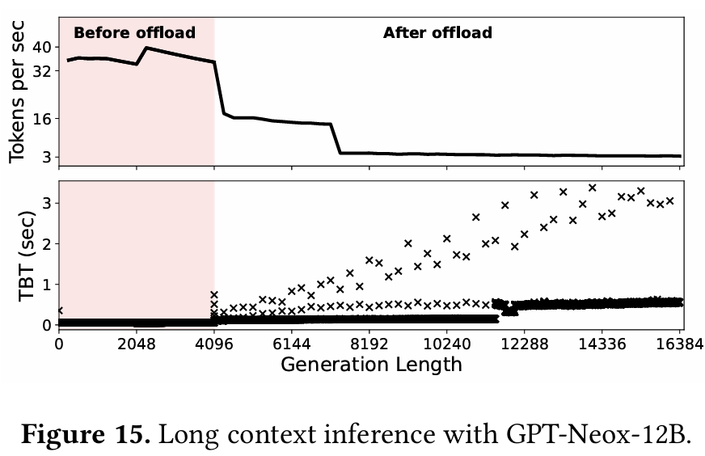

在此实验中，我们测量了HGCA在解码过程中的性能，同时允许KV缓存随序列长度成比例增长。模型配置为在单个请求（批处理大小1）内连续解码16,384个令牌，如图15所示。HGCA在GPU上的KV大小配置为4096个KV，β设置为1。一旦序列长度超过4096，即调用混合注意力。图15显示了每秒令牌速率和令牌间时间（TBT）。HGCA的混合注意力有助于扩展到长序列输出，而不会出现内存不足（OOM）错误，且性能可接受。例如，在生成接近结束时，HGCA仍然可以每秒交付3-4个令牌，相当于每分钟180-250个令牌，接近平均人类阅读速度。然而，我们还观察到随着解码的进行，TBT存在较大变化和异常值。该问题是由于低效的多线程调度和CPU注意力期间的负载不平衡。通过展示CPU稀疏注意力的潜力，我们预计这将激发进一步研究以优化CPU上的稀疏注意力。

## 6 结论

我们提出了HGCA，一种新颖的混合CPU-GPU注意力机制，通过将基于GPU的密集注意力与CPU优化的稀疏注意力相结合，实现可扩展的LLM推理。HGCA在显著降低GPU内存压力的同时保持模型准确性。通过高效融合和细粒度的每头稀疏化，HGCA提供了强大的性能增益，并实现了卓越的可扩展性，支持在商用GPU硬件上更长的上下文和更大的批处理大小。
