# LiquidGEMM：用于高性能LLM服务的硬件高效W4A8 GEMM内核

https://arxiv.org/pdf/2509.01229

> 上海交通大学、字节Seed团队

- [LiquidGEMM：用于高性能LLM服务的硬件高效W4A8 GEMM内核](#liquidgemm用于高性能llm服务的硬件高效w4a8-gemm内核)
  - [摘要 (Abstract)](#摘要-abstract)
  - [1 引言 (Introduction)](#1-引言-introduction)
  - [2 预备知识 (Preliminary)](#2-预备知识-preliminary)
  - [3 动机 (Motivation)](#3-动机-motivation)
    - [3.1 屋顶线分析与实践之间的差距 (Gap between Roofline Analysis and Practice)](#31-屋顶线分析与实践之间的差距-gap-between-roofline-analysis-and-practice)
    - [3.2 深入探究 GEMM 处理 (A Deep Dive into the GEMM Processing)](#32-深入探究-gemm-处理-a-deep-dive-into-the-gemm-processing)
    - [3.3 性能剖析与分析的启示 (Insights from Profiling and Analysis)](#33-性能剖析与分析的启示-insights-from-profiling-and-analysis)
  - [4 量化算法 (Quantization Algorithm)](#4-量化算法-quantization-algorithm)
  - [5 高性能 W4A8 GEMM 内核 (High Performance W4A8 GEMM Kernel)](#5-高性能-w4a8-gemm-内核-high-performance-w4a8-gemm-kernel)
    - [5.1 异步计算流水线的设计 (Design of Async Computation Pipeline)](#51-异步计算流水线的设计-design-of-async-computation-pipeline)
    - [5.2 内存布局与数据加载 (Memory Layout and Data Loading)](#52-内存布局与数据加载-memory-layout-and-data-loading)
    - [5.3 硬件高效反量化 (Hardware-Efficient Dequantization)](#53-硬件高效反量化-hardware-efficient-dequantization)
    - [5.4 其他 GEMM 优化 (Other GEMM Optimizations)](#54-其他-gemm-优化-other-gemm-optimizations)
  - [6 LLM 服务系统与离线量化 (LLM Serving System and Offline Quantization)](#6-llm-服务系统与离线量化-llm-serving-system-and-offline-quantization)
  - [7 实验 (Experiments)](#7-实验-experiments)
    - [7.1 实验设置 (Experimental Setup)](#71-实验设置-experimental-setup)
    - [7.2 LLM 服务效率比较 (Efficiency Comparison of LLM Serving)](#72-llm-服务效率比较-efficiency-comparison-of-llm-serving)
    - [7.3 GEMM 内核效率比较 (Efficiency Comparison of GEMM Kernel)](#73-gemm-内核效率比较-efficiency-comparison-of-gemm-kernel)
  - [8 相关工作 (Related Work)](#8-相关工作-related-work)
  - [9 结论 (Conclusion)](#9-结论-conclusion)

## 摘要 (Abstract)

量化 (Quantization) 是一种通过减少内存占用和提高计算效率来加速LLM推理的关键技术。在各种方案中，4位权重和8位激活量化 (W4A8) 在准确性和性能之间提供了良好的平衡。然而，现有的W4A8 GEMM内核在实践中表现不佳，原因是CUDA核心上的反量化 (dequantization) 效率低下，无法跟上张量核心 (Tensor Cores) 的高吞吐量。在本文中，我们提出了LiquidGEMM，一种用于高效LLM服务的硬件高效W4A8 GEMM内核。LiquidGEMM设计了两种关键技术：LiquidQuant，一种硬件高效的量化方法，只需每四个元素两条算术指令即可实现快速、防溢出的反量化；以及一种隐式细粒度流水线 (implicit fine-grained pipeline)，可在经线组 (warp groups) 之间完全重叠权重加载、反量化和矩阵乘累加 (MMA)，而无需软件同步或冗余内存流量。实验结果表明，LiquidGEMM比最先进的W4A8内核实现了高达2.90倍的加速，并实现了高达4.94倍的端到端系统级加速。与NVIDIA TensorRT-LLM中的各种量化GEMM内核相比，LiquidGEMM提供了1.12-1.63倍的性能提升，并实现了高达1.63倍的系统级加速。

## 1 引言 (Introduction)

大型语言模型 (LLMs) 已经改变了广泛的应用领域，从自然语言理解到内容生成，显著提升了AI的能力。然而，其庞大的模型规模和计算强度对在生产环境中高效部署构成了严峻挑战。为了缓解这些问题，整数量化 [7,8,14,27,29,30] 已成为一项关键技术。通过将全精度浮点值（FP32或FP16）转换为低精度整数格式（例如INT4），它可以减少模型大小、降低内存带宽需求，并在针对低精度算术优化的硬件上加速推理。

在各种量化配置中，最近的研究 [15,34] 强调4位权重和8位激活量化 (W4A8) 是准确性、效率和内存使用之间一个引人注目的折衷方案。如屋顶线分析 (roofline analysis)（图1）所示，W4A8通过利用低比特张量核心操作的高吞吐量，在计算受限的场景（如大批量推理）中优于W4A16，从而提供更好的性能。与W8A8相比，W4A8不仅减少了内存占用，还降低了内存带宽需求，使其在内存受限的设置（如小批量推理）中特别有优势。此外，W4A8提高了算术强度 (arithmetic intensity)，从而减少了使GPU计算资源饱和所需的批量大小。虽然更激进的配置（如W4A4）提供了类似的模型压缩，但由于激活被高度量化，它们通常会导致显著的准确性下降 [15, 34]。相比之下，W4A8在保持效率优势的同时保持了更高的准确性。由于其优势，W4A8量化是生产环境中高性能LLM服务的一个有前景的解决方案。

通用矩阵乘法 (GEMM) 操作是LLM服务中的核心计算构建块，对推理效率至关重要。然而，我们的实验表明，最先进的W4A8 GEMM实现 [15] 未能达到预期：在内存受限的场景下，它没有优于更高精度的方法（如W8A8），并且在计算受限的情况下（例如，在LLaMA2-7B上批量大小为256时），现有的W4A8 GEMM [15] 比W8A8甚至FP16慢了近2倍。这与最近的屋顶线分析 [15, 34] 相矛盾，后者表明W4A8在内存受限的情况下应优于W8A8，并在计算受限的设置中实现可比的性能。

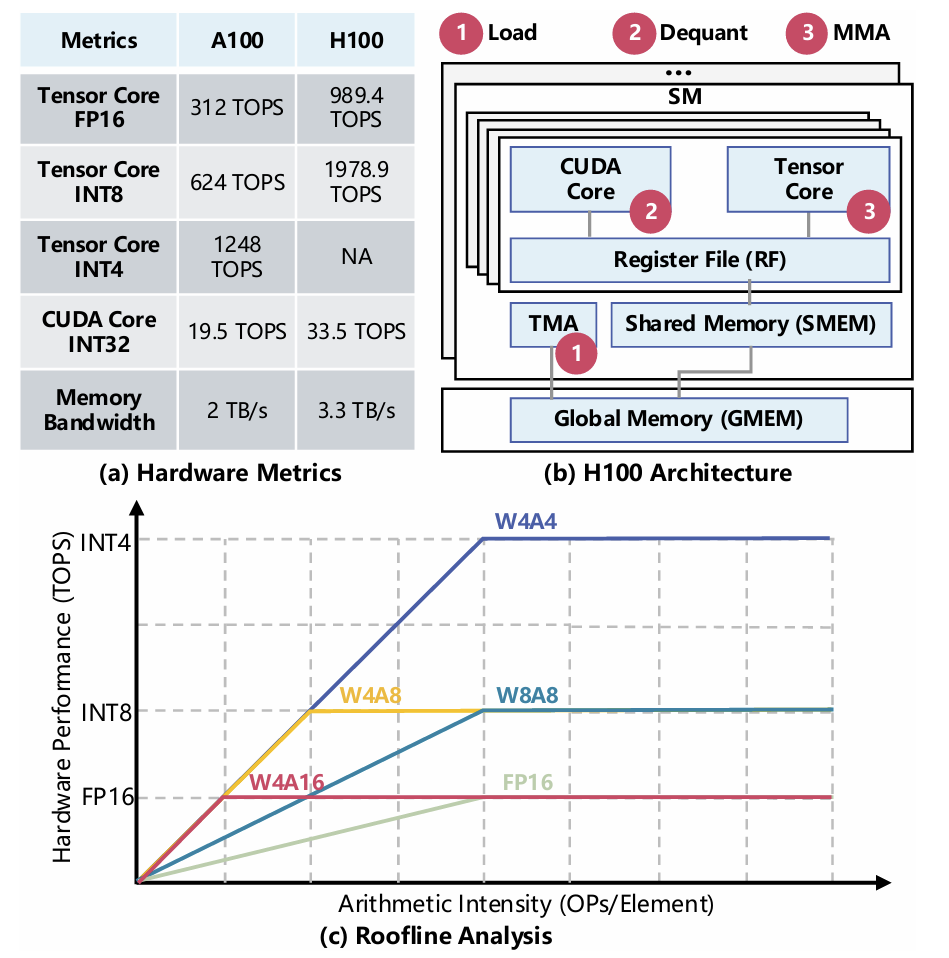
> Figure 1: Key performance metrics of NVIDIA A100 and H100 GPUs, with the roofline for GEMM layers in LLM serving.

为了分析问题，我们分析了W4A8反量化方法的开销，并开发了一个成本模型来捕捉流水线化GEMM执行中的关键性能因素（详见第3节）。我们的分析表明，核心问题在于MMA之前的硬件无关的反量化步骤，由于CUDA核心和张量核心之间巨大的性能差距（图1a），该步骤产生了显著的开销。具体来说，在将权重从GMEM加载到RF后，W4A8 GEMM必须首先在CUDA核心上将4位权重量反量化为8位，然后在张量核心上执行MMA（矩阵乘累加）。QoQ算法 [15] 在32位寄存器内反量化多个元素，存在潜在的溢出风险，并需要数十条指令来解决它。这给容量有限的CUDA核心带来了巨大的计算压力，使其无法跟上高吞吐量的张量核心（图1a）。相比之下，W8A8 GEMM在MMA之前避免了这种反量化步骤，可以充分利用张量核心的性能。因此，尽管W4A8在理论上很有前景，但反量化步骤成为限制其实际效率的性能瓶颈。屋顶线潜力与实际性能之间的这种差距突显了当前W4A8方法的根本局限性。

为了解决W4A8 LLM服务中的根本瓶颈，我们提出了LiquidGEMM，一种用于高性能LLM服务的硬件高效W4A8 GEMM内核。LiquidGEMM支持跨异构GPU硬件单元（包括TMA、CUDA核心和张量核心）的流水线并行执行，以重叠反量化与权重加载和MMA，从而隐藏其开销并最大化硬件利用率。实现这一点需要解决两个关键挑战。首先，必须优化量化算法以减少CUDA核心上反量化的计算负担（与张量核心相比，CUDA核心的计算吞吐量有限），以便可以有效地与其他阶段重叠。其次，执行流水线必须协同设计以高效协调数据移动和计算，满足张量核心（现代GPU上GEMM的主要计算引擎）的需求。

为了解决这些挑战，我们首先提出了LiquidQuant (LQQ)，一种为硬件指令原生支持而设计的硬件高效W4A8量化方案。与先前直接将INT8量化为UINT4导致反量化期间溢出问题的方法不同，LQQ应用了一种基于旋转的变换，在量化为UINT4之前将INT8值移位到UINT8范围内。配合这种旋转，我们设计了一种巧妙的反量化策略，利用二进制补码 (two's complement) 表示的特性，完全在UINT8域内恢复原始INT8值，而不会溢出。这种反量化是高度硬件高效的，仅需两条32位硬件指令——IMAD和XOR——来处理四个元素，显著减少了CUDA核心上的计算负载。

接下来，我们为LiquidGEMM设计了隐式细粒度流水线 (ImFP) 执行机制。在NVIDIA Hopper GPU上，对现有经线专用 (warp-specialized) GEMM流水线的一个直接扩展是分配一个额外的经线组 (WG) 用于反量化，旨在重叠权重加载、反量化和MMA。然而，这种方法会因经线组通信所需的RF和SMEM之间的往返数据移动以及昂贵的经线间同步而产生显著开销，导致流水线气泡 (pipeline bubbles) 和效率降低。为了解决这个问题，我们的ImFP采用单生产者-多消费者 (single-producer, multiple-consumer) 执行模型。一个专用的加载经线组 (Load WG) 将权重从GMEM传输到SMEM，GEMM工作负载被划分为细粒度任务，由多个计算经线组 (Compute WGs) 以抢占方式动态消费。每个计算经线组立即对其已反量化的权重执行MMA，消除了SMEM和RF之间的往返数据移动。反量化和MMA的重叠是通过并发执行的计算经线组实现的。值得注意的是，任务调度由硬件管理，从而避免了软件同步的开销。围绕这种流水线设计，我们进一步优化了数据布局和反量化。LiquidGEMM目前部署在我们生产LLM服务基础设施中作为主要的GEMM内核。总之，本文做出了以下贡献。

● 我们深入分析了W4A8 GEMM执行流水线并识别了关键性能瓶颈。  
● 我们提出了LiquidGEMM，一种针对高效LLM服务优化的高性能W4A8 GEMM内核。  
● 我们开发了LiquidQuant，一种最小化GPU上反量化开销的硬件高效量化算法。  
● 我们引入了一种隐式细粒度流水线，通过高效的流水线执行最大化硬件利用率。  

为了评估LiquidGEMM的效率，我们在开源组件之上实现了一个端到端的LLM服务系统包括用于注意力计算的FlashAttention [6] 和用于KV缓存管理的PagedAttention [12]。实验结果表明，LiquidGEMM比最先进的W4A8内核 [15] 实现了高达2.90倍的加速，并导致高达 $4.94x$ 的端到端系统级加速。与NVIDIA TensorRT-LLM中的各种量化GEMM内核（W4A16、W8A8和FP8）相比，LiquidGEMM提供了1.12-1.63倍的性能提升，并实现了高达 $1.63x$ 的系统级加速。

## 2 预备知识 (Preliminary)

**整数量化 (Integer Quantization)。** 这是一种通过将高精度浮点值（FP32或FP16）转换为低精度整数表示（例如INT8或INT4）来减少LLM内存占用和计算成本的重要技术。这种转换使得模型能够在支持整数算术的GPU上更高效地执行。形式上，量化将浮点张量W映射到一个n位整数张量Q，如下所示：

$$Q=\left\lfloor\frac{W}{s}+z\right\rceil, \quad s=\frac{\max(W)-\min(W)}{\max(Q)-\min(Q)}, \quad z=\left\lfloor\min(Q)-\frac{\min(W)}{s}\right\rceil \qquad (1)$$

s是缩放因子 (scaling factor)，z是零点 (zero-point)。运算符 $\lfloor\cdot\rceil$ 表示四舍五入到最接近的整数。由于Q使用n位表示，其动态范围被限制为 $\left[0,2^{n}-1\right]$（对于无符号整数）或 $\left[-2^{n-1}, 2^{n-1}-1\right]$（对于有符号整数），具体取决于量化类型。相应的反量化过程从量化后的整数张量Q重建一个近似的浮点值 $\widehat{W}$：

$$\widehat{W}=(Q-z)\cdot s \qquad (2)$$

在实践中，使用了两种常见的量化变体：非对称量化 (asymmetric quantization)，其中z非零以适应任意输入范围；以及对称量化 (symmetric quantization)，其中范围以零为中心，z设置为0。在非对称量化中，整数范围由 max(Q)-min(Q)=2^n-1 给出，而在对称量化中，范围变为 $2^{n}-2$，因为 $|\max(Q)|=|\min(Q)|$。与对称量化相比，非对称量化可以充分利用可用的值范围，但需要在反量化期间进行额外的减法操作。

**GPU上的GEMM。** 图2提供了GPU上GEMM执行的概述。给定一个GEMM操作 Y = XW^T，其中 X ∈ R^{M×K} 是输入张量，W^T ∈ R^{K×N} 是权重矩阵，Y ∈ R^{M×N} 是输出，GPU将Y划分为大小为 Mt × Nt 的图块 (tile)，每个图块由一个线程块 (thread block) 处理。为了计算其分配的任务图块，一个线程块在K维度上以 Kt 为步长进行迭代，执行一系列大小为 Mt × Nt × Kt 的较小GEMM操作。在每次迭代中，它加载X和W的相应切片，执行乘累加操作，并更新输出图块。这种在K维度上的迭代，称为主循环 (main loop)，主导了GEMM的总体计算成本。每个输出图块进一步被划分为片段 (fragment)，每个经线 (warp) 使用张量核心上的MMA（矩阵乘累加）指令计算一个片段。这些硬件加速的张量核心针对小矩阵形状（例如 64×256×32）进行了优化，通过并行处理多个片段实现高吞吐量计算。为简单起见，我们在整篇论文中互换使用图块 (tile) 和片段 (fragment) 这两个术语，因为它们的区别不影响核心分析。

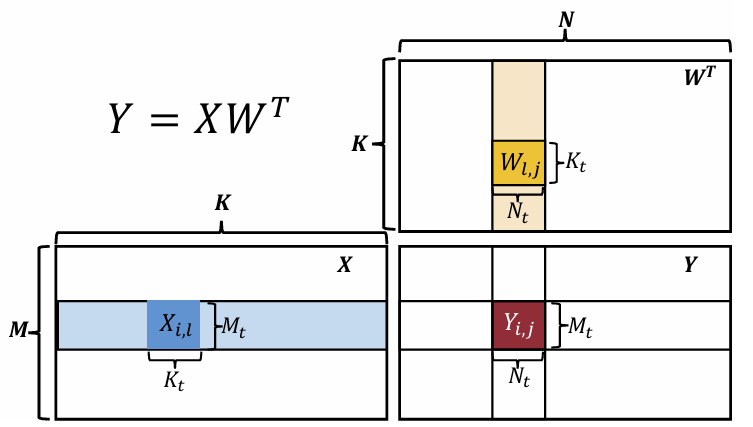
> Figure 2: Overview of GEMM on GPUs, where 𝑖, 𝑗, 𝑙 denote loop iterations along the 𝑀, 𝑁, 𝐾 dimensions, respectively.

张量核心原生支持操作数具有匹配对称精度的操作，即权重和激活具有相同的数据类型。根据输入矩阵的精度，GEMM可以分为两种类型：对称GEMM（两个操作数共享相同类型）和非对称GEMM（权重和激活的精度不同，通常权重具有更低的位宽）。在非对称GEMM中，权重必须在主循环期间被反量化，然后才能被张量核心处理。图3将非对称GEMM W4A8与对称GEMM W8A8进行了比较。在W4A8中，反量化在主循环期间在张量核心上的MMA之前在CUDA核心上执行。相比之下，W8A8完全在张量核心上执行主循环，反量化被推迟到尾声 (epilogue)。

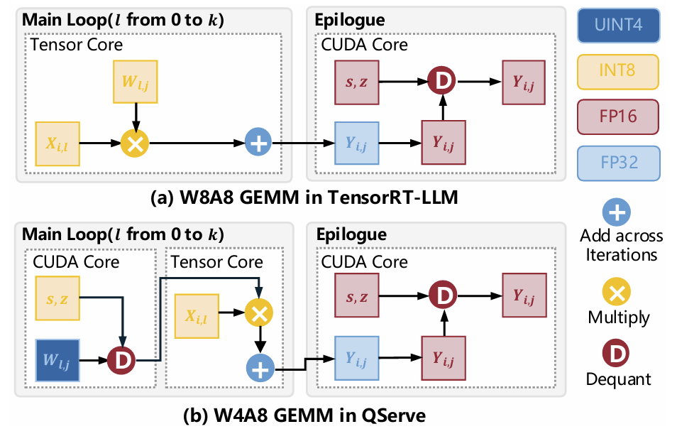
> Figure 3: Comparison of W8A8 GEMM in TensorRT-LLM and W4A8 GEMM in QServe.

## 3 动机 (Motivation)

我们评估了W4A8 GEMM在LLM服务中的实际性能，将其与代表性量化方法进行了比较。具体来说，我们对QServe [15] (W4A8)、TRT-W4A16 (W4A16)、TRT-W8A8 (W8A8)、TRT-FP8 (FP8) 和 TRT-FP16 (FP16) 进行了基准测试，其中TRT指的是NVIDIA开发的TensorRT-LLM [20]。我们还考虑了Atom [35] (W4A4) 和 QQQ [34] (W4A8)。然而，Atom在H800 GPU上性能较差，因为张量核心不支持INT4。QQQ的性能也低于QServe。因此，我们在进一步的评估中省略了Atom和QQQ。

### 3.1 屋顶线分析与实践之间的差距 (Gap between Roofline Analysis and Practice)

为了评估这些GEMM配置的实际性能，我们在H800 GPU上对LLM服务进行了基准测试，模型包括LLaMA2-7B（密集模型）和Mixtral-8×7B（MoE模型），批量大小范围从4到256。对于LLaMA2-7B，我们选择W8A8量化；对于Mixtral-8×7B，我们选择FP8量化，因为W8A8量化目前不支持Mixtral-8×7B。我们考虑两种输入-输出长度设置：1) 1024个输入token和512个输出token；2) 128个输入token和128个输出token。请注意，增加token长度不会影响解码过程中FFN和投影（PROJ）层的GEMM工作负载，但会增加注意力计算。图4显示了GEMM延迟（来自FFN和PROJ层）在端到端推理中所占的比例。我们观察到，在小批量大小下，GEMM主导了延迟；在长序列大批量大小下，GEMM仍占总延迟的20%以上。对于Mixtral-8×7B，由于需要为每个专家运行单独的GEMM，GEMM在所有测试案例中仍然是延迟的主要贡献者。这些结果突显了GEMM在LLM服务性能中的根本作用。

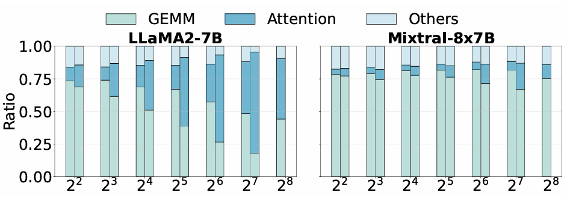
> Figure 4: Time breakdown of inference for input lengths 128 (left) and 1024 (right). The bar for batch size 256 at length 1024 is omitted due to out-of-memory.

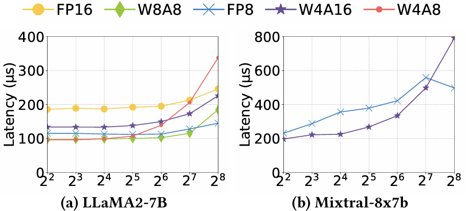
> Figure 5: GEMM latency on a single transformer layer with batch sizes ranging from 4 to 256.

图5显示了在解码过程中平均每层GEMM的延迟。与基于屋顶线的预测相反，W4A8在小批量大小 $(M\leqslant 64)$ 下表现与W8A8相似，但在更大的批量大小 $(M\geqslant 128)$ 下变得慢了近2倍，而它本应在这些情况下具有竞争力。值得注意的是，W4A8甚至表现不如FP16和W4A16（它们不涉及或仅涉及部分量化）。在Mixtral-8×7B上仅报告了FP8和W4A16的结果，因为其他系统缺乏对该模型的支持。Mixtral上的延迟也显著高于LLaMA2-7B。总之，尽管理论上预期W4A8应在内存受限区域优于W8A8，并在计算受限区域匹配其性能，但我们的结果表明，现有的W4A8实现始终未能达到预期，特别是在计算受限条件下，突显了理论潜力与实际性能之间的明显差距。

### 3.2 深入探究 GEMM 处理 (A Deep Dive into the GEMM Processing)

为了理解性能差距，我们首先分析了 W4A8 反量化的开销，然后开发了一个成本模型来捕捉关键性能因素。

**QServe 的反量化开销 (Dequantization Overhead of QServe)。** 我们关注 QServe 的主循环，因为 K 维度通常远大于图块大小 $K_{t}$ 并主导整体 GEMM 成本。在每次迭代中，QServe 使用寄存器级并行将权重从 UINT4 $(Q_{u4})$ 反量化为 INT8 $(Q_{i8})$，每个 32 位寄存器处理四个元素。给定 $Q_{i8}$ 和 $Q_{u4}$，缩放因子 $s_{i8}$ 和零点 $z_{i8}$ 可以根据公式 1 离线计算。为了避免寄存器级算术运算中的溢出，QServe 应用了两种技术：1) **渐进量化 (Progressive Quantization)**：它将 $Q_{i8}$ 限制在范围 [-119, 119] 内，确保 $Q_{u4}\cdot s_{i8}$ 保持在有效范围内；2) **乘法后减法 (Subtraction after Multiplication)**：QServe 推迟减法以避免乘以负值，计算 $Q_{u4}\cdot s_{i8} - s_{i8}\cdot z_{i8}$，而不是在乘法前减去 $z_{i8}$（如公式 2 所示）。

尽管做出了这些努力，减法步骤仍然可能溢出。为了缓解这个问题，QServe 依赖 `vadd` 指令将打包到 32 位寄存器中的四个 8 位元素相加。然而，`vadd` 不是原生硬件指令，会被分解为十几个低级操作，给 CUDA 核心带来了巨大压力。由于 CUDA 核心和张量核心之间存在巨大的性能差距（见图 1），这种开销成为了瓶颈。在 LLaMA2-7B 的 FFN 层上使用 NVIDIA Nsight 进行分析显示，涉及 `vadd` 的减法占经线停顿 (warp stalls) 的 21%，突显了 QServe 反量化策略的性能成本。

**成本模型 (Cost Model)。** 接下来，我们提出了一个成本模型来捕捉第 2 节描述的带有反量化的流水线 GEMM 执行中的关键性能因素。假设图块大小为 $M_{t}\times N_{t}\times K_{t}$。那么，输出图块的数量为 $m\times n$，其中 $m=\left\lceil\frac{M}{M_{t}}\right\rceil, n=\left\lceil\frac{N}{N_{t}}\right\rceil$，每个图块需要 $k=\left\lceil\frac{K}{K_{t}}\right\rceil$ 次迭代来完成主循环。主循环的每次迭代包括两个阶段：数据加载和计算。我们首先分析单次迭代的成本，然后将分析扩展到完整的流水线执行。

**数据加载 (Data Loading)。** 每次迭代的数据加载时间由公式 3 给出，其中 $\phi_{BD}^{x}$ 表示加载 x 类型数据的块级吞吐量（元素/秒），基于线程块可用的有效内存带宽。在 LLM 服务中，激活矩阵通常较小并从快速内存中重用，因此成本主要由从全局内存传输权重决定。
$$ T_{LD}=\frac{\left(M_t\cdot K_t+N_t\cdot K_t\right)}{\phi_{BD}^x}\approx\frac{N_t\cdot K_t}{\phi_{BD}^x} \qquad (3)$$

**计算 (Computation)。** 计算阶段包括：1) 在 CUDA 核心上进行反量化；2) 在张量核心上进行 MMA。因此，每次迭代的计算时间由下式给出：
$$ T_{COMP}=\frac{\alpha\cdot N_t\cdot K_t}{\phi_{CUDA}}+\frac{2\cdot\min\left(M_t, M\right)\cdot N_t\cdot K_t}{\phi_{TC}^y} \qquad (4)$$
其中 $\alpha$ 是反量化一个权重元素所需的指令数，$\phi_{CUDA}$ 是块级 CUDA 核心吞吐量（操作/秒），$\phi_{\text{TC}}^{y}$ 是数据类型 y 的块级张量核心吞吐量（操作/秒）。一个 MAC（乘累加）等于两个操作（一次乘法和一次加法）。在所有迭代之后，每个输出图块必须写回全局内存，产生一个尾声成本。由于主循环通常占主导地位，我们省略了尾声成本。

**单图块执行 (Single-Tile Execution)。** 一个线程块计算一个输出图块的总时间 $T_{t}$ 包括初始流水线填充加上重复的重叠加载和计算。对于大的 k，填充和排空开销可以忽略不计，因此 $T_{t}$ 可以近似为公式 5：
$$\begin{align*} T_t&=T_{LD}+T_{COMP}+(k-1)\cdot\max\left(T_{LD}, T_{COMP}\right)\\ &\approx k\cdot\max\left(T_{LD}, T_{COMP}\right) \end{align*} \qquad (5)$$

**GPU 级执行 (GPU-Level Execution)。** 假设一个设备有 S 个流式多处理器 (streaming multiprocessors)，每个能够并发运行最多 L 个线程块。用 $\Phi_{BD}^{x}$（内存）、$\Phi_{\text{CUDA}}$（CUDA 核心）和 $\Phi_{TC}^{y}$（张量核心）表示设备级吞吐量。由于 $M_{t}, N_{t}, K_{t}$ 很小，我们通常有 $N\gg N_{t}$ 和 $K\gg K_{t}$；M 取决于批量大小。给定 $m\times n$ 个总图块，总执行时间 T 近似为：
$$\begin{align*}T&=\frac{m\cdot n}{S\cdot L}\cdot T_{t}=m\cdot\max\left(\frac{n\cdot k}{S\cdot L}\cdot T_{LD},\frac{n\cdot k}{S\cdot L}\cdot T_{COMP}\right)\\ &\approx m\cdot\max\left(\frac{N\cdot K}{\Phi_{BD}^{x}\cdot S\cdot L},\frac{\alpha\cdot N\cdot K}{\Phi_{CUDA}\cdot S\cdot L}+\frac{2\cdot\min\left(M_{t}, M\right)\cdot N\cdot K}{\Phi_{TC}^{y}\cdot S\cdot L}\right)\\ &=\left\lceil\frac{M}{M_{t}}\right\rceil\cdot\max(\underbrace{\frac{N\cdot K}{\Phi_{BD}^{x}}}_{T_{L D}},\underbrace{\alpha\cdot\frac{N\cdot K}{\Phi_{CUDA}}}_{T_{D Q}}+\underbrace{\min\left(M_{t}, M\right)\cdot\frac{2\cdot N\cdot K}{\Phi_{TC}^{y}}}_{T_{M M A}}),\end{align*} \qquad (6)$$
其中 $T_{L D}, T_{D Q}$ 和 $T_{M M A}$ 分别表示数据加载、反量化和 MMA 的时间。为简洁起见，我们使用相同的符号 $T_{L D}$ 表示每次迭代的数据加载时间。我们定义有效输出高度为 $\min\left(M_{t}, M\right)$ 以考虑批量大小小于图块大小的情况。该成本模型突显了 GEMM 性能如何受到批量大小 M、硬件指标（$\Phi_{BD},\Phi_{CUDA}$ 和张量核心吞吐量 $\Phi_{TC}$）以及量化精度（权重位宽 x 和激活位宽 y）的影响。

### 3.3 性能剖析与分析的启示 (Insights from Profiling and Analysis)

**差距的根本原因 (Root Cause of the Gap)。** 根据该模型，如果没有反量化开销，W4A8 和 W8A8 在计算受限场景下应表现出相似的性能，因为两者都使用 INT8 MMA 并共享相同的 $T_{MMA}$。在内存受限的情况下，由于其较低的内存加载 $(T_{LD})$，W4A8 预计将优于 W8A8。转换点发生在 $T_{LD}=T_{MMA}$ 时，对应于 H100 上 W4A8 的批量大小阈值为 150，W8A8 为 300，基于图 1 中的指标。这些结果与先前的基于屋顶线的分析 [34, 35] 一致。

然而，反量化改变了这一性能曲线。由权重矩阵大小决定的开销 $T_{DQ}$ 变得显著，这是由于 CUDA 核心有限的计算能力 $(\Phi_{\text{CUDA}})$ 和处理溢出带来的高每元素成本 $\alpha$。因此，尽管具有更低的 $T_{LD}$，W4A8 在内存受限情况下仅提供与 W8A8 相似的性能，并且在计算受限情况下表现慢达 2 倍，如第 3.1 节所示。虽然人们可能期望通过增加批量大小 M 来分摊 $T_{DQ}$，但算术强度最终受限于图块大小 $M_t$，而 $M_t$ 又受共享内存的限制。这一限制阻止了 $T_{DQ}$ 被有效隐藏，导致理论预期与实际观察到的性能之间存在显著差距。

**对高效 GEMM 设计的启示 (Implication on Efficient GEMM Design)。** 成本模型为高效的 W4A8 GEMM 提出了两个关键设计原则。首先，权重加载、反量化和 MMA 应在异构硬件单元（TMA、CUDA 核心和张量核心）之间完全流水线化，以避免由反量化引起的串行化瓶颈。其次，反量化必须是高度硬件高效的，以便有效地与其他阶段重叠。原则上，为了在内存受限场景 $(T_{DQ}\leqslant T_{LD})$ 下匹配权重加载的延迟，基于图 1 中的 H100 指标，每个反量化元素的指令成本必须 $\alpha\leqslant 5.07$。在计算受限设置 $(T_{DQ}\leqslant T_{MMA})$ 下，当 $M=150$ 时，该阈值变为 $\alpha\leqslant 5.05$。此外，CUDA 核心必须执行辅助任务，例如地址计算，这进一步增加了计算负载。这些约束共同突显了在现代 GPU 上实现低开销反量化的挑战。

**对 LLM 服务的启示 (Implication on LLM Serving)。** 我们简要讨论硬件趋势如何影响 LLM 服务。在生产环境中，期望在较小的批量大小下达到计算受限状态，以便：1) 充分利用 GPU 计算能力；2) 减少请求延迟；3) 支持长序列；4) 最小化操作风险，例如硬件故障。此外，批量大小也受内存大小限制。然而，如图 1 所示，张量核心性能的提升速度超过了内存带宽，将内存到计算的转换点推向了更高的批量大小，根据我们的模型，W8A8 在 A100 上为 156，在 H100 上为 300。相比之下，W4A8 将这些阈值减半。这突显了量化在实现高效推理方面的价值，以及高性能 W4A8 GEMM 内核的重要性。

为此，我们提出了 LiquidGEMM，一种用于高性能 LLM 服务的硬件高效 W4A8 GEMM 内核。在接下来的章节中，我们将介绍我们的量化算法，描述内核流水线设计和优化，并展示用于评估的端到端 LLM 服务系统的实现。

## 4 量化算法 (Quantization Algorithm)

为了解决反量化溢出问题，我们提出了LiquidQuant (LQQ)，一种为硬件指令原生支持而设计的硬件高效W4A8量化方案。

**量化 (Quantization)。** 为了提高低位量化的准确性，LQQ采用了分组量化策略 [8,14,15,34,35] 和一个两级量化框架，将FP16权重量化为UINT4。由于第一级反量化发生在GEMM尾声 (epilogue) 且开销可忽略，我们的重点是第二级量化。具体来说，遵循QServe [15]，第一级使用逐通道 (per-channel) 缩放因子将W量化为INT8张量 $Q_{i8}$，如公式1所定义。我们还采用了第3.2节中的保护性量化范围，将 $Q_{i8}$ 限制在 [-119,119] 范围内，以防止反量化缩放期间溢出（证明见 [15]）。

第二级将INT8转换为UINT4。我们的核心思想是将 $Q_{i8}$ 的对称范围移位 (shift) 到UINT8张量 $Q_{u8}$ 的无符号域中，然后将 $Q_{u8}$ 量化为 $Q_{u4}$。这种设计符合我们的反量化方法，以消除推理期间潜在的溢出，我们将在本节末尾证明这一点。量化过程定义在公式7中。我们省略了零点 $z_{u8}$，因为 $Q_{u8}$ 和 $Q_{u4}$ 的最小值都是零。

$$ Q_{u 8}=Q_{i 8}-\min\left(Q_{i 8}\right),\quad Q_{u 4}=\left\lfloor\frac{Q_{u 8}}{s_{u 8}}\right\rceil,\quad s_{u 8}=\frac{\max\left(Q_{u 8}\right)}{\max\left(Q_{u 4}\right)}.\qquad(7)$$

与公式1中的标准量化相比，我们的方法引入了一个从 $Q_{i8}$ 到 $Q_{u8}$ 的简单移位，该移位完全离线执行。核心优化集中在在线反量化上，这对高效的LLM服务至关重要。

**反量化 (Dequantization)。** 基于公式7，我们在推理期间将张量从UINT4反量化回INT8，如下所示：

$$\widehat{Q}_{i 8}=\widehat{Q}_{u 8}+\min\left(Q_{i 8}\right)=Q_{u 4}\cdot s_{u 8}+\min\left(Q_{i 8}\right).\qquad(8)$$

为确保无溢出，我们必须保证此计算保持在有效的数值范围内。根据公式7，缩放因子满足 $s_{u 8}\leqslant\left\lfloor\frac{119-(-119)}{15}\right\rceil=16$。由于 $Q_{u 4}\in[0,15]$，我们有 $\widehat{Q}_{u 8}=Q_{u 4}\cdot s_{u 8}\leqslant 15\times 16=240$，这保持在UINT8范围内，避免了乘法期间的溢出。

然而，直接加上可能是负数的 $\min\left(Q_{i 8}\right)$ 会导致环绕 (wraparound) 问题。我们用一个例子说明这一点。假设 $Q_{u 4}=15,\max\left(Q_{i 8}\right)=119$，且 $\min\left(Q_{i 8}\right)=-104$。那么，我们有 $s_{u 8}=\left\lfloor\frac{119-(-104)}{15}\right\rceil=\left\lfloor\frac{223}{15}\right\rceil=15$，预期结果是： $\widehat{Q}_{i 8}=Q_{u 4}\cdot s_{u 8}+\min\left(Q_{i 8}\right)=15\times 15+(-104)=225-104=121$。在二进制中， $Q_{u 8}=225$ 表示为 1110 0001，而 $\min\left(Q_{i 8}\right)=-104$ 在二进制补码形式中表示为 1001 1000。如果加法在位级别执行而不进行类型提升 (type promotion)，1110 0001 + 1001 1000 = 1 0111 1001，这会发生溢出。或者，在加法之前将 $Q_{u 8}$ 转换为INT8也是无效的，因为11100001在INT8中表示-31，而不是225。这个例子突显了加法步骤需要超越标准硬件指令的谨慎处理。

LQQ引入了一种巧妙的反量化方法 (sweet dequantization method)，结合移位量化，利用二进制补码表示的特性来消除溢出：一个INT8值i和一个UINT8值j共享相同的二进制表示，如果 $i\equiv j\left(\operatorname{mod} 2^{8}\right)$。例如，$-3\equiv 253\left(\operatorname{mod} 2^8\right)$，两者都表示为11111101。利用这个特性，我们将公式8重写为：

$$\begin{align*}\widehat{Q}_{i 8}&\equiv Q_{u 4}\cdot s_{u 8}+\min\left(Q_{i 8}\right)+x\cdot 2^8\quad\left(\text{ mod} 2^8\right)\\ &\equiv Q_{u 4}\cdot s_{u 8}+\left(2^7+\min\left(Q_{i 8}\right)\right)+(2 x-1)\cdot 2^7\quad\left(\text{ mod} 2^8\right),\end{align*} \qquad(9)$$

其中x是一个整数。我们接下来证明公式9中的计算避免了溢出，即所有中间结果都保持在UINT8范围内，通过适当地控制x的值。

**证明。** 设 $q_{i}$ 是第一级量化后 $Q_{i8}$ 中的一个元素，设 $q_{u}=q_{i}-\min\left(Q_{i 8}\right)$ 是 $Q_{u8}$ 中对应的元素。根据公式9，反量化的计算过程可以表示为：

$$\widehat{q}_{i}\equiv\underbrace{\left\lfloor\frac{q_{u}}{s_{u 8}}\right\rceil\cdot s_{u 8}}_{\widehat{q}_{u}\in[0,255]}+\underbrace{\left(2^{7}+\min\left(Q_{i 8}\right)\right)}_{a\in[0,255]}+\underbrace{(2 x-1)\cdot 2^{7}}_{b}\quad\left(\text{ mod} 2^{8}\right). \qquad(10)$$

我们首先证明 $\widehat{q}_{u}+a$ 在UINT8范围内有界。由于 $s_{u 8}\leqslant 16$ 且 $q_{u}\leqslant\max\left(Q_{i 8}\right)-\min\left(Q_{i 8}\right)=238$，我们有：

$$\begin{align*}\widehat{q}_{u}+a&=\left\lfloor\frac{q_{u}}{s_{u 8}}\right\rceil\cdot s_{u 8}+a\leqslant q_{u}+\frac{s_{u 8}}{2}+a\\ &\leqslant\left(\max\left(Q_{i 8}\right)-\min\left(Q_{i 8}\right)\right)+8+\left(2^{7}+\min\left(Q_{i 8}\right)\right)\\ &=\max\left(Q_{i 8}\right)+8+2^{7}\leqslant 119+8+128=255.\end{align*} \qquad(11)$$

接下来，为确保最终结果 $\widehat{q}_{u}+a+b$ 也保持在 $[0,255]$ 范围内，我们如下控制x的值：如果 $\widehat{q}_{u}+a\geqslant 128$，则设 $x=0$ 使得 $b=-128$；否则设 $x=1$ 使得 $b=128$。这保证了公式10中的计算在UINT8范围内是无溢出的。 $\square$

**硬件高效计算 (Hardware-Efficient Computation)。** 在运行时检查 $\widehat{q}_{u}+a$ 并确定x会给GEMM的主循环带来显著开销。通过分析，我们观察到加上b等价于翻转 $\widehat{q}_{u}+a$ 的最高有效位 (most significant bit)。因此，反量化可以执行为：

$$\widehat{Q}_{i 8}=\left(Q_{u 4}\cdot s_{u 8}+a\right)\oplus 0\times 80, \qquad(12)$$

其中 $a=2^{7}+\min\left(Q_{i 8}\right)$ 是离线预计算的，$\oplus$ 表示异或 (XOR) 操作。这种形式将所有中间值保持在UINT8范围内，避免溢出，并实现高效的硬件执行（见第5.3节）。对于第一级反量化，LQQ遵循公式2中的标准过程。

## 5 高性能 W4A8 GEMM 内核 (High Performance W4A8 GEMM Kernel)

基于LiquidQuant (LQQ)，我们提出了LiquidGEMM，一种具有异步计算流水线的高性能W4A8 GEMM内核。我们使用当前的云主力GPU H800来说明该内核。为了优化执行，我们计算 $Y=\left(W X^{T}\right)^{T}$ 而不是 $Y=X W^{T}$，如第5.4节所述。

### 5.1 异步计算流水线的设计 (Design of Async Computation Pipeline)

**显式粗粒度流水线 (Explicit Coarse-Grained Pipeline, ExCP)。** 像CUTLASS这样的高性能GEMM库使用经线专用化 (warp specialization) 来重叠权重加载和计算。在这种模型中，线程块内的经线被划分为专门的角色，例如加载经线 (Load Warps) 和MMA经线 (MMA Warps)，它们以生产者-消费者模式异步运行。在H800上，经线被分组为经线组 (Warp Groups, WGs)，每个组由四个经线（128个线程）组成，它们协同工作。在反量化背景下，一个直接的想法是将其应用于W4A8计算。具体来说，如图6所示，我们设计了一个三阶段流水线，其中三个WG分别被分配用于加载权重、执行反量化和执行MMA。每个阶段映射到不同的硬件单元：通过TMA加载权重，通过CUDA核心反量化，通过张量核心执行MMA。这些阶段并发运行，实现了 $T_{LD}$、$T_{DQ}$ 和 $T_{MMA}$ 的重叠。我们将这种方法称为显式粗粒度流水线 (ExCP)。

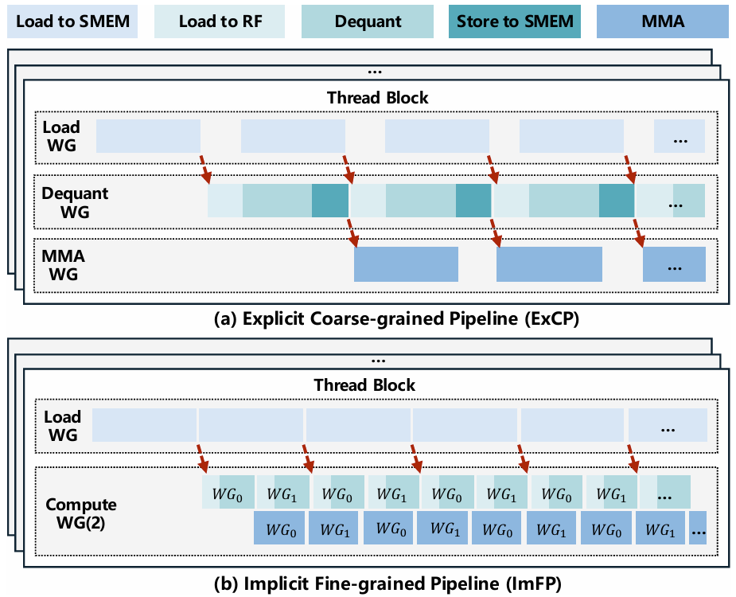
> Figure 6: Comparison of Explicit Coarse-Grained Pipeline (ExCP) and Implicit Fine-Grained Pipeline (ImFP) designs.

然而，ExCP会引入流水线气泡 (pipeline bubbles)，从而降低GEMM效率，这是由于其粗粒度执行和显式的经线组调度所致。特别是，反量化WG从共享内存 (SMEM) 加载权重（这些权重先前已由加载WG从全局内存 (GMEM) 加载）到寄存器文件 (RF) 中，以便在CUDA核心上进行反量化。反量化后，它将权重写回SMEM，并通知MMA WG开始执行。RF和SMEM之间的这种往返数据移动产生了不小的开销，并增加了反量化WG的工作负载，导致流水线停顿 (stalls)。此外，反量化和MMA WG之间基于软件的同步增加了额外的开销。

**隐式细粒度流水线 (Implicit Fine-Grained Pipeline, ImFP)。** 为了解决ExCP的低效问题，我们提出了隐式细粒度流水线 (ImFP)。与ExCP为反量化和MMA分配单独的WG不同，ImFP使用一个统一的计算WG (Compute WG) 负责这两项任务。这消除了将反量化结果从RF写回SMEM的需要，减少了数据移动开销（图6）。为了重叠反量化和MMA，我们利用不同计算WG之间的流水线阶段。具体来说，ImFP采用单生产者-多消费者模型 (single-producer, multiple-consumer model)。加载WG作为生产者，将权重从GMEM加载到SMEM，并将它们分割成细粒度任务 (fine-grained tasks)，每个任务是权重矩阵的一个片段 (fragment)。然后，这些任务被多个计算WG以抢占方式 (preemptive manner) 动态获取和处理。每个计算WG立即对其已反量化的权重执行MMA，消除了SMEM和RF之间的往返数据移动。反量化和MMA的重叠是通过并发执行的计算WG实现的。值得注意的是，任务调度由硬件管理，从而避免了软件同步的开销。在我们的实现中，每个线程块由一个加载WG和两个计算WG组成，这有效地平衡了硬件利用率和任务吞吐量。实验结果表明，ImFP显著优于粗粒度的ExCP设计。接下来，我们详细介绍数据加载和计算。

### 5.2 内存布局与数据加载 (Memory Layout and Data Loading)

在每个主循环迭代中，所需的权重图块由加载WG从GMEM加载到SMEM，然后由计算WG加载到RF中进行反量化和MMA。张量核心上的MMA需要跨线程的结构化数据布局以符合硬件内部函数 (intrinsic) 的要求。为了满足这一需求，权重矩阵的内存布局至关重要，因为它直接影响数据加载的效率。

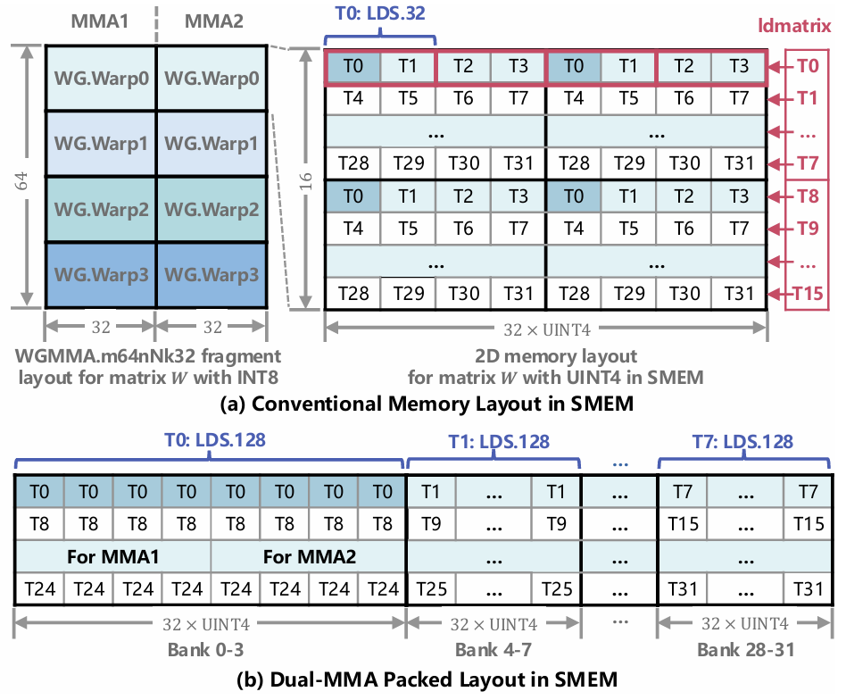
> Figure 7: Comparison of conventional memory layout and our Dual-MMA packed layout.

**传统方法 (Conventional Approach)。** 现代GPU支持在硬件定义的固定矩阵形状上进行MMA操作。对于INT8输入，H800提供了像 `WGMMA.m64nNk32` 和 `WGMMA.m64nNk64` 这样的指令，其中N的范围从8到256。如图7a所示，`WGMMA.m64nNk32` 在张量核心上执行一个64 x N x 32的MMA，需要来自矩阵W的一个64x32片段。WG中的每个经线加载一个16x32的段 (segment)，每个线程使用跨步布局 (strided layout) 将16个元素取入寄存器：每4个连续元素为一组，间隔排列以匹配内部函数的平铺模式。图7a中显示了线程T0访问的元素（深蓝色）。为了从SMEM加载到RF，H800提供了 `ldmatrix` 指令。每个线程在一个事务中加载16个连续字节，并将每4字节组分散 (scatter) 到适当的线程——假设每个元素是1字节。这个假设对于W4A8不成立，因为元素被压缩为4位。结果，`ldmatrix` 会错误地分散数据，例如，原本属于T2和T3的元素可能会被送到T1，如图7a所示。一种替代方法是使用 `LDS.32` 指令，它从指定地址加载32位。然而，每个线程只需要四个4位值，这意味着有一半的数据未被使用，降低了有效带宽。此外，这种方法需要更多的加载指令和额外的地址计算，增加了算术开销，并给CUDA核心带来了额外负担 [15]。

**双MMA打包布局 (Dual-MMA Packed Layout)。** 受QServe [15] 中计算感知权重重排序 (compute-aware weight reordering) 的启发，我们提出了双MMA打包布局来解决这个问题。在单个MMA操作中，每个线程需要16个UINT4元素，而粗粒度的 `LDS.128` 指令每次事务加载32个元素。为了利用这个间隙，我们将每个线程两次连续MMA操作所需的数据打包并连续存储，如图7b所示。这使得每个线程可以使用单个 `LDS.128` 指令加载全部32个UINT4元素。为了满足WGMMA片段布局的要求，我们重新排序权重，使得每个线程在两次MMA中所需的元素在内存中是相邻的。与QServe将权重存储在2D布局中不同，我们将这些元素排列在1D布局中，以消除共享内存库冲突 (shared memory bank conflicts) 并避免对数据打乱 (swizzling) 或复杂数据打包的需要。这种布局支持跨线程的八个 `LDS.128` 操作同时进行，充分利用了共享内存带宽。此外，双MMA打包布局显著减少了加载指令的数量，并最小化了CUDA核心上的地址计算开销。GMEM中的权重矩阵遵循与SMEM相同的布局，使得能够使用每个经线可用的最粗粒度加载指令 `LDG.128` 进行高效传输。由于布局转换是离线应用的，因此不会引入运行时开销。

### 5.3 硬件高效反量化 (Hardware-Efficient Dequantization)

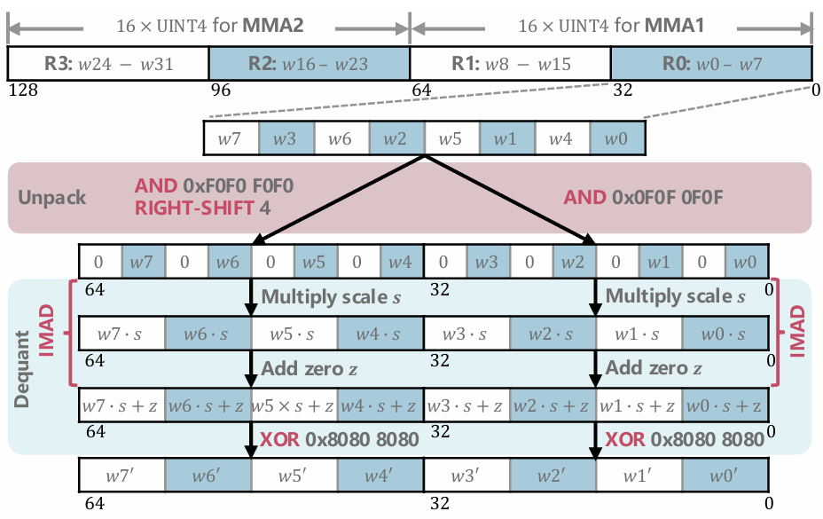
> Figure 8: Dequantization process using bitwise and IMAD instructions, natively supported by hardware. 𝑠 = 𝑠𝑢8 and 𝑧 = 𝑎 are calculated offline based on Equation 12.

将权重从SMEM加载到RF后，每个线程持有32个UINT4元素，打包在四个32位寄存器中，如图8所示。元素w8-w15对应第一个MMA操作，w16-w31对应第二个MMA操作。我们使用LQQ（第4节）在CUDA核心上将这些权重从UINT4反量化为INT8。

图8说明了反量化过程。我们首先应用QServe [15] 的解包方法，将一个寄存器中的八个4位元素扩展为两个包含8位值的寄存器。然后我们使用公式12执行反量化：乘以缩放因子 $s_{u8}$，加上偏移量 $a$，并应用最终的异或 (XOR)。由于LQQ保证了无溢出，所有操作都可以使用本地32位硬件指令执行，特别是用于乘加的 `IMAD` 和用于偏移校正的 `XOR`。注意 $s_{u8}$ 和 $a$ 都可以离线预计算。反量化后，得到的UINT8元素与目标INT8值共享相同的二进制表示，使其可直接用于后续张量核心上的MMA操作。

总之，我们的方法仅用两条硬件算术指令即可反量化四个元素。包括解包步骤在内，反量化八个元素仅需七条指令，显著减少了CUDA核心上的计算负载，远低于与权重加载和MMA有效重叠所需的阈值（第3.3节）。第一级反量化被融合到GEMM尾声，开销可忽略。

### 5.4 其他 GEMM 优化 (Other GEMM Optimizations)

如上所述，GPU MMA指令仅限于硬件定义的固定矩阵形状。对于INT8，H800将m维度固定为64，而n可以在多种配置中从8变化到256。为了在批量大小较小的情况下更好地利用张量核心，我们应用了一个硬件特定的优化：通过改写 $Y=\left(W X^{T}\right)^{T}$ 而不是 $Y=X W^{T}$，允许我们根据批量大小选择WGMMA指令并最大化计算效率。此外，我们采用了标准的GEMM优化，例如持久内核 (persistent kernels)。由于这些技术被广泛使用，为简洁起见，我们省略了细节。

利用CUTLASS和Cute的编程原语，我们将诸如图块调度器 (tile scheduler)、主循环和尾声等组件集成并适配到一个经线专用乒乓内核 (warp-specialized ping-pong kernel) 中。具体来说，我们的反量化算法被融合到MMA主循环中，并且在数据加载期间使用了双MMA打包布局。我们在PTX中实现了WGMMA指令、屏障同步 (barrier synchronization) 以及像TMA这样的通用组件，并由CUTLASS封装。相比之下，反量化逻辑直接在CUDA中实现。

## 6 LLM 服务系统与离线量化 (LLM Serving System and Offline Quantization)

为了支持端到端性能评估，我们实现了一个LLM服务系统，该系统集成了用于关键系统组件的开源技术，包括注意力计算、KV缓存管理和量化方案。本节简要概述了它们的实现以及离线量化。

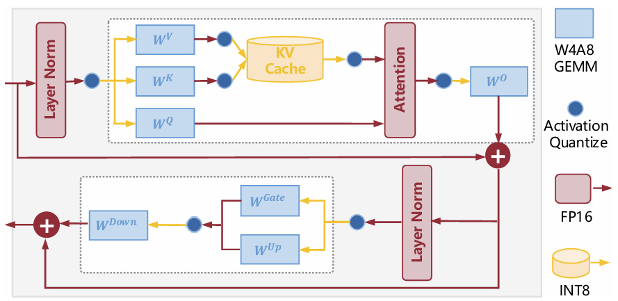
> Figure 9: Overview of dataflows in our LLM serving system for LLaMA models.

**服务系统 (Serving System)。** 图9展示了我们为LLaMA模型构建的LLM服务系统的数据流。查询 (Query)、键 (Key)、值 (Value)、输出 (Output) 和前馈网络 (FFN) 层使用我们提出的LiquidGEMM执行，对权重和激活进行W4A8量化，产生FP16输出。遵循TensorRT-LLM [20]，KV缓存使用逐通道静态量化 (per-channel static quantization) 量化为INT8，缩放因子离线计算。为了提高内存效率，我们采用PagedAttention [12] 进行KV缓存管理，并使用FlashAttention-2 [6] 进行运行时注意力计算。我们没有采用FlashAttention-3 [22]，因为它专为FP8设计。对于激活量化，我们遵循SmoothQuant [29]，通过逐令牌量化 (per-token quantization) 除以平滑缩放因子 (smooth scale) 后，将FP16激活动态映射到INT8。由于激活张量内存占用小且计算开销低，量化是轻量级的，通常融合到其他内核中。

**离线量化 (Offline Quantization)。** 我们采用SmoothQuant [29] 训练后量化 (post-training quantization) 方法离线量化权重。具体来说，权重首先通过平滑因子进行缩放，然后使用第4节描述的两级方法进行量化：从FP16到INT8的逐通道量化，然后是逐组量化到UINT4。遵循OutlierSuppression+ [28]，我们应用网格搜索 (grid search) 来确定最优的平滑缩放因子。请注意，我们的重点是优化W4A8 GEMM的效率；我们的方法可与提高量化准确性的技术正交，并且可以无缝集成此类方法。

## 7 实验 (Experiments)

### 7.1 实验设置 (Experimental Setup)

**研究系统 (Systems Under Study)。** 我们的W4A8内核LiquidGEMM使用CUDA和PTX实现。我们将第6节描述的完整LLM服务系统称为LiquidServe。默认情况下，权重使用分组大小为64的分组量化进行量化，KV缓存使用逐通道静态量化量化为INT8。我们将LiquidServe与两个基线系统进行比较。第一个是QServe [15]，一个最先进的W4A8 LLM服务系统，具有高效的W4A8 GEMM实现。QServe默认使用分组大小为128的分组权重量化，并将KV缓存量化为4位。我们使用其GitHub上公开可用的实现¹。第二个基线是TensorRT-LLM [20]，一个由NVIDIA提供的LLM推理框架。我们使用其0.16.0版本的实现²。我们将其包含在几种常见精度设置下的比较中：FP16（表示为TRT-FP16）、W4A16（TRT-W4A16）、W8A8（TRT-W8A8）和FP8（TRT-FP8）。对于W4A16、FP8和FP16配置，KV缓存被逐通道量化为FP8；对于W8A8，则量化为INT8。

**测试平台 (Testbed)。** 我们在配备Intel Xeon Platinum 8457C CPU、2.9 TB RAM和NVIDIA H800 GPU（80 GB内存）的Linux服务器上进行实验，通过云访问。所有系统级评估均在PyTorch 2.4.0和CUDA 12.4下运行。为了隔离并公平比较GEMM内核性能，我们从每个系统中提取GEMM内核，并使用统一的基于CUDA的框架³对其进行基准测试。该框架支持灵活的矩阵形状配置以模拟各种模型场景。

**实验路线图 (Experiment Roadmap)。** 我们的评估包括两部分。首先，我们测量系统级吞吐量和延迟，以了解量化对LLM服务端到端的影响。虽然我们的重点是加速W4A8 GEMM，但这一步提供了GEMM效率如何转化为整体系统性能的背景。然而，系统级性能也受到其他因素的影响，例如注意力计算和KV缓存管理，这些因素在不同实现中有所不同，不在本文讨论范围内。因此，我们用第二组实验作为补充，该实验使用我们的统一框架直接对GEMM内核进行基准测试。这使得在一致和受控的条件下进行公平、准确的比较成为可能。

尽管我们的LQQ量化算法旨在提高效率，我们也评估了其对模型准确性的影响。我们在LLaMA [9, 25, 26]、Mistral-7B [10]、Mixtral-8x7B [11] 和 Yi-34B [31] 上进行了测试，使用了WikiText2 [19] 上的困惑度 (perplexity) 以及PIQA [2]、ARC [5]、HellaSwag [33] 和WinoGrande [21] 上的零样本 (zero-shot) 准确率。结果表明LQQ保持了准确性。由于篇幅限制，详细结果将在完整版技术报告中发布。

### 7.2 LLM 服务效率比较 (Efficiency Comparison of LLM Serving)

**内存约束下的吞吐量 (Throughput Under Memory Constraint)。** 我们在相同内存预算（H800 GPU上80 GB）下比较所有系统可实现的最大吞吐量。遵循先前的工作 [15]，我们将输入和输出序列长度固定为1024和512。我们改变批量大小从1到256（或直到系统内存不足），以确定最优配置，并报告每个系统实现的峰值吞吐量。

表1总结了所有系统的峰值吞吐量。QServe通常在批量大小为64或128时达到峰值性能，而LiquidServe随着批量大小的增加继续扩展。因此，QServe在LLaMA-30B和LLaMA2-13B上优于TRT，因为它使用低位KV缓存，允许更大的批量大小，但在其他模型上表现明显较差。LiquidServe在LLaMA3-8B和Mistral-7B上略低于TRT-FP8，因为TRT-FP8利用了针对H800上FP8优化的注意力内核。然而，LiquidServe在其余案例中始终优于所有其他系统。性能优势在较大模型上尤其显著。例如，在LLaMA2-70B上，LiquidServe通过4位权重量化支持更大的批量大小，比TRT-W8A8实现了3.16倍的加速；并且由于其更高的计算吞吐量和INT8 MMA，比TRT-W4A16实现了1.63倍的加速。这些结果突显了W4A8量化在系统级上的实际效率提升。

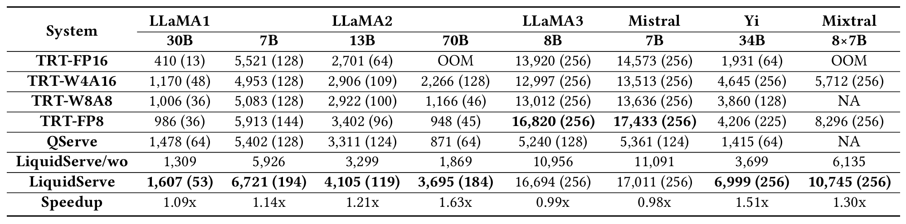
> Table 1: Peak token generation throughput (tokens/s) of LiquidServe, QServe, and TRT on H800 with 80 GB memory constraint. The number in parentheses indicates the batch size at which peak throughput is achieved. Speedup is reported relative to the best-performing baseline between QServe and TRT. LiquidServe/wo uses the W4A8 GEMM kernel from QServe.

然而，如前所述，系统性能受到注意力计算和KV缓存管理的影响。为了分离我们W4A8 GEMM的贡献，我们用QServe的W4A8内核替换LiquidServe中的LiquidGEMM，表示为LiquidServe/wo。如表1所示，LiquidServe比LiquidServe/wo实现了1.13-1.98倍的端到端加速，这既证明了GEMM的关键作用，也证明了LiquidGEMM的有效性。

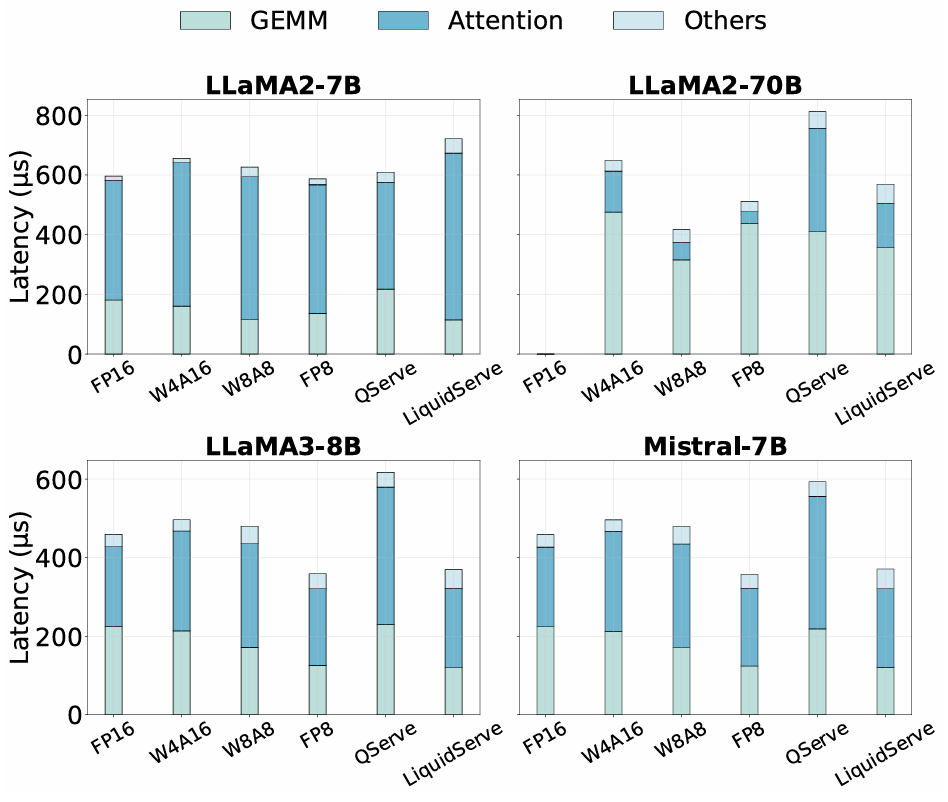
> Figure 10: Time breakdown for processing one decoding layer of LLaMA2-7B, LLaMA2-70B, LLaMA3-8B, and Mistral-7B at the batch sizes specified in Table 1.

**端到端LLM服务的时间分解 (Time Breakdown of End-to-End LLM Serving)。** 为了分析表1中端到端性能提升的来源，我们将LLaMA2-7B、LLaMA2-70B、LLaMA3-8B和Mistral-7B在相应批量大小下的一层推理时间分解为GEMM、注意力和其他部分。请注意，虽然较大的批量大小通常会产生更高的吞吐量，但它们也会增加每层的处理工作负载。如图10所示，得益于LiquidGEMM的硬件友好型反量化缓解了CUDA核心瓶颈，LiquidServe始终提供与所有基线相当或更优的GEMM延迟。

在LLaMA2-7B上，LiquidServe实现了最低的GEMM延迟，比QServe快1.90倍，比TRT快达1.58倍。在LLaMA2-70B上，尽管使用了更大的批量大小，它仍然比QServe快1.15倍，但比TRT-W8A8稍慢。对于LLaMA3-8B和Mistral-7B，LiquidServe在GEMM延迟上与FP8相当，但在“其他”类别中产生了略高的开销。这些结果突显了LiquidGEMM在提高整体推理效率方面的有效性。

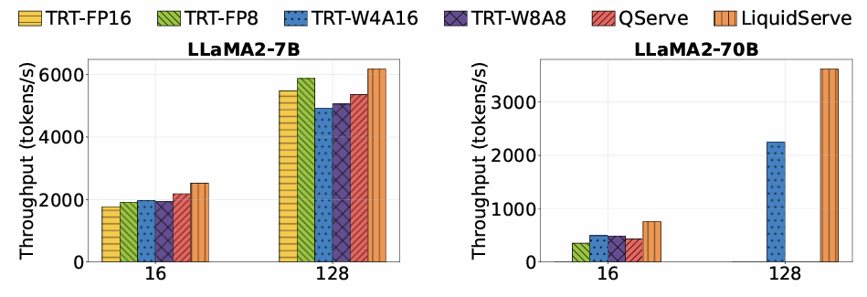
> Figure 11: Comparison of token generation throughput across systems at the same batch size.

**固定批量大小下的吞吐量 (Throughput at Fixed Batch Sizes)。** 为了在一致的工作负载设置下进一步评估系统性能，我们使用相同的批量大小比较不同系统的吞吐量。由于篇幅限制，我们以LLaMA2-7B和LLaMA2-70B为代表。图11显示了两个批量大小的令牌吞吐量：16（通常是内存受限）和128（接近计算受限）。缺失的条形表示内存不足错误。LiquidServe始终优于所有基线，展示了其效率优势。

### 7.3 GEMM 内核效率比较 (Efficiency Comparison of GEMM Kernel)

我们使用统一的测试框架评估了所有系统的量化GEMM内核的效率。具体来说，我们测量了在单个Transformer层上所有GEMM的计算性能，包括融合的QKV投影GEMM、输出投影GEMM和两个FFN GEMM，结果在五次运行中取平均值。

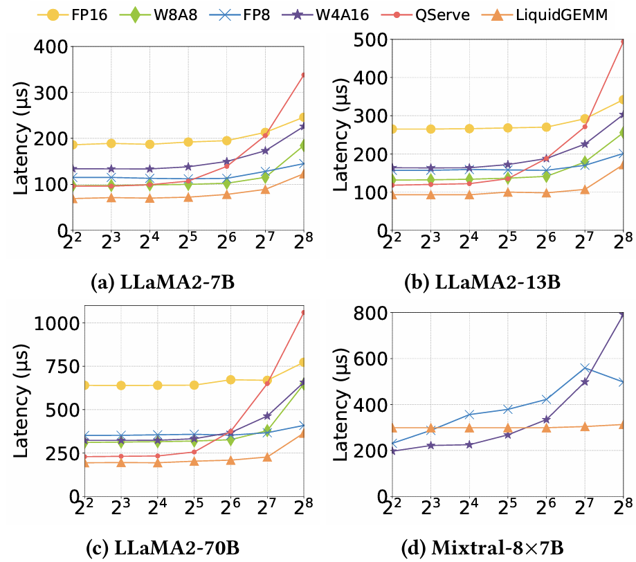
> Figure 12: Comparison of GEMM latency on the FFN layer with batch sizes ranging from 4 to 256.

**效率比较 (Efficiency Comparison)。** 图12比较了批量大小从4到256的GEMM延迟。在LLaMA模型上，由于4位量化的优势，QServe和LiquidGEMM在LLaMA2-13B和LLaMA2-70B的小批量大小下通常优于其他系统。然而，随着批量大小的增加，QServe经历了显著的性能下降，而LiquidGEMM始终保持较低的延迟。在批量大小256时，LiquidGEMM在LLaMA2-7B、13B和70B上分别比QServe实现了2.75倍、2.87倍和2.90倍的加速。对于Mixtral-8x7B，当批量大小小于32时，TRT-W4A16和TRT-FP8优于LiquidGEMM，因为它们使用了针对小批量场景优化的专用GEMV内核。在批量大小超过32时，LiquidGEMM比TRT-FP8实现了1.41-1.84倍的加速，比TRT-W4A16实现了1.12-2.53倍的加速，展示了强大的可扩展性和鲁棒性。

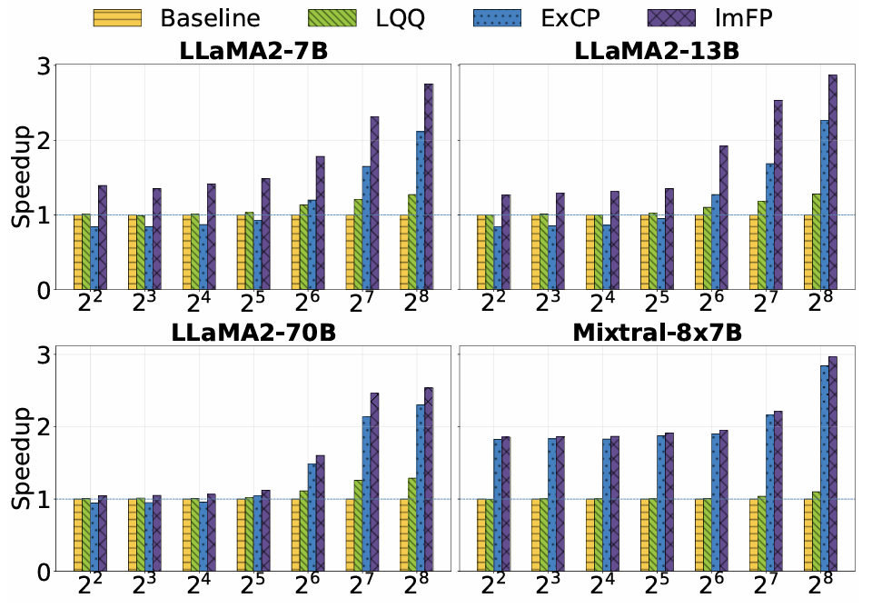
> Figure 13: Ablation study of LiquidGEMM by first enabling LQQ, followed by either the explicit coarse-grained pipeline (ExCP) or the implicit fine-grained pipeline (ImFP).

**消融研究 (Ablation Study)。** 图13展示了消融结果。我们首先启用LQQ。当批量大小较小时，GEMM是内存受限的，LQQ提供的益处有限。随着批量大小的增加和计算占主导地位，LQQ带来了高达1.29倍的加速。在小批量大小时启用ExCP会由于往返流量和同步开销而降低性能。在较大的批量大小时，流水线执行变得更加有效，ExCP开始提供益处。相比之下，ImFP在所有批量大小下都能持续提高性能。请注意，ExCP和ImFP共享相同的内存布局和反量化逻辑。它们的优势源于跨分组GEMM的流水线执行，特别是对于MoE模型，而基线和仅LQQ的变体缺乏这种跨GEMM流水线。总之，这些结果突显了LQQ算法的有效性和ImFP流水线策略的优越性能。

## 8 相关工作 (Related Work)

**LLM推理的量化 (Quantization for LLM Inference)。** 方法通常分为两类：仅权重量化 (weight-only quantization) 和权重-激活量化 (weight-activation quantization)。对于仅权重量化，GPTQ [8] 通过使用近似的二阶信息将权重压缩到3或4位，开创了亚8位量化。AWQ [14] 通过结合激活统计信息来识别和保护关键权重，进一步提高了准确性。对于权重-激活量化，GPT3.int8() [7] 引入了混合精度量化，将激活中的离群值 (outlier) 隔离在单独的16位乘法中。SmoothQuant [29] 提出通过数学上等效的转换将量化挑战从激活迁移到权重，有效地平滑了激活离群值。Atom [35] 采用混合精度细粒度分组量化，在吞吐量和准确性之间取得了平衡。OmniQuant [23] 提供了自动学习最优量化参数的方法。QServe [15] 利用针对GPU张量核心优化的两阶段W4A8KV4量化方法，而QQQ [34] 将自适应平滑与基于Hessian的补偿相结合，开发了一种新的W4A8 GEMM内核。其他近期工作，包括QuaRot [1]、SpinQuant [18] 和 DuQuant [13]，应用了变换（例如旋转）来有效分布离群值。其中，DuQuant与SpinQuant相比简化了训练复杂性，并展示了优于QuaRot的性能。与这些工作不同，本文专注于W4A8 GEMM的效率，以实现高效的LLM服务。

**LLM训练的量化 (Quantization for LLM Training)。** 量化感知训练 (Quantization-aware training, QAT) 比训练后量化 (post-training quantization, PTQ) 实现了更高的准确性，但由于其高计算开销，其应用受到限制。LLM-QAT [17] 引入了一种使用预训练模型生成的无数据蒸馏方法，使得LLM的实用QAT成为可能。EfficientQAT [4] 通过两阶段训练策略加速了QAT。Bondarenko等人 [3] 提出了一种轻量级、内存高效的LLM低秩QAT方法。EdgeQAT [24] 引入了一种基于熵引导的方法，具有自适应令牌重要性，以减少QAT中的信息失真。

**LLM服务 (LLM Serving)。** Orca [32] 通过迭代级调度和选择性批处理优化了服务性能。vLLM [12] 通过受虚拟内存机制启发的PagedAttention提高了KV缓存管理效率。NVIDIA的TensorRT-LLM [20] 提供了一个专门为在GPU上加速LLM推理而优化的开源库。DistServe [36] 通过使用高级放置算法解耦预填充 (prefill) 和解码 (decoding) 计算，增强了服务性能。COMET [16] 提出了一个混合精度推理框架，结合了新颖的、高度优化的内核，以最大化LLM推理性能。

## 9 结论 (Conclusion)

本文解决了LLM服务中W4A8量化的反量化瓶颈。我们首先分析了现有的W4A8 GEMM内核，并开发了一个成本模型来识别关键性能因素。在此分析的指导下，我们提出了LiquidGEMM，一种硬件高效的W4A8 GEMM内核，它集成了两种协同设计的技术：LiquidQuant，一种防溢出的反量化算法；以及一种隐式细粒度流水线，可在GPU子系统之间最大化并行性。实验表明，与先前的W4A8内核相比，实现了高达2.90倍的内核加速和4.94倍的系统级加速，并且比NVIDIA TensorRT-LLM实现了1.12-1.63倍的改进。这些结果表明，硬件感知设计使得W4A8 GEMM对于高性能LLM推理既高效又可扩展。
