# CWM：面向世界模型的代码生成研究开源权重大语言模型

Meta FAIR CodeGen团队

- [CWM：面向世界模型的代码生成研究开源权重大语言模型](#cwm面向世界模型的代码生成研究开源权重大语言模型)
  - [1 引言](#1-引言)
  - [2 代码世界模型数据集](#2-代码世界模型数据集)
    - [2.1 可执行仓库镜像：大规模构建仓库](#21-可执行仓库镜像大规模构建仓库)
    - [2.2 Python 追踪：神经代码解释数据](#22-python-追踪神经代码解释数据)
    - [2.3 ForagerAgent：代理中期训练数据生成](#23-forageragent代理中期训练数据生成)
  - [3 代码世界建模示例](#3-代码世界建模示例)
  - [4 CWM：架构、预训练与缩放定律](#4-cwm架构预训练与缩放定律)
    - [4.1 架构与超参数](#41-架构与超参数)
    - [4.2 两阶段预训练](#42-两阶段预训练)
    - [4.3 缩放定律](#43-缩放定律)
  - [5 后期训练：SFT、RL算法与环境](#5-后期训练sftrl算法与环境)
    - [5.1 监督微调（SFT）](#51-监督微调sft)
    - [5.2 RL算法](#52-rl算法)
    - [5.3 RL环境与数据](#53-rl环境与数据)
      - [5.3.1 代理软件工程（SWE）](#531-代理软件工程swe)
      - [5.3.2 编码](#532-编码)
      - [5.3.3 代理编码](#533-代理编码)
      - [5.3.4 数学](#534-数学)
    - [5.4 联合RL](#54-联合rl)
  - [6 代码与基础设施](#6-代码与基础设施)
    - [6.1 高效训练技术](#61-高效训练技术)
    - [6.2 RL系统](#62-rl系统)
  - [7 实验结果](#7-实验结果)
    - [7.1 CWM数据的影响](#71-cwm数据的影响)
    - [7.2 代理评估](#72-代理评估)
    - [7.3 执行跟踪预测](#73-执行跟踪预测)
    - [7.4 程序终止预测](#74-程序终止预测)
    - [7.5 算法复杂度预测](#75-算法复杂度预测)
    - [7.6 代码与数学推理](#76-代码与数学推理)
    - [7.7 非推理评估](#77-非推理评估)
  - [8 透明度、风险与限制](#8-透明度风险与限制)
    - [8.1 关于外部模型和数据的透明度](#81-关于外部模型和数据的透明度)
    - [8.2 代码世界模型准备度报告](#82-代码世界模型准备度报告)
    - [8.3 局限性 \& 未来研究](#83-局限性--未来研究)
  - [9 结论](#9-结论)

我们发布Code World Model（CWM），这是一个拥有320亿参数的开源权重大语言模型，旨在推动结合世界模型的代码生成研究。为了提升对代码的理解能力，我们通过中间训练阶段让CWM学习大量来自Python解释器和代理Docker环境的观察-动作轨迹，并在可验证的编码、数学和多轮软件工程环境中进行了广泛的强化学习多任务推理训练。借助CWM，我们为研究人员提供了一个强大的测试平台，以探索世界模型如何通过计算环境中的推理和规划来改进代码生成。本文展示了世界模型如何助力代理编码、实现Python代码执行的逐步模拟，并初步验证了推理能力如何从中受益。CWM是一个密集型解码器架构的大语言模型，支持最大131k上下文长度。除世界建模能力外，CWM在通用编码和数学任务上也表现出色：在SWE-bench Verified上达到65.8%的pass@1分数（含测试时扩展），LiveCodeBench上68.6%，Math-500上96.6%，AIME 2024上76.0%。为支持代码世界建模的进一步研究，我们发布了中间训练、监督微调和强化学习后的模型检查点。

日期：2025年9月24日

推理代码：github.com/facebookresearch/cwm

---

## 1 引言

软件开发是大型语言模型（LLMs）已经产生显著现实世界影响的领域之一（Cui et al., 2024; Bick et al., 2024）。它们已迅速被全球软件工程师采纳到其工作流程中，并且其能力发展迅速：从仅支持程序员编写小片段代码到自主修复问题或编写代码库（Yeverechyahu et al., 2024; Handa et al., 2025）。然而，即使对当前一代的LLMs来说，可靠地生成高质量代码仍然是一个挑战，基准测试在发布时 consistently 揭示出缺点（Hendrycks et al., 2021a; Chen et al., 2021; Aider Team, 2025; Jimenez et al., 2024）。

我们相信，利用LLMs推进代码生成可能需要新的训练和建模范式。通常，在预训练期间，代码被视为与任何其他文本数据相同：模型学习从左到右、从上到下逐行预测代码。我们认为这是不够的——要掌握编码，人们必须不仅理解代码看起来是什么样子，还要理解它在执行时做什么。这种技能对软件工程师的日常工作至关重要：在局部层面，他们理解一行代码的执行如何改变局部变量的状态，并且，在全局层面，他们可以预测代码库的更改如何影响程序输出。然而，通常在后期训练之前，并不考虑教授LLMs这种代码世界建模能力。

我们发布代码世界模型（Code World Model, CWM），这是一个用于代码生成和推理的新LLM，它已经在大量代码世界建模数据上进行了训练。具体来说，CWM在两种不同类型的观察-行动轨迹上进行了中期训练（mid-trained），这些轨迹捕获了软件开发的重要方面：Python代码执行跟踪和与Docker环境的代理交互。大规模的中期训练此类数据应有助于通过将我们模型的预测基于底层动态系统来改进编码性能，并为强化学习（RL）提供优越的起点。

对于Python执行数据，行动是Python语句，观察包含局部变量的内容。通过在仅以代码为上下文的条件下，在观察-行动对的轨迹上训练CWM，我们直接教授模型一行Python代码的执行如何影响局部变量的状态。我们这里的前提是，教授CWM程序的语义而不仅仅是语法，应该有助于编写代码以及推理任务，如验证、测试和调试。

我们还在一大规模合成的与计算环境的代理交互集合上训练CWM。这些轨迹是由我们所谓的ForagerAgent生成的，它“搜寻”涵盖代理软件工程场景的数据，例如根据错误消息实现缺失功能或修复错误。这里的行动是代理生成的类似shell的命令或代码编辑，观察是来自运行环境的响应。虽然最近的模型包含类似数据并不少见，但这主要是在后期训练期间以小规模进行（Yang et al., 2025b）。另一方面，来自ForagerAgent的数据是大规模的，并且已经包含在中期训练中，有助于在后期训练之前塑造内部表征。

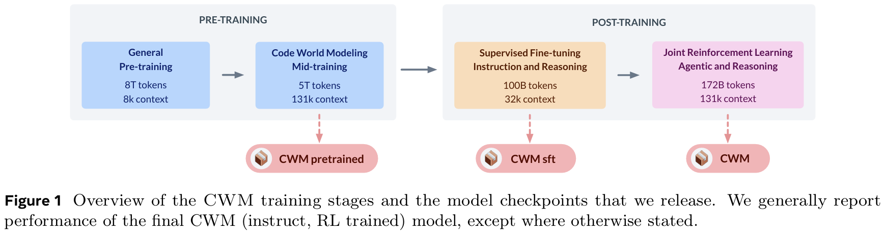

CWM使用密集的、仅解码器的Transformer架构（Vaswani et al., 2017; Radford et al., 2018），具有320亿（$32\mathrm{B}$）参数，交错滑动窗口注意力支持高达131k（$131\mathrm{k}$）token的上下文大小，并在预训练、中期训练和后期训练阶段进行训练（见图1）。通过量化，可以在单个80 GB的NVIDIA H100上执行CWM推理。除了世界建模能力之外，CWM在通用和代理编码及推理任务上相对于其他同等规模的开源权重模型实现了强大的性能：它在SWE-bench Verified上达到65.8%的pass@1分数（使用测试时缩放；见图2），在LiveCodeBench-v5上达到68.6%，在Math-500上达到96.6%，在AIME 2024上达到76.0%，在CruxEval Output上达到94.3%。

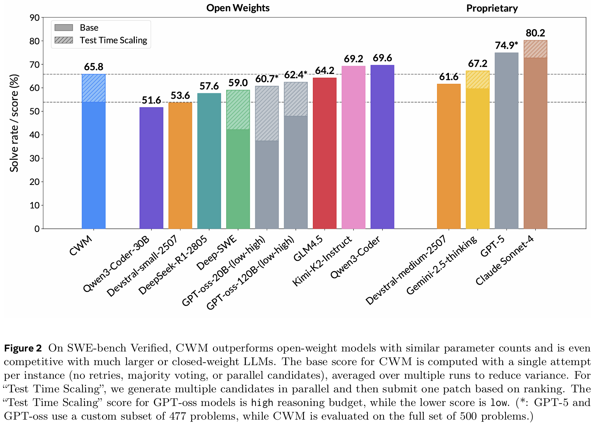

首先，发布CWM旨在支持关于利用世界建模改进代码生成的新研究。我们对此愿景感到兴奋，并且我们的报告提供了早期的支持性证据：我们举例说明了世界模型如何有益于代理编码，支持Python代码执行的逐步模拟，并展示了推理如何从后者中受益的早期结果。然而，我们相信最好的尚未到来，并希望与开源研究社区携手探索如何利用世界模型进行推理和规划以改进代码生成。为此，我们在非商业研究许可下发布最终权重和中间检查点。鉴于CWM的竞争性能，我们进行了一项准备度评估，结论是CWM不太可能增加超出当前模型生态系统中已存在的灾难性风险。

## 2 代码世界模型数据集

CWM 在预训练、中期训练和后期训练阶段接受了各种数据集的训练。我们在所有训练阶段都高度重视代码和代码世界建模数据。我们重点介绍两项大规模的数据收集工作，它们赋予了 CWM 的世界建模能力：Python 执行跟踪和 ForagerAgent。我们在 §4 中介绍了我们数据混合中更传统的组成部分。

### 2.1 可执行仓库镜像：大规模构建仓库

捕获 Python 执行跟踪和真实世界软件工程任务中的代理轨迹的一个核心前提是大规模执行代码仓库。为了隔离和可重复性，我们将这些仓库构建为 Docker 容器，称为可执行仓库镜像（executable repository images）。这些镜像包含一个预配置的环境，能够运行仓库代码和测试，无需额外设置。由于手动构建任意的 GitHub 仓库无法扩展到我们期望的数据集规模，我们同时采用了基于 LLM 和基于 CI 的方法。

对于前者，一个由 LLM 支持的代理，称为 RepoAgent，其任务是设置目标仓库的开发环境，查找测试文件，并确保大量测试能够运行并通过。为了支持其工作，我们向 RepoAgent 提供从目标仓库提取的人类可读文档。尽管这进一步提高了 RepoAgent 的成功率，但面向人类的文档可能由于缺乏可验证性和维护激励不足而存在不准确性。相比之下，面向机器的指令必须保持准确才能成功构建，像 GitHub 这样的平台会立即发出失败信号。

因此，我们还开发了 Activ（在虚拟环境中执行）流水线，以重新利用 GitHub Actions CI 执行来构建可执行仓库镜像。该流水线通过 act (Lee, 2019) 库在本地运行工作流。由于许多 GitHub Actions 工作流并非为第三方执行设计，并且不限于 CI 构建，我们修改目标仓库的源代码，并在单个成功构建完成后触发提前退出。由于所有 GitHub Actions 工作流作业在单独的容器中同时运行且构建状态是瞬态的，我们添加或修改仓库的 pytest 配置文件，以注入一个在测试执行时自动运行的 fixture。这个 fixture 捕获运行单元测试的容器的构建状态。然后，我们提交并推送每个仓库的结果镜像，详见 §D。通过并行运行 RepoAgent 和 Activ 方法，我们创建了超过 3.5 万个（$35\mathrm{k}$）独特的可执行仓库镜像。

### 2.2 Python 追踪：神经代码解释数据

我们介绍的第一种 CWM 数据是 Python 程序的内存追踪。这涉及收集可执行函数或可执行仓库镜像，并使用不同的 IO 对或 CI 测试运行它们，同时捕获每行代码执行后的内存状态，主要是局部变量。这个过程使我们能够对齐代码和执行跟踪，以模拟计算环境中的观察-行动数据。先前的工作经验表明，这种方法有益于提高通用代码生成和理解能力（Armengol-Estapé et al., 2025; Zhang et al.）。神经代码解释还有潜力超越传统解释器，其应用包括追踪不可执行代码或将其与推理能力相结合。接下来，我们描述我们收集执行跟踪数据的不同来源。

**函数级追踪。** 我们从在线资源收集了一个 Python 函数数据集，并通过结合模糊测试和提示 Llama3-70B-Instruct 自动生成输入-输出对。我们的追踪过程捕获了 Python 程序（解释器堆栈帧）在不同中间执行点的状态，这些状态对应于 Python 解释器的事件（例如，执行的代码行、返回语句、异常）。最终数据集包含超过 1.2 亿（120 M）个追踪的 Python 函数。

我们对原始跟踪进行后处理以构建观察-行动对。观察包含在执行一行代码之前立即存在的局部变量和堆栈帧元数据，行动是正在执行的特定 Python 代码行，随后的观察捕获了产生的局部变量状态以及其他事件元数据（如返回语句）；我们忽略全局变量和外部副作用。相对于上一步未发生变化的变量值用省略号概括。我们在跟踪数据前加上源代码上下文。

图 3 说明了 Python 跟踪的 CWM 格式。给定一个 Python 代码上下文和一个跟踪起始点标记，模型跟随一系列 Python 堆栈帧预测（以 JSON 格式的字典形式，包含局部变量）和相应的行动（即正在执行的代码部分）。帧、行动和参数分隔符，以及跟踪上下文开始指示器，都使用自定义 token 表示。我们请读者参考 §B 获取跟踪预测示例，参考 §H 获取此跟踪表示格式的规范。

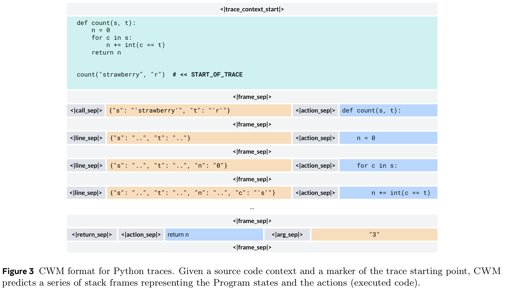

**CodeContests 解决方案追踪。** 我们还为竞争性编程问题的解决方案生成跟踪数据。具体来说，我们使用 Llama-3.1-70B-Instruct 为 CodeContests (Li et al., 2022) 训练集问题生成 Python 解决方案，重用 Gehring 等人 (2025) 的框架。对生成结果进行过滤以确保错误和正确提交的平衡，最终总数达到 $262\mathrm{k}$。我们使用提供的单元测试中的输入对这些解决方案进行跟踪，并过滤掉超过 $10\mathrm{k}$ 行事件或磁盘空间占用超过 1 MB 的长跟踪，剩下 $33\mathrm{k}$ 个有效代码片段和 $70\mathrm{k}$ 个跟踪。

**仓库级追踪。** 我们还对超过 $21\mathrm{k}$ 个可用且可追踪的仓库镜像的单元测试进行了 Python 执行跟踪。对于这些仓库的一个子集，我们使用仓库的 git 日志随机选择我们构建的提交之前的额外提交。由于构建环境是针对当前提交的依赖项配置的，较旧的提交可能无法执行。我们尝试对每个仓库最多追踪 40 个历史提交，但将每个仓库的成功跟踪限制在 4 个提交以内，以避免任何单个仓库的过度代表。这个过程产生了大约 $70\mathrm{k}$ 个执行跟踪的提交。

我们对原始跟踪进行后处理分为两个步骤。首先，我们将跟踪“片段化”，从原始 pytest 跟踪中提取函数级跟踪，可配置堆栈深度和随机步入概率。当随机步入发生时，函数调用会概率性地包含在其父跟踪中，而不是作为一个单独的片段，以模拟可变的执行深度。在第二步中，我们从目标仓库收集并压缩预测观察-行动轨迹所需的源代码上下文。对生成的上下文-跟踪对，我们应用与之前相同的 CWM 格式化。

**自然语言追踪。** 最后，我们生成了一个用自然语言而非之前严格的 JSON 类格式逐步描述 Python 代码执行的数据集。代码执行的自然语言解释更接近其他 LLM 任务的领域，我们希望这将简化到其他上下文的知识迁移，例如代码生成中的推理。这种不太结构化的格式还有其他优点，例如允许注入语义上下文（例如，“此操作保留了最大堆的结构属性”）或通过动态跳过轨迹中不太有趣的部分（例如，for 循环中的重复逻辑）来压缩跟踪。我们通过提示 Qwen3-32B-FP8（无思考）(Yang et al., 2025a) 重写来自我们函数级和 CodeContests 跟踪数据集的执行跟踪来生成此数据。在移除 Qwen 的最终输出预测与地面真实跟踪分歧的情况后，我们从独立的 Python 函数中获得 7500 万（75 M）条轨迹，从 CodeContests 数据中获得 $110\mathrm{k}$ 条。

### 2.3 ForagerAgent：代理中期训练数据生成

我们在一个由基于 LLM 的软件工程代理与计算环境之间交互的大规模数据集上对 CWM 进行中期训练。这些数据由我们所谓的 ForagerAgent 生成，它通过提示 LLM 在特定代码仓库的上下文中解决软件工程任务来收集多步轨迹。在中期训练期间尽早让 CWM 大规模接触此类数据，应能改善后续在类似环境中的后期训练，因为模型预测应该已经基于环境动态。

代理可用的行动源自标准 SWE-Agent (Yang et al., 2024) 工具集：(i) 创建文件，(ii) 编辑文件，(iii) 运行 bash 命令，以及 (iv) 查看或导航文件内部。一旦 LLM（Llama3-70B-Instruct (Dubey et al., 2024) 或 Qwen3-235B-A22B（无思考）(Yang et al., 2025a)）认为任务已解决，或者 token 数量、轮次或 API 成本超过硬性限制，轨迹即告结束。与仓库级跟踪数据一样，ForagerAgent 依赖于我们的一组可执行仓库镜像（见 §2.1）来播种问题生成。为避免污染，我们过滤掉 SWE-bench 中使用的所有仓库（及其分支）。呈现给模型的任务可分为两组：合成任务和真实世界任务，我们称之为 mutate-fix 和 issue-fix。

**Mutate-fix 任务。** 对于 mutate-fix 任务，我们从一个工作的代码库开始，然后合成地引入一个错误让代理修复。我们首先识别可以使用仓库测试套件验证的函数（和方法 - 为简洁起见下文省略）。作为第一步，我们将这些函数过滤到所有单元测试都成功通过的子集。然后，我们考虑以下一组突变来合成地将错误引入这些函数：

*   **函数：** 移除函数的一部分或整个函数。
*   **参数：** 从函数定义中移除参数或随机重新排序函数调用参数。
*   **变量：** 在函数中采样一对变量并交换它们的所有出现。
*   **语句：** 移除 import 或 return 语句。
*   **操作符：** 替换函数语句中的操作符（二元、一元或布尔）。

我们通过解析相应函数的抽象语法树（AST）来过滤掉无法应用于给定函数的突变。最后，我们验证应用候选突变确实会导致相关的单元测试失败。现在我们可以使用这个突变作为代理数据收集的起点：我们指示代理检查突变后的函数，运行其单元测试，并通过修复错误来解决失败的测试。

**Issue-fix 任务。** 对于 issue-fix 任务，我们提示模型修复我们仓库集中的真实问题，使用来自 GitHub 的问题和拉取请求（PR）数据。我们检出错误修复 PR 之前的提交，并让代理负责解决失败的单元测试，并提供相应的 GitHub 问题描述作为上下文。我们确保在 PR 之前单元测试失败，并且它们的解决对于解决问题是必要且充分的。

**后处理。** 为避免对重复交互过拟合，我们对从同一源仓库采集的轨迹进行近重复数据删除：我们首先通过连接其行动来表示轨迹，然后使用 MinHash 对轨迹进行编码，最后丢弃轨迹，使得所有保留的编码轨迹之间的成对 Jaccard 相似度小于 0.5。因为我们对 ForagerAgent 数据的目标是学习代理与代码环境交互的全面世界模型，我们不根据错误或问题解决是否成功来过滤轨迹。遵循同样的动机，我们进一步训练模型以预测代理和环境轮次，尽管我们随机屏蔽 $50\%$ 的观察的损失，因为它们表现出有限的多样性。总体而言，我们剩下从 $10.2\mathrm{k}$ 个镜像获得的 300 万（3M）条轨迹，我们参考表 1 获取更详细的统计数据。

**表 1 ForagerAgent 轨迹的统计数据。我们从 $10.2\mathrm{k}$ 个镜像和 $3.15\mathrm{k}$ 个底层仓库中收集了 $3\mathrm{M}$ 条轨迹。轨迹在 issue-fix 和 mutate-fix 任务之间按 55-45 分割。**

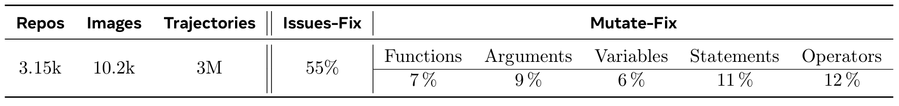

## 3 代码世界建模示例

在更正式地介绍CWM架构和基准测试结果之前，在本节中，我们分享一些来自最终模型的生成示例，以阐述我们对代码世界建模的兴奋之情。

对于竞争性编程，图4展示了一个示例，其中CWM首先在推理问题陈述后创建了一个初始解决方案，然后构建输入-输出对以评估其解决方案的正确性，最后将其自己的预测与程序执行的实际结果进行比较。尽管我们没有直接为此训练CWM，但这正是我们相信代码世界模型能够实现的那种关于环境动态的推理。我们对于未来那些明确整合关于环境反馈的推理以改进代理代码生成的研究感到兴奋。

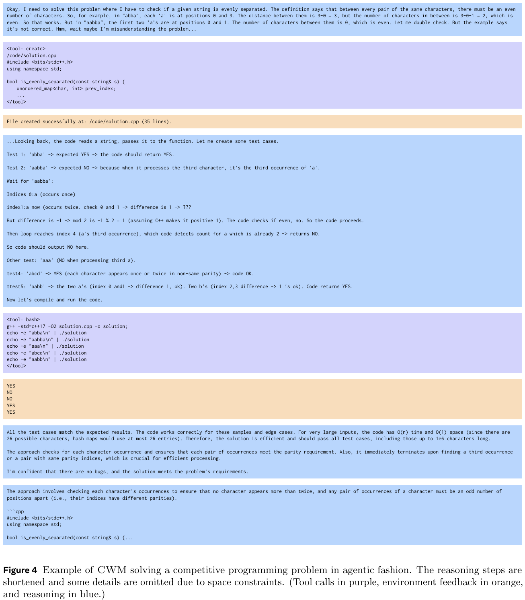
**图4** CWM以代理方式解决竞争性编程问题的示例。由于空间限制，推理步骤被缩短并省略了一些细节。（紫色表示工具调用，橙色表示环境反馈，蓝色表示推理。）

虽然CWM被训练为逐行模拟Python代码的执行，但我们认为将跟踪预测正式整合到自然语言推理中是未来一项有趣的工作。图5展示了这方面的早期原型，显示CWM在轻度提示下已经能够泛化到这种行为。我们相信执行跟踪预测能够实现关于代码生成和执行的接地推理（grounded reasoning），而无需访问实时执行环境。这可以采取明确的形式，例如在我们的原型中，但我们还设想通过世界建模来规范推理的更隐式形式。我们进一步计划扩展CWM的跟踪预测，以创建一个“神经调试器”，其能力超越传统调试，例如在恒定时间内跳转到代码的未来行、预测到达任意状态的输入，或学习支持程序验证、调试或生成的程序状态的抽象表示。

与此相关的是，我们对更直接地使用Python执行跟踪预测来改进代码生成感到兴奋。在适当的提示下，CWM可用于预测未直接在上下文中给出但仅通过自然语言或形式化断言约束的函数的执行跟踪。在跟踪预测之后，模型然后从生成的操作（即已执行的Python语句）构建函数体。我们在图B.26和B.27中展示了这方面的早期示例。这种通过跟踪进行推理以生成程序的方法让人联想到Hoare（1971）和Dijkstra（1976）关于使用逻辑推理来指导程序开发而不仅仅是事后确认正确性的工作。

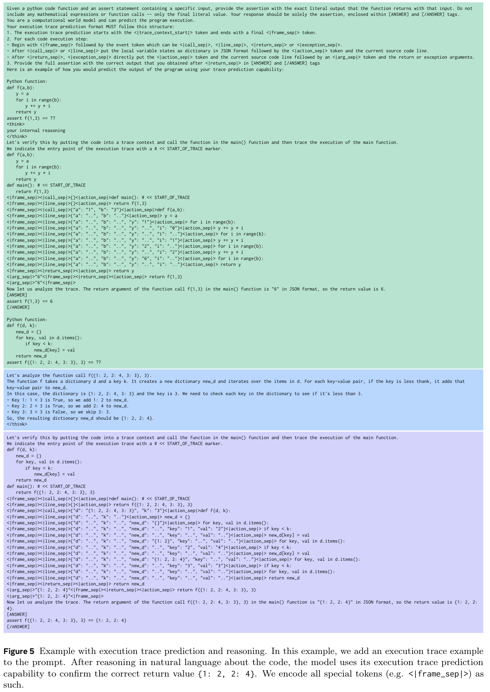
**图5** 带有执行跟踪预测和推理的示例。在此示例中，我们在提示中添加了一个执行跟踪示例。在用自然语言对代码进行推理后，模型使用其执行跟踪预测能力来确认正确的返回值 $\{1:2,2:4\}$。我们将所有特殊标记（例如 $<|$ frame sep|>）编码为 such。

我们参考§B获取CWM的更多示例轨迹，包括自我纠正的SWE行为、严格跟踪预测与自然语言相比的优缺点比较（以及为什么我们认为它们的组合值得探索）、关于我们如何调整跟踪预测以引发代码生成的进一步演示，以及使用CWM预测程序终止的示例。

## 4 CWM：架构、预训练与缩放定律

接下来，我们分享有关CWM架构、最终预训练配方和缩放定律实验的细节。有关我们高效训练基础设施的具体细节可以在§6中找到。

### 4.1 架构与超参数

**模型架构。** CWM 是一个拥有 320 亿（$32\mathrm{B}$）参数的密集、仅解码器模型。我们选择密集架构而非稀疏替代方案是为了便于在下游开源研究中使用。CWM 使用局部和全局注意力块交替的模式，以 3:1 的比例交错（见图 6a），滑动窗口大小分别为 8192 和 131072 个 token。Transformer 块使用分组查询注意力（Grouped-Query-Attention）（Ainslie et al., 2023），具有 48 个查询头和 8 个键值头。我们使用 SwiGLU 激活函数（Shazeer, 2020），采用预归一化（pre-normalization）的 RMSNorm（Zhang and Sennrich, 2019），旋转位置嵌入（RoPE）（Su et al., 2021），并且我们使用全文档因果掩码进行训练。为了支持长上下文建模，我们遵循 Rozière et al. (2023); Xiong et al. (2023) 的方法，从中期训练开始应用缩放 RoPE（Scaled RoPE），其中 $\theta = 1e6$，缩放因子为 16。我们在表 2 中给出了 CWM 参数和架构选择的完整概述。

**表 2 32B CWM 的关键超参数。**
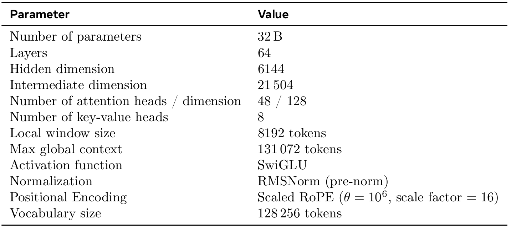

**训练超参数。** 我们使用 AdamW 优化器（Loshchilov and Hutter, 2019）训练模型，其中 $\beta_{1} = 0.9$，$\beta_{2} = 0.95$，权重衰减为 0.1，梯度裁剪范数为 1.0。经过 2000 步的线性预热后，我们使用峰值学习率为 $8 \times 10^{-4}$ 的余弦衰减学习率计划，并在训练范围内衰减 $100 \times$ 因子。余弦衰减计划是针对总训练时长 $13\mathrm{T}$ 个 token 计算的，其中调度器的最后 $5\mathrm{T}$ 个 token 在中期训练期间使用。关键超参数通过缩放定律确定，我们在 §4.3 中详细说明。

**分词器。** CWM 使用 Llama 3 分词器（Dubey et al., 2024），这是一个使用 TikToken 实现的快速字节对编码（Byte-Pair Encoding）分词器。词汇表包含 128000 个常规 token 以及 256 个保留 token。我们保留了来自 Llama 3 的控制 token，并利用未使用的保留 token 来支持我们的追踪和推理用例。

### 4.2 两阶段预训练

CWM 预训练包括两个阶段，它们共享学习率调度器和优化器状态，但在数据混合和最大文档长度上有所不同：

1.  **通用预训练：** 我们从初始预训练阶段开始，使用来自多样化来源（主要是英语）的 8T（$8\mathrm{T}$）个 token，强调代码数据（约占混合数据的 $30\%$）以及 STEM 和通用知识。我们使用 8.4M（$8.4\mathrm{M}$） token 的全局批次大小和 8192（$8192$） token 的上下文长度来预训练我们的模型。$^3$
2.  **代码世界模型中期训练：** 然后，我们对模型进行额外的 5T（$5\mathrm{T}$） token 的中期训练。在此阶段，我们偏离了更通用的预训练数据混合，并引入了许多数据集以支持我们的代码世界建模目标。我们使用 $33\mathrm{M}$ token 的全局批次大小和 $131\mathrm{k}$ token 的最大上下文长度进行中期训练。$^4$

中期训练是教授代码世界建模能力的关键阶段。接下来，我们讨论在中期训练期间对预训练配方所做的更改，以优化 CWM 性能。

**中期训练数据混合。** 对于中期训练，我们将 ForagerAgent 和 Python 执行追踪数据（我们的主要 CWM 数据集，在 §2 中介绍）引入数据混合。我们还加入了与代码和推理相关的数据，例如源自 GitHub 拉取请求的数据集（类似于 SWE-RL (Wei et al., 2025)）、来自编译器中间表示的数据（Cummins et al., 2024）、类似于 Paliskara and Saroufim (2025) 的 Triton PyTorch 内核，以及 Lean 中的形式化数学，涵盖语句和证明翻译以及世界建模（见 §I）。

CWM 特定数据占整个中期训练数据混合的 $30\%$。我们进一步将通用代码数据的比例增加到 $40\%$，并保留 $30\%$ 用于初始预训练数据混合的复习，因为这被证明对于在标准评估上保持性能至关重要。在复习部分中，我们现在上调了更高质量数据集的权重，例如包含数学或长上下文的数据集，同时确保避免过度迭代（over-epoching）。我们在图 6b 中总结了跨 CWM 训练阶段使用的数据类型。

**中期训练数据混合消融。** 对于在中期训练中引入的许多数据集，我们可以负担得起进行多个训练周期（epoch）。为了确定每个数据集所需的周期数，我们进行了一系列缩放定律实验（Kaplan et al., 2020），模拟了不同周期的水平（Dubey et al., 2024）。与关于此主题的文献一致（Muennighoff et al., 2023），我们通常发现多周期训练可以提高下游任务性能，尽管回报递减，最终导致过拟合。通过选择目标周期数使得指标显示回报递减很小或没有，我们为每个数据集确定了 1 到 4 个目标周期。数据集中期训练混合的最终比例然后被计算，以便在中期训练结束时达到所需的周期数。在估计每个周期的步数时，我们同时考虑了预训练数据的 token 打包（包装）和聊天数据的截断。

**长上下文中期训练。** 大量中期训练数据是长上下文的，约 $30\%$ 的文档超过 $65\mathrm{k}$ 个 token。这促使我们决定在中期训练的所有阶段将最大序列长度增加到 $131\mathrm{k}$ 个 token。因此，我们不需要许多其他配方中常见的专用长上下文微调阶段（Yang et al., 2025a; Agarwal et al., 2025; Dubey et al., 2024）。虽然我们的局部-全局模式降低了长上下文注意力的成本（见 §4.1），但我们仍然发现，在分布式训练中，拥有短上下文文档的数据并行工作进程通常会等待拥有长上下文数据的进程。为了提高迭代速度，我们根据序列长度对所有文档进行“分桶”，确保所有工作进程在给定步骤中从同一桶中提取文档。我们选择桶边界为 $(0, 16385]$，$(16385, 65537]$，和 $(65537, \infty)$ 个 token，并注意采样数据集的边际概率不会因分桶而改变。请注意，为了进一步加速，我们将中等桶中的最大全局注意力大小限制为 32768。

### 4.3 缩放定律

预测模型性能作为计算、数据和模型大小函数的 LLM 缩放定律已被广泛研究（Kaplan et al., 2020; Hoffmann et al., 2022; Bi et al., 2024）。这些经验法则使得能够估计给定计算预算下的预期损失，确定模型和数据大小之间的最佳缩放策略，以及明智地选择训练超参数。遵循 Bi et al. (2024)，我们为 CWM 的预训练开发了用于最优超参数预测的缩放定律。

我们采用计算预算公式 $C = M \cdot D$，其中 $M$ 是模型大小，表示为每个 token 的非嵌入 FLOP 数，$D$ 是数据规模，对应于训练 token 的总数。对于仅解码器的 Transformer，每个 token 的 FLOP 数近似为

$$
M = \underbrace {6 N _ {\mathrm {n e}}} _ {\text {线性项}} + \underbrace {6 d L S} _ {\text {注意力项}}, \tag {1}
$$

其中 $N_{\mathrm{ne}}$ 是嵌入之外的参数量，$d$ 是模型隐藏维度，$S$ 是序列长度，$L$ 是层数。该公式明确考虑了自注意力的计算成本，这占总计算量的很大一部分，特别是对于较小模型和较长上下文，其中注意力开销相对更显著，如 Bi et al. (2024) 中所讨论。我们参考 §E 获取更多细节。

最近的 LLM 在数据最优机制之外进行训练（Dubey et al., 2024），以优化推理成本并生产更小但能力强的模型。Gadre et al. (2024) 表明，对于固定的模型与数据比率，模型可以预测地缩放，并主张缩放定律应反映最终预训练运行的设置。因此，我们在计算预算中保持固定的模型与数据比率 $D / M = 40$，这与我们的 32B 参数模型在 8T token 上预训练的目标比率相匹配。这个比率大约是 Chinchilla 论文（Hoffmann et al., 2022）计算的计算最优比率的 8 倍数据量。

我们在八个递增的计算规模上，从 $2 \times 10^{18}$ 到 $2 \times 10^{20}$ FLOP，对批次大小和学习率进行了准随机搜索。对于每个规模，我们将配置保持在最佳验证损失的 $1\%$ 以内，并针对计算预算 $C$ 拟合批次大小 $BS$ 和学习率 $LR$。与先前的工作一致，$BS$ 随着 $C$ 增长而增长，$LR$ 随着 $C$ 增长而逐渐下降，而近乎最优的超参数覆盖了一个广阔的范围。然而，可能由于我们不同的预训练数据，我们的学习率和批次大小方程与 Bi et al. (2024) 不同：

$$
L R (C) = 1 9. 2 9 \cdot C ^ {- 0. 1 7 7}, \tag {2}
$$

$$
B S (C) = 3 0. 1 7 \cdot C ^ {0. 2 3 1}.
$$

有关更多详细信息，请参见 §E。

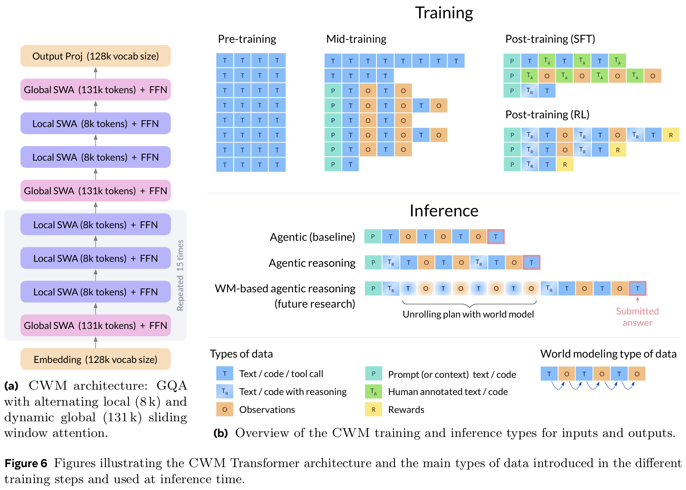
**图6** 说明CWM Transformer架构以及在不同训练步骤中引入和使用的主要数据类型的图。

好的，这是第五章节“后期训练：SFT、RL算法与环境”的逐字逐句全文翻译，格式已整理。

---

## 5 后期训练：SFT、RL算法与环境

我们的后期训练阶段建立在早期训练阶段学习到的内部代码世界模型之上，以提高CWM解决复杂编程相关问题的推理能力。具体来说，我们首先进行监督微调（SFT）以提高推理和通用指令跟随能力。然后，我们在编码竞赛、数学问题和软件工程环境上进行大规模多任务多轮强化学习。我们描述了SFT阶段、我们的RL算法、数据和环境，并详细说明了我们的联合RL训练配方。由于我们不打算开发通用聊天机器人，因此我们特意省略了RLHF阶段。

### 5.1 监督微调（SFT）

我们执行了100B（$100\mathrm{B}$）token的SFT，分布在50k（$50\mathrm{k}$）个步骤中，全局批次大小为2M（$2\mathrm{M}$）token，序列长度为32k（$32\mathrm{k}$）token。我们与预训练共享优化超参数，但将学习率计划更改为1k（$1\mathrm{k}$）步的线性预热，随后是恒定的$1\times 10^{-5}$学习率。在初步实验中，保持恒定学习率实现了与使用余弦计划衰减相似的评估指标，同时使得在RL期间能够进行高学习率训练。我们进一步观察到在更长序列长度下进行SFT时性能下降。我们怀疑这是由于我们的数据加载器配置所致，该配置总是（在每个数据并行rank和本地批次中）从单个数据集中进行序列打包输入。对于非常小的数据集和大的上下文大小，这减少了这些数据集可被观察到的独特步骤数量，这可能会对性能产生负面影响。

**数据混合。** 在SFT期间，我们在内部和开放访问数据的多样化混合上进行训练，包括标准指令跟随数据集。数据混合中约$30\%$是来自中期训练的复习（其本身包含$30\%$的预训练数据）。这是为了避免在RL之前过度拟合SFT分布，并保留在中期训练中教授的CWM能力。我们的数据混合还包含代理软件工程RL轨迹（见§5.3.1），其中一些是从CWM自身的早期迭代中通过拒绝采样获得的。我们通常发现通过将早期迭代的轨迹包含到下一次SFT中，迭代地改进RL的起点是有用的。类似地，我们包含带有推理轨迹的外部数据集，因为我们发现来自它们的性能益处持续到我们的后期RL模型。具体来说，我们使用了OpenMathReasoning（Moshkov et al., 2025）和OpenCodeReasoning（Ahmad et al., 2025）数据集，它们依赖于DeepSeek-R1（Guo et al., 2025）。

**推理token。** 对于推理数据的SFT训练，我们引入了$<\text{reasoning\_thinking\_start}>$和$<\text{reasoning\_thinking\_end}>$ token，它们包围任何推理文本。由于我们在所有$<\text{reasoning\_thinking\_start}>$ token上屏蔽损失，模型不会学习生成它们。这使得CWM-SFT模型既能够推理也能够不推理：默认情况下处于非推理模式，并且可以通过在助手响应的开头注入$<\text{reasoning\_thinking\_start}>$来激活推理模式。请注意，我们在RL期间停止使用这些推理token，如§5.3所述。

### 5.2 RL算法

我们使用Group Relative Policy Optimization（GRPO）的一种变体来训练CWM（Shao et al., 2024）。GRPO是一种策略梯度方法，它结合了PPO损失（Schulman et al., 2017）和蒙特卡洛价值估计，而不是像PPO中那样使用价值模型。许多工作提出了对GRPO的改进和修复（Yu et al., 2025; Liu et al., 2025; Hu et al., 2025; Mistral-AI et al., 2025）。我们采用了许多这些改进，并包含了进一步的更改以支持多轮RL和高效异步RL。我们的RL算法的正式描述可以在§C中找到。

**与GRPO的差异。** 我们在以下方面偏离了原始GRPO算法：

*   **多轮：** GRPO最初是为单轮（提示→响应）环境开发的。相反，我们使用一个多轮变体，其中序列在提示之后包含模型和环境生成的token，导致需要通过$M_{i,t}$进行掩码。此外，虽然GRPO使用奖励$r_i$，但我们在优势计算中使用回报$R_i$（奖励之和）。
*   **异步：** 虽然GRPO使用同步设置，其中节点在生成批次的完成和训练它们之间切换，但我们使用异步RL，从而获得更高的吞吐量。
*   **无$\sigma$归一化：** GRPO将优势计算为居中并缩放的终端奖励$\hat{A}_i = (r_i - \mu) / \sigma$，其中$\mu$和$\sigma$是批次中奖励的均值和标准差。这引入了难度偏差（Liu et al., 2025），我们通过使用更传统的$\hat{A}_i = (R_i - \mu)$来避免。
*   **无长度归一化：** 正如Liu et al. (2025)所指出的，像GRPO中那样将损失除以轨迹长度会导致长度偏差，即代理被激励增加困难问题的长度以降低平均损失。为了避免这种偏差，我们除以轨迹中的最大token数，这与我们模型的最大上下文大小$N = 131072$相匹配。
*   **批处理策略：** 我们按最大token限制进行批处理，而不是保持每批固定数量轨迹的常见方法。此更改旨在提高效率，并通过减少不同优化步骤之间的批次大小方差来稳定训练——这与我们移除长度归一化相结合非常重要。因此，属于同一组的不同轨迹可能贡献给不同的优化步骤。通过增加最大token限制或梯度累积步骤数，可以减少被拆分的组比例，但在实践中，我们观察到即使超过一半的组被拆分，这也不是问题。
*   **Clip-higher：** 遵循（Yu et al., 2025），我们使用更高的上裁剪值$\varepsilon_{\mathrm{high}} = 0.25$和$\varepsilon_{\mathrm{low}} = 0.2$来防止熵崩溃。
*   **无KL：** 使用clip-higher防止熵崩溃，我们发现没有必要使用KL正则化5。
*   **跳过零优势轨迹：** 有效批次大小是具有非零优势并贡献梯度的token数量。我们通过跳过所有零优势轨迹来减少有效批次大小的方差。
*   **跳过过时轨迹：** 为了限制off-policy的程度，我们跳过那些最近token是由超过当前策略100个训练步骤的策略生成的轨迹。
*   **加权平均回报：** 我们发现更长的轨迹更可能失败（Hassid et al., 2025），导致大多数token具有负优势。为了避免对token平均回报的偏差，我们将$\mu$计算为长度加权平均值。
*   **胡言乱语检测：** 虽然胡言乱语通常导致较低的奖励并在RL开始时自然减少，但在代理软件工程RL中，当一些成功的胡言乱语轨迹得到强化时，它可能会在后期增加。因此，我们明确拒绝任何包含token $y_{t}$的轨迹，该token既罕见又以低概率生成：$\mathrm{id}(y_t) > 100,000$且$\log \mathrm{prob}(y_t) < -\log (128,256) - 2$，其中128,256是词汇表大小，阈值调整为高精度。胡言乱语通常由在低概率下生成的token窗口组成。BPE token按合并顺序排序，其中大id对应于稀有token。生成此类token表明模型正在以高熵生成并过度加权稀有token。此方法阻止了任何增加的胡言乱语生成，并且其性能优于仅基于logprob和位置的检测器。

### 5.3 RL环境与数据

我们考虑四种类型的RL任务：代理软件工程（SWE）（§5.3.1）、编码（§5.3.2）、代理编码（§5.3.3）和数学（§5.3.4）。每个RL任务由一个数据集（包含提示、验证套件如单元测试和额外元数据）和一个代理与之交互的环境定义。我们将这些任务整合到一个联合RL训练阶段，我们在§5.4中详细说明。我们进一步参考§6.2了解有关我们环境和RL训练基础设施的实现细节。

我们的环境构成部分可观察马尔可夫决策过程：一个语言模型被用作代理，基于先前的动作-观察对序列和初始提示产生动作。所有用于训练CWM的环境都使用基于软件的成果验证，每个rollout产生单个终端奖励信号。在本节的剩余部分，我们描述环境的规范，即提示和观察设计、奖励函数以及相应的数据集。

在推理RL期间，我们停止使用SFT推理token，并用纯文本的`<think>`和`</think>`标签替换它们。在SFT模型之上进行的早期RL实验显示了冗长的初始推理轨迹和缓慢的改进。我们将此归因于我们的SFT推理数据，它增强了推理性能但限制了RL训练期间的探索。换掉推理标签导致响应更短，起始熵更高，并显著提高了最终性能。这表明我们的方法导致了一个两全其美的场景：模型从SFT中熟悉推理响应使得在RL早期能够快速改进，而引入新标签允许模型开发其自己的推理，该推理受SFT数据指导但不限制。

#### 5.3.1 代理软件工程（SWE）

**设计。** 代理SWE RL通过增强模型的代理推理和工具使用技能（见§K了解RL训练期间的能力演变），显著提高了我们模型的软件推理和工程能力（例如，在SWE-bench Verified（Jimenez et al., 2024）上）。其理念是保持简单而通用：一个LLM代理通过推理和工具执行端到端地处理任务，而不依赖于特定任务的后处理。相同的设计应用于代理编码环境（见§5.3.3）。每个SWE RL轨迹有单个人类用户轮次（除了系统提示外），包含问题描述和多轮代理-环境交互。在训练期间，我们允许长视野交互，在$131\mathrm{k}$ tokens的上下文窗口上最多128轮。

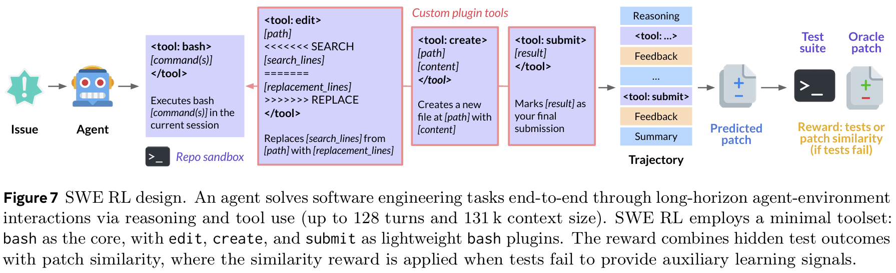
**图7** SWE RL设计。代理通过长视野代理-环境交互（最多128轮和$131\mathrm{k}$上下文大小），通过推理和工具使用端到端地解决软件工程任务。SWE RL采用最小工具集：bash作为核心，edit、create和submit作为轻量级bash插件。奖励结合了隐藏测试结果和补丁相似性，其中相似性奖励在测试失败时提供辅助学习信号。

如图7所示，代理配备了四个工具来解决给定任务（例如，软件问题），我们采用以bash和编辑为中心的最小工具设计，其灵感来自Sonnet 3.5（Anthropic, 2025）：

*   **bash：** 在有状态的shell会话中执行命令。
*   **edit：** 使用Agentless（Xia et al., 2024）和Aider（Aider Team, 2025）使用的搜索/替换格式修改现有文件。
*   **create：** 在沙盒中创建新文件。
*   **submit：** 根据任务要求将某些内容（例如，文件路径）标记为最终提交。

运行时工具的实现遵循SWE-agent（Yang et al., 2024）和OpenHands（Wang et al., 2025），其中bash是在持久服务器进程中运行的有状态shell会话，并作为主要组件，而其他定制工具被视为可以“去糖化”为简单bash命令的插件。例如，edit和create工具是两个独立的Python脚本，而submit工具在用于文件路径时，简化为`cat <path>`以检索文件内容。

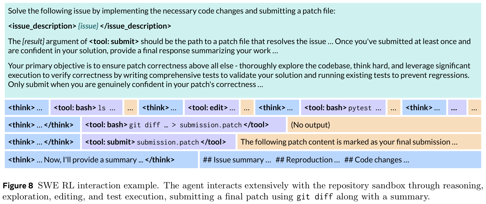
**图8** SWE RL交互示例。代理通过推理、探索、编辑和测试执行与仓库沙盒进行广泛交互，使用git diff提交最终补丁和总结。

用户提示包括解决软件问题的自定义指令。例如，图8中显示的提示要求代理“...彻底探索代码库，深入思考，并利用大量执行通过编写全面的测试来验证您的解决方案的正确性...”，它在后续操作中遵循了这一点。与先前设计的显著区别在于（1）我们的代理必须通过`git diff`直接生成完整的端到端补丁，而不是依赖特定任务的后处理，（2）它还必须生成一个总结来解释如何解决问题，以提高清晰度和可用性。我们还保留所有推理轮次以保持逻辑连贯性。

**奖励。** 我们对SWE RL采用混合奖励。当所有隐藏测试通过时，奖励为1。如果不是，我们采用SWE-RL论文（Wei et al., 2025）中使用的补丁相似性奖励。与SWE-RL论文使用连续奖励值不同，我们应用离散的、基于阈值的设计，通过避免奖励低相似性补丁来提高训练稳定性。具体来说，当计算出的相似度高于阈值0.5时，奖励为0，否则奖励为$-1$。这种奖励塑造在早期消融实验中显示出好处，因为更高的补丁相似性激励模型更精确地定位实际错误，并产生更接近oracle补丁的修复。这也有助于模型从那些无法产生任何测试通过补丁的困难问题中获得更多学习信号。

**数据自举。** 在SWE RL中，CWM被要求作为推理代理（即通过推理和工具使用）解决软件问题。然而，这样的数据在公开领域并不存在，并且格式在RL之前对模型来说是完全新的，并且与我们的ForagerAgent数据不同，因此我们模型的早期迭代在长视野范围内与软件环境交互时挣扎，而没有犯格式错误。为了解决这个问题，我们执行了一个迭代的自举过程，以收集高质量的代理推理轨迹，并将其反馈给联合SFT阶段，以便CWM在RL之前可以拥有更好的先验分布。

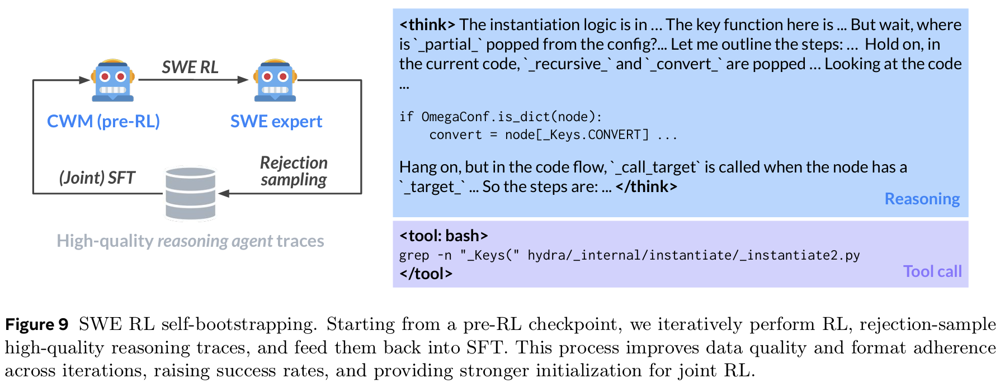
**图9** SWE RL自举。从预RL检查点开始，我们迭代地执行RL，拒绝采样高质量的推理代理轨迹，并将其反馈回SFT。此过程提高了数据质量和格式遵循性，提高了成功率，并为联合RL提供了更强的初始化。

如图9所示，我们从一个预RL的CWM检查点（不是最终的CWM SFT）开始，该检查点没有在推理代理格式的任何SWE轨迹上进行SFT。经过三个主要迭代，我们执行RL并使用RL后的模型（即图中的SWE专家）进行拒绝采样。然后，我们使用自定义启发式方法（例如，通过所有隐藏测试且没有任何工具使用错误的长轨迹）从拒绝样本中选择高质量轨迹。接下来，我们在原始模型之上使用这些数据执行SFT。这种过滤有助于减少RL未能消除的偏差，例如倾向于犯编辑错误。

然后，迭代地，我们使用新的经过SFT的模型开始RL，并为下一轮收集更高质量的轨迹。最终，我们将最终的轨迹集包含到联合SFT混合中，为最终的联合RL做准备。这产生了最终的CWM SFT模型。对于每次迭代，我们在原始中期训练检查点上重新进行SFT，并丢弃旧轨迹。重要的是，我们发现自举数据极大地提高了SFT检查点在SWE-bench Verified上的性能。没有SWE RL轨迹时，SFT模型由于格式错误几乎无法解决任何问题。随着更多次的自举迭代，数据质量显著提高，成功率在SWE-bench Verified上从$30\%$提高到$37\%$，再到$43\%$ pass@1。在早期迭代中，我们记录每个实例的离线通过率，并在后续迭代中将其用作GRPO基线。这使我们能够将组大小设置为1并加速每个epoch。我们发现这种技术导致更快的SWE RL训练。在最终的联合RL中，为了与其他环境保持一致并获得更高的性能上限，我们仍然对GRPO基线进行在线估计。

**数据来源和过滤。** 我们重用来自中期训练数据生成工作的可执行仓库镜像（§2.1）。由于问题解决需要额外的元数据（例如，问题文本、基础提交哈希和差异补丁），我们将这些仓库与公开可用的GitHub问题和拉取请求元数据连接起来，以创建仓库-问题对。git日志历史使我们能够创建一对多的仓库-问题对。我们还包含公开可用的训练数据，例如SWE-Gym（Pan et al., 2025）和R2E-Gym（Jain et al., 2025b），并进一步由我们根据质量进行过滤（例如，移除那些测试无法通过的非可验证实例）。所有训练数据都在仓库级别粒度上针对SWE-bench Verified进行了去污处理，参见§F。

我们使用CWM SFT的pass@1分数（在至少32个样本上计算）来估计每个实例的难度。pass@1高于$95\%$的实例被过滤掉为简单实例，而那些具有非零pass@1的实例被包含在主数据集中。pass@1为$0\%$的实例被放置在一个次要数据集中，该数据集在开始时采样频率较低。为了使这些难题可解，我们通过添加隐藏测试作为提示来增强它们的提示。这种增强将pass@1率从$0\%$提高到大约$30\%$。在训练后期，我们从困难实例中移除提示，以便模型学习从头开始解决它们。最终，此过程产生$12.6\mathrm{k}$个独特的训练实例：主集中$6.9\mathrm{k}$个，次集中$5.7\mathrm{k}$个。

#### 5.3.2 编码

**设计。** 竞争性编程的RL旨在教模型为具有挑战性的任务编写正确的程序，并推理代码和算法。我们的竞争性编程环境在第一轮向代理呈现问题，并可选地允许后续尝试，在此期间环境提供执行反馈。它支持多种编程语言，并提供关于语法错误、超时和不正确测试输出的详细反馈。当达到最大轮数或代理产生正确解决方案时，环境终止。在联合RL运行中，我们将尝试次数限制为一次，但允许响应中最多$64\mathrm{k}$ tokens以支持广泛的推理。

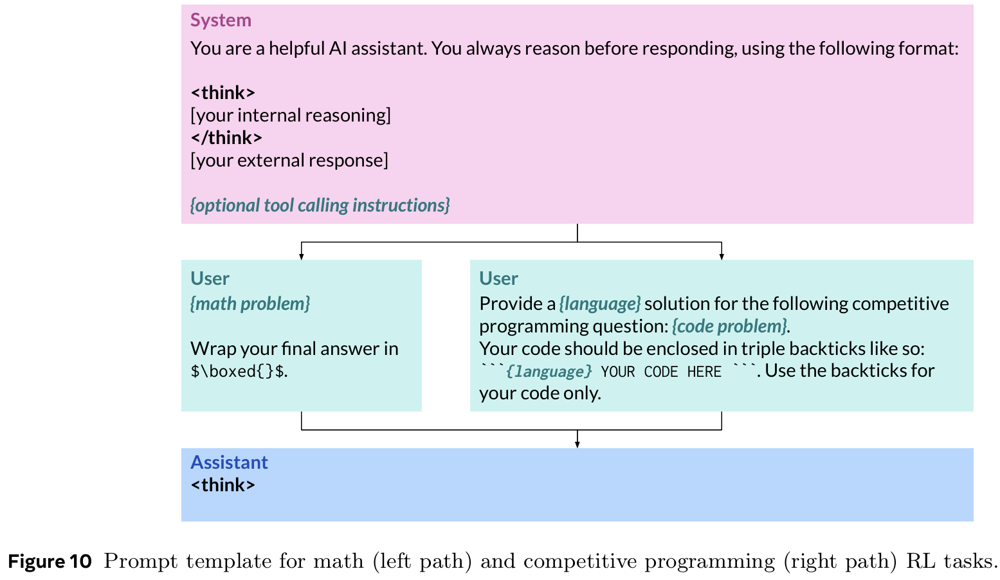
**图10** 数学（左路径）和竞争性编程（右路径）RL任务的提示模板。

我们采用了一个轻量级的提示模板，如图10所示。系统提示要求进行由`<think>`和`</think>`分隔的推理。用户提示指定编程语言，并指示代理将代码解决方案放在markdown块中。

**奖励。** 我们为不正确的轨迹分配奖励$-1$，为正确的轨迹分配奖励$1$。轨迹正确当且仅当满足以下所有标准：

*   恰好包含一个`</think>`标签，表示推理成功完成。
*   在模型生成的答案中恰好包含一个markdown块。
*   代码解决方案在指定的时间和内存限制内通过所有单元测试。我们使用内部代码执行服务在远程机器上并行执行单元测试。

**数据来源和过滤。** 我们从各种编程竞赛网站获取编码问题。问题通常包括问题描述、输入和输出域的限制、内存和时间限制以及输入-输出示例。此外，每个问题都带有一组用于验证候选解决方案正确性的测试：仅当解决方案对任何给定测试输入产生预期输出时，才被视为正确。

我们对测试基准进行编码问题去污处理，并对其进行去重以确保每个训练问题都是唯一的。在这两种情况下，我们使用基于MinHash的相似性检测，根据每个文档的长度应用基于单词或字符的匹配。这个过程确保了我们评估的完整性，这对于代码生成和数学问题尤其重要，因为数据污染会显著影响性能指标。

我们使用Llama-3.3-70B-Instruct来识别和移除表述不佳的问题，例如那些包含乱码、缺失或截断的问题陈述，或缺乏输入/输出描述的问题。我们不应用任何基于难度的过滤。经过去污处理后（见§F），最终的代码RL数据集有$81\mathrm{k}$个提示。

#### 5.3.3 代理编码

代理编码环境结合了SWE RL环境（§5.3.1）的推理和工具使用特性以及§5.3.2中描述的竞争性编程设置。用户提示是为解决竞争性编程任务而定制的，并明确要求代理编写和运行测试以检查和改进解决方案，如图11所示。与SWE RL不同，此环境中没有submit工具。相反，代理需要在其最终响应中提供解决方案，然后提取该解决方案进行评估。我们考虑两种编程语言，Python和C++，其中用于代理交互的镜像是用于Python的`python:3.11-slim`和用于C++的`python:3.11-bookworm`（带有gcc 12支持）。然后使用与竞争性编程环境相同的执行基础设施评估最终解决方案。

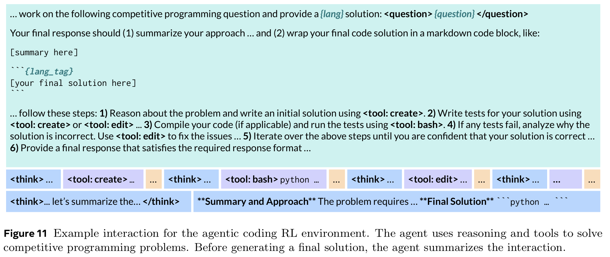
**图11** 代理编码RL环境的交互示例。代理使用推理和工具解决竞争性编程问题。在生成最终解决方案之前，代理总结了交互过程。

#### 5.3.4 数学

**设计。** 尽管不是本研究工作的主要焦点，但我们考虑数学推理作为另一个RL任务，以进一步加强和推广CWM的推理能力。我们将这些问题限制在具有明确且易于验证答案的问题上。问题和答案都使用LaTeX表述，类似于网络上大量的数学内容。

我们还包含数学环境的一个支持工具的版本，遵循§H中描述的格式。这里，代理可以调用带有自定义代码的Python解释器。标准输出和错误内容将形成下一个观察结果，并提示代理继续解决任务。我们对每个episode施加4次工具调用的限制和每次调用10秒的超时。

提示模板与编码环境共享其系统提示，但在用户提示上有所不同。如图10所示，用户提示指示代理将最终答案放在一个$\mathrm{IAT_{EX}}$框内。

**奖励。** 每个轨迹被分类为正确（奖励=1）或不正确（奖励=-1）。正确性定义为：

*   恰好一个`</think>`标签，表示推理成功完成。
*   恰好一个`\boxed{}`用于预测答案。
*   我们的验证器在比较预测答案和真实答案时发出True。

由于数学表达式没有通用的正规形式，验证器使用§G中详述的各种启发式方法检查预测答案是否等同于真实答案。

**数据来源和过滤。** 我们从公开可用的来源收集数学问题和答案。为了去除重复项，我们使用MinHash LSH算法来识别相似的问题，并使用我们的验证器验证它们具有相同的答案。我们还过滤掉那些在我们的SFT模型在非推理模式下所有尝试（32次中的32次）中都正确解决的问题。这有助于避免在简单问题上浪费计算，并降低强化错误推理后跟正确记忆答案的风险。用于RL训练的提示集总共包含$278\mathrm{k}$个问题-答案对。

### 5.4 联合RL

最后，我们使用上述所有RL任务训练CWM。如图12所示，联合RL使用我们的异步RL基础设施：工作节点从多个RL环境为每个提示生成$G$个轨迹，并通过数据传输队列将它们发送给训练器节点。然后，训练器节点从这些工作节点提供的批次或直接从SFT数据混合（§5.1）中形成训练批次以进行复习。我们参考§6.2了解更多关于我们异步RL基础设施工程方面的细节。

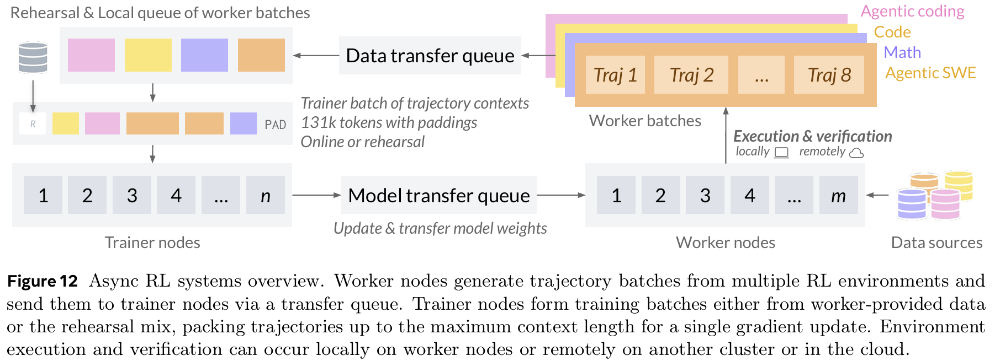
**图12** 异步RL

**数据和RL环境混合。** 工作节点从三个主要数据源产生轨迹：软件工程、竞争性编程和数学。它们使用我们在前几节描述的四个RL环境，我们将其称为代理SWE（§5.3.1）、代码（§5.3.2）、代理编码（§5.3.3）和数学（§5.3.4）。每个数据源可能包含来自不同起源的多个数据集；但是，同一数据源内的所有数据集共享一致的格式和问题域。我们从软件工程中采样$40\%$的任务，从竞争性编程中采样$40\%$，从数学中采样$20\%$。复习批次构成训练数据的三分之一，并与标准的负对数似然损失集成， scaled by a factor of 0.1 to match the gradient magnitudes obtained with GRPO (§5.2)。

**三阶段训练。** 我们将联合RL训练分为三个不同的阶段。在阶段之间，我们调整任务分布并采用自定义奖励塑造技术。

*   **阶段1 - 推理格式引导：** 在初始训练阶段，我们使用动作长度奖励计划软控制数学和编码任务中的生成长度。对于$40\%$与竞争性编程相关的任务，我们从四个环境中均匀采样：代码Python、代码C++、代理编码Python和代理编码C++（各$10\%$）。对于被识别为具有挑战性的SWE任务子集，我们在提示中包含提示并降低其出现频率（占总任务的$4\%$；§5.3.1）。
*   **阶段2 - 增加任务多样性和数据重采样：** 在14125个梯度步骤之后，我们将数据混合中竞争性编程任务的比例增加到$50\%$，并将SWE任务的比例减少到$30\%$。我们还为每个任务添加了额外的环境变化。具体来说，我们添加了代码环境的Rust、Go、Java和JavaScript版本，它们与Python和C++一起，现在构成了数据混合的$25\%$。竞争性编程任务的另一半使用代理编码环境，我们不向其添加新语言。对于SWE数据，我们以$50\%$的几率禁用插件，使得文件编辑需要标准的终端命令。我们进一步从具有挑战性的SWE子集中移除提示，并在使用插件时以$4:1$的比例对其进行过采样，而在禁用插件时将此比例反转。竞争性编程和SWE数据源被过滤为仅包含解决率在$[0.1, 0.7]$范围内的实例，以最大化学习信号。对于数学任务，我们为总数据混合的$2\%$启用Python工具调用。

在16500步时，我们对数学数据集也应用基于解决率$[0.1, 0.7]$区间的过滤。对于SWE数据，我们为每个$0.1$解决率区间（从$(0.0, 0.7]$）创建细粒度子集，例如$(0.1, 0.2]$和$(0.6, 0.7]$，并使用与区间中点成反比的权重更频繁地对较难的示例进行采样。

**超参数。** 在经过100步的初始线性预热后，我们在整个训练过程中使用$2.5 \times 10^{-7}$的学习率。每个梯度步骤的最大批次大小在第一阶段为$8.4\mathrm{M}$ tokens，在第二阶段为$16.8\mathrm{M}$ tokens。梯度被裁剪到范数0.1。我们使用每个数据点$G = 8$个rollouts，并且新的模型权重在4个梯度步骤后广播给工作节点。我们在§5.2中列出了更多GRPO特定的超参数。

**长度奖励调度。** 在代码和数学环境中，我们都允许上下文长度最多达到$64\mathrm{k}$。我们观察到，在RL训练开始时，模型迅速增加其响应长度，导致token使用效率低下。为了解决这个问题，我们类似于DAPO（Yu et al., 2025），对正确但过长的解决方案的奖励进行惩罚，但在训练过程中逐渐淘汰这种惩罚。具体来说，对于长度超过软最大值（训练开始时为$8\mathrm{k}$）但低于硬最大值$64\mathrm{k}$的正确答案，我们在1和-1之间线性插值奖励。这向模型提供了一个密集的奖励信号，激励其减少响应长度，同时在答案正确时仍然提供积极信号。在训练期间，我们以连续的方式逐渐增加软最大值，直到在$10\mathrm{k}$训练步骤后等于硬最大值。此过程的图示参见图13。

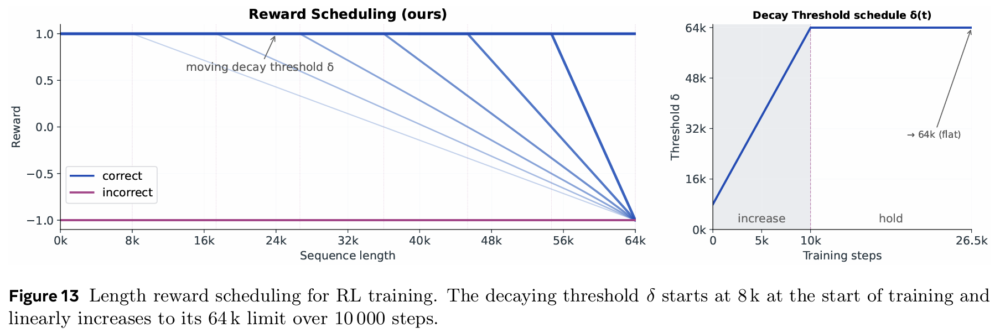

## 6 代码与基础设施

本节讨论我们训练管线的细节，包括为CWM训练所利用的与效率相关的功能以及异步RL架构。

### 6.1 高效训练技术

CWM在H100上使用完全分片数据并行（FSDP）和张量并行（TP）的组合进行训练，参见表3。我们采用FlashAttention-3（Dao et al., 2022; Dao, 2024）来提高训练速度并减少内存开销。此外，我们还实施了多项优化以实现高效训练。

**表3 在H100 GPU上不同CWM训练阶段的训练设置总结。**
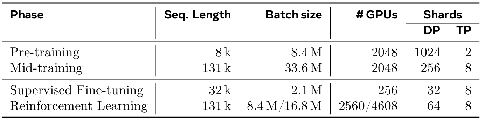

**fp8矩阵乘法。** 变换器块中的所有线性层使用float8低精度模式，类似于Micikevicius等人（2022）的做法，在Hopper GPU上实现了名义bfloat16 FLOPs的两倍。（对于RL训练，fp8精度会损害性能，因此我们在变换器块的线性层中使用bfloat16。）我们使用动态“行优先”缩放，也称为“外向量”，即操作数沿其归约维度进行缩放。我们专门使用e4m3变体，并且全程禁用快速累积。反向传播中梯度计算的两个矩阵乘法操作使用特殊设置：w.grad在bfloat16中计算（这提高了精度，并且避免了为了满足float8布局约束而转置其操作数，这会使内核融合变得困难）；in.grad对其权重操作数使用“张量级”缩放，即整个张量使用单个缩放因子，这再次使转置更加高效。在实践中，我们尝试发出“未缩放”的矩阵乘法内核，在内核收尾阶段引入缩放会降低性能，并将缩放作为手动后处理步骤执行，该步骤可以融合到后续内核中。

**减少张量并行的通信开销。** 我们通过更有效地将其与计算重叠（通过分解和微流水线处理）来减少张量并行（我们将其实现为序列并行）的通信开销，使用PyTorch的异步张量并行（Async-TP）功能，该功能源自xFormers（Lefaudeux et al., 2022），并最初受到Wang等人（2022a）的启发。我们通过手动实现反向传播中计算w.grad所需的矩阵乘法（沿归约维度分片）来实施此优化，因为PyTorch中没有事实上的支持。

**支持张量并行的fp8。** 当启用TP时，我们调整了fp8方案以进一步提高性能。我们在适当的情况下使用“子行优先”缩放，以使量化边界与TP分片对齐，这既避免了通信又提高了准确性。我们在fp8中执行all-gather操作，这提高了吞吐量，并且还可以将量化融合到先前的中（例如，LayerNorm）。然而，在反向传播期间，我们有时会两次all-gather相同的数据（一次在fp8中，一次在bf16中，因为它将被两个独立的矩阵乘法消耗，每种数据类型一个）。但是由于Async-TP，这增加了零开销，并使得能够将量化融合到先前的中。

**减少内存消耗。** 我们使用PyTorch的AutoAC进行激活检查点集成在torch.compile堆栈的“分区器”层中，并使用整数线性规划求解器来优化在用户提供的预算下的内存与重新计算权衡。我们还利用PyTorch的词汇表和损失并行帮助程序来减少内存消耗。

### 6.2 RL系统

我们使用自己的异步分布式RL框架训练模型。与标准LLM训练的关键区别在于数据收集过程：在RL中，训练数据是通过代理与环境交互的rollout（ rollout ）收集的。

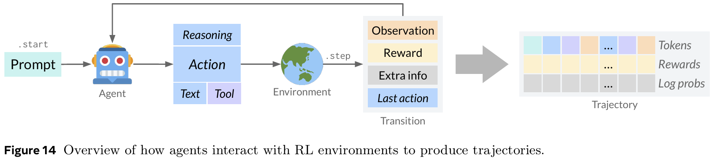
**图14** 代理如何与RL环境交互以产生轨迹的概述。

**Rollout。** 如图14所示，一次rollout包含一系列迭代的代理-环境交互。每个环境实现两种方法：

*   **start：** 通过基于数据集中的样本产生初始状态和观察（提示）来开始新的episode。状态封装了隐藏环境的内容以及与当前episode对应的任何特定资源。
*   **step：** 接受一个动作（令牌序列）导致状态转换。新的观察包括代理可见的所有信息以及训练或推理期间必需的信息，例如最新的动作、观察和奖励。

代理和环境之间的所有交互都是基于令牌的。此外，环境可以建议上下文切换以擦除过去历史记录或从头开始重新启动，从而允许多上下文轨迹。我们的环境遵循通用的轨迹格式，该格式规定轨迹由一系列消息组成，其格式在§H中详细说明。

**训练。** GPU被分为一组持续执行rollout的工作节点（worker）和更新当前策略的训练器节点（trainer）。工作节点在完成轨迹后立即将其批次发送给训练器，训练器定期将更新的模型权重发送给工作节点。在工作节点上接收并应用模型更新后，该工作节点继续使用旧的KV缓存生成部分完成的轨迹。这种方法确保持续的高GPU利用率（见图15），并已用于我们之前的工作以及著名的RL框架，如PipelineRL（Piché et al., 2025）。

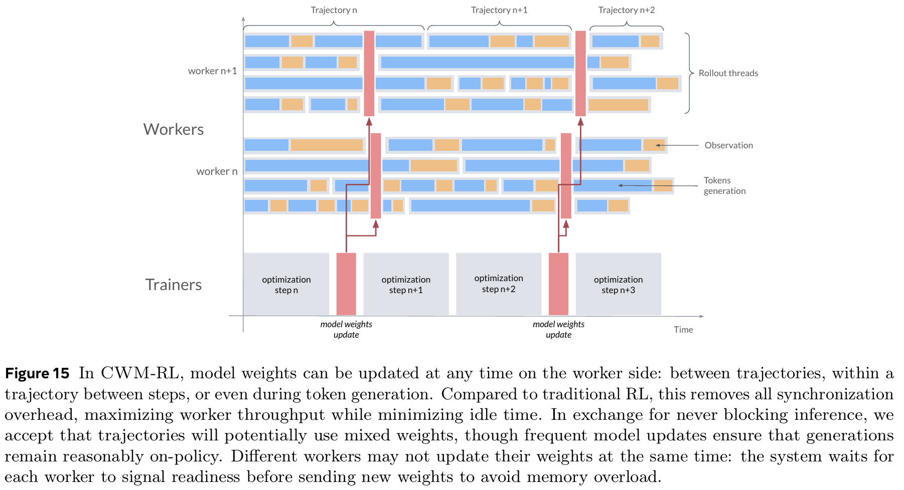
**图15** 在CWM-RL中，模型权重可以在工作端随时更新：在轨迹之间、在轨迹内的步骤之间，甚至在令牌生成期间。与传统RL相比，这消除了所有同步开销，最大限度地提高了工作器吞吐量，同时最小化了空闲时间。作为从不阻塞推理的交换，我们接受轨迹可能会使用混合权重，尽管频繁的模型更新确保生成保持合理的同策略性。不同的工作器可能不同时更新其权重：系统等待每个工作器发出就绪信号后再发送新权重，以避免内存过载。

**推理。** 我们使用自己吞吐量优化的推理后端FastGen（Carbonneaux, 2025）。FastGen支持批处理推理、CUDA图、分页注意力（Kwon et al., 2023）、分块前缀、主机端KV缓存、张量并行以及CPU/GPU分析。在批处理推理中，为批次中的每个序列并行生成令牌，继续而不同步CUDA流，直到完成一个令牌块（例如，32个）。每个块之后，在停止令牌处截断已完成的序列并返回，并添加新序列以保持批次大小不变。更多细节请参见Carbonneaux（2025）。

**并行性。** 我们在训练器和工作节点上支持各种并行。训练器的操作大致与预训练相同（见§4.2），支持FSDP和TP。工作节点通过TP分组以执行批处理推理。虽然所有训练器GPU是同步的，但工作节点组/模型副本彼此异步运行，并且与训练器异步运行。

**模型传输。** 为了高效的模型传输，我们使用自定义的PyTorch分布式后端 moodist（Mella, 2025）。它实现了高效的队列，通过InfiniBand在GPU和CPU内存之间直接传输数据，无论是在同一计算节点内还是在不同节点之间。这有助于将模型权重直接从训练器的GPU内存传输到工作节点的CPU内存。使用FSDP时，每个训练器拥有模型权重的一个分片。这些分片必须连接起来并发送给工作节点。模型传输包括三个阶段：

1.  每个训练器将其本地分片从GPU内存发送到单个工作节点的CPU内存。
2.  工作节点执行类似于all-gather的分布式连接，使得每个工作节点最终获得所有权重。
3.  然后每个工作节点单独应用新权重。

训练器仅参与第一阶段，这最大限度地减少了模型传输在训练器上花费的时间。在工作节点上，第一阶段和第二阶段都完全在CPU内存中进行，这使得它们可以与生成过程重叠。第三阶段仅仅是CPU到GPU的内存复制，因此相当快。启用TP时，此过程针对每个数据并行组单独发生。

**执行基础设施。** 我们的训练管线利用内部代码执行服务，以安全地每秒并行执行数万个代码片段，跨多种编程语言，并在隔离的容器化环境中异步执行。此代码执行服务集成到我们的训练循环中，提供执行结果（包括stdout、stderr、退出代码和环境状态）作为对LLM的反馈。

**用于代理RL的容器化执行。** 我们为代理强化学习使用基于工具的定制执行环境，使代理能够通过结构化工具调用与容器化环境交互以完成代理任务。它具有一个基于灵活容器覆盖（例如，Docker执行服务或Modal（Modal Team, 2025））的核心工具执行框架，实现了远程执行服务器和客户端作为持久shell会话的接口，可以作为独立Python脚本通过bash调用的插件，以及用于奖励计算或基准测试的评估基础设施。

## 7 实验结果

我们首先通过小规模消融实验分析在中期训练中加入CWM数据的影响。接下来，我们评估CWM并将其性能与相关基线进行比较，重点关注编码和数学推理任务。我们考虑了编码任务的代理评估，以及额外的面向计算的评估，涵盖（i）带有执行跟踪和推理的输出预测，（ii）完整执行跟踪预测，（iii）程序终止预测，以及（iv）算法复杂度的预测和生成。最后，我们在竞争性编程、数学推理、非推理评估和长上下文方面的既定基准上评估CWM。除非另有说明，我们在所有评估中使用温度1.0和top-p值0.95。

### 7.1 CWM数据的影响

为了评估在中期训练中加入CWM数据的效果，我们使用在7T个token上训练的8B参数模型进行消融实验。我们首先对一个模型进行了6T个token的预训练，然后研究了剩余1T个token的不同中期训练数据混合，消融了两个CWM数据集（ForagerAgent和Python执行跟踪数据）以及我们的GitHub PR轨迹数据。$^{10}$ 在中期训练之后，所有变体都经历了一个与我们的CWM主设置（§5.1）相当的微调阶段，但不包括RL阶段。我们报告了中期训练后模型在CruxEval-O、CruxEval-I、SWE-bench Verified（SBV）oracle补丁上的NLL以及代理SBV轨迹（截断到$32\mathrm{k}$序列长度）的NLL，以及SFT后模型的SBV pass@1数据。

表4中的结果显示，当一起使用所有数据集时，在我们的所有指标上实现了最佳性能。这种效果延续到我们SFT模型的SBV评估中，证明了中期训练数据选择如何积极影响最终模型性能。观察单个数据集的影响，我们发现包含PR数据有助于oracle SBV NLL和SBV pass@1，但对代理SBV轨迹NLL或CruxEval没有帮助。进一步加入执行跟踪数据显著提高了CruxEval-input和-output预测，但所有SBV相关指标未受影响。最后，只有添加ForagerAgent数据才能改善代理SBV NLL。ForagerAgent数据还能够将SBV pass@1分数再提高$3.7\%$。

**表4** 我们的消融研究揭示了在中期训练中引入GitHub PR轨迹、Python执行跟踪和ForagerAgent数据对性能的积极影响。我们报告了CruxEval-output、CruxEval-input、oracle SWE-bench Verified（SBV）轨迹的NLL、代理SBV轨迹的NLL以及SBV pass@1分数。所有结果均针对8B模型，经过6T个token的联合预训练和1T个token的中期训练消融，并在额外的SFT阶段后报告SBV pass@1。
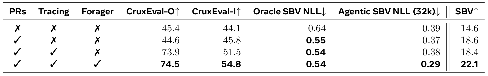

### 7.2 代理评估

**SWE-bench Verified。** 图2和图16显示了SWE-bench Verified的结果。CWM在使用测试时缩放（test-time-scaling）的情况下达到了$65.8\%$的pass@1解决率，在不使用测试时缩放的情况下达到了$53.9\%$（4次运行的平均值）。在使用测试时缩放的情况下，CWM的性能优于类似规模的开源权重模型，并且与更大、更专有的模型相比具有竞争力。不使用测试时缩放的基础分数也超过了参数数量相似的开源权重模型，并且在与GPT-oss-120B（Agarwal et al., 2025）、Qwen3-Coder（Yang et al., 2025a）和Kimi K2（Kimi Team et al., 2025）等大得多的模型比较时仍然表现良好。

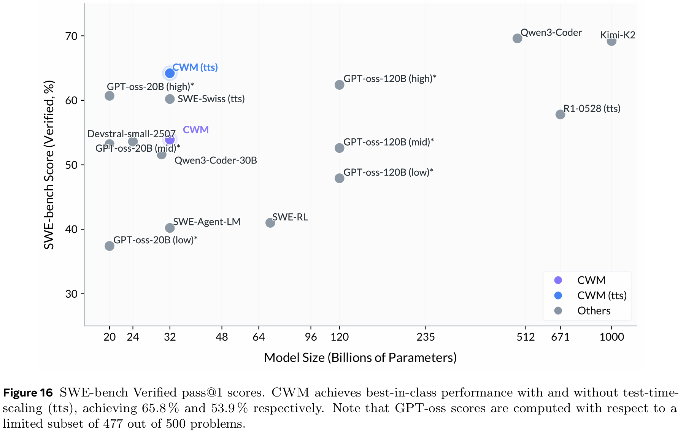

对于SWE-bench Verified的测试时缩放（TTS），我们首先为每个实例并行生成$k$个候选解决方案以及40个新颖的单元测试。与Agentless（Xia et al., 2024）类似，我们要求模型生成验证补丁正确性并重现原始错误的测试，使我们能够过滤掉未能重现错误的测试。遵循SWE-RL（Wei et al., 2025），我们为每个实例保留前5个多数测试。由于候选解决方案在通过的现有测试数量上通常相似，我们通过仅保留那些通过最多现有测试的补丁来优先考虑最强的候选者。然后，我们在过滤后的新颖测试集上执行剩余的补丁，并选择通过率最高的补丁进行提交。在平局的情况下，我们优先考虑多数补丁，如果平局仍然存在，我们选择轨迹token较少的补丁。我们将此方法称为best@$k$。

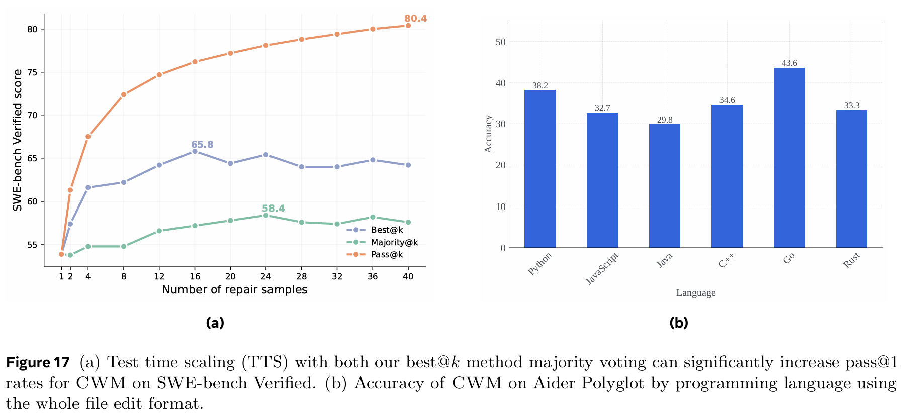

在图16中，我们报告了$k = 16$的best@k结果，其达到了$65.8\%$的解决率。作为best@k的简单替代方案，我们发现基于精确字符串匹配的候选补丁多数投票，无需任何测试生成或执行，可达到$58.4\%$的通过率。在图17a中，我们报告了不同$k$值下的best@k和pass@k。正如预期，pass@k随着$k$的增大而单调提高，最终在$k = 40$时达到$80.4\%$的成功率。对于best@k，性能从$k = 2$开始急剧提高，然后在$k = 16$左右趋于稳定。对于多数投票，性能从$k = 2$开始逐渐提高，并在$k = 24$时趋于稳定。

**SWE-bench Verified的替代工具链。** 为了更好地理解CWM对评估工具链和工具调用实现选择的鲁棒性，我们使用第三方方法进行了实验，即Mini-SWE-Agent（Yang et al., 2024）和OpenHands（Wang et al., 2025）。对于两者，我们缩短并调整了系统提示以更好地与SWE RL提示（见图11）保持一致，并确保将推理输出作为消息历史的一部分保留。我们将两个工具链配置为使用OpenAI函数调用，该调用发送带有结构化工具描述的消息。在提示模型时，我们格式化并将可用工具附加到系统提示中。当模型决定调用工具时，调用被解析并返回到我们响应中的tool_calls字段中。这确保工具以适合提示CWM的语法模板呈现。对于Mini-SWE-Agent，我们遵循官方250轮的预算。对于OpenHands，我们报告了40、128和500轮的结果。此外，我们报告了仅使用bash工具的结果。如表5所示，尽管在使用不同代理、工具实现或限制工具选择时解决率会下降，但CWM在所有设置中都提供了稳健且合理的性能。

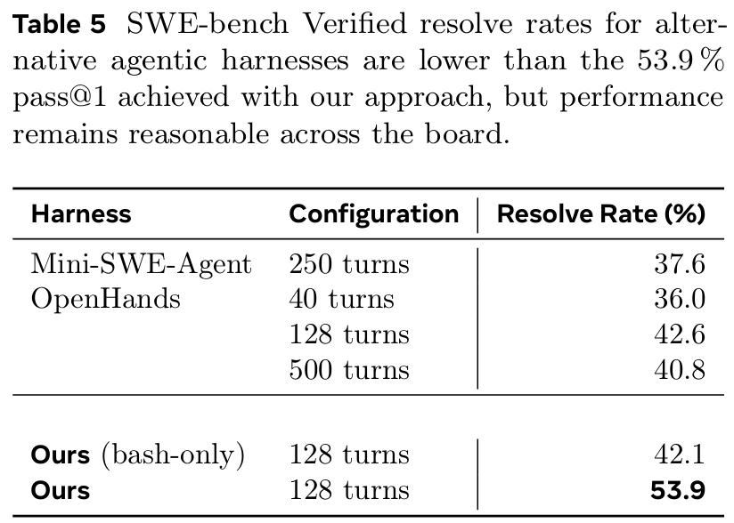

**多语言编码。** Aider Polyglot基准测试（Aider Team, 2025）使用来自Exercism $^{11}$的具有挑战性的练习来测量跨多种编程语言的编码能力。主要指标是第二次尝试的通过率，允许模型在测试失败时迭代一次。我们对工具链进行了一些更改以使其与CWM训练分布保持一致，例如从历史记录中删除硬编码的助手消息、连接相同角色的相邻消息、从系统提示中删除示例、关闭自动linting和推理跟踪剥离，并在提示中重申需要精确匹配。我们在温度0.4下使用推理进行评估，并且不使用测试时缩放。尽管Aider Polyglot可能不完全符合真正代理基准测试的条件——因为它缺乏动态工具使用，并且交互有限——但我们在这里包含了它，因为它允许自我纠正功能。

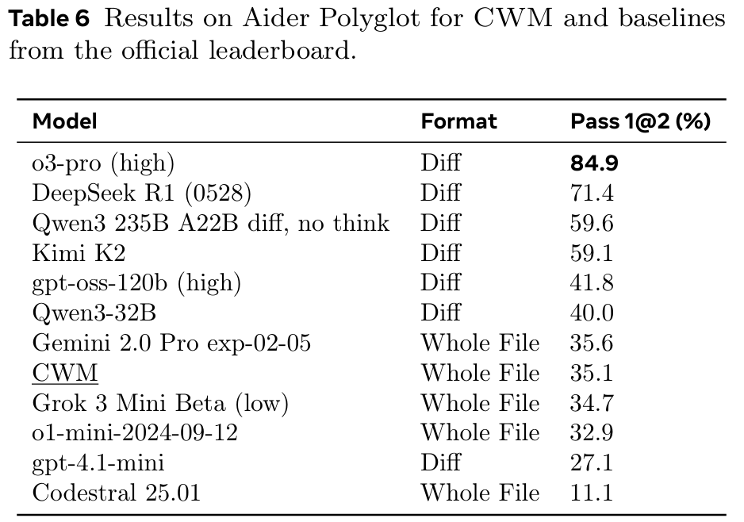

如表6所示，CWM达到了$35.1\%$的准确率，与同类其他模型（如Qwen3-32B $(40.0\%)$）以及其他使用“完整文件”编辑格式的模型（如Gemini 2.0 Pro $(35.6\%)$）相当。我们还观察到在基准测试中测试的六种语言上具有良好的泛化性能，如图17b所示。许多表现最佳的模型，如o3-pro $(84.9\%)$（OpenAI, 2025b）、DeepSeek R1 $(71.4\%)$和Qwen3 235B $(59.6\%)$，使用“diff”编辑格式获得了显著更高的分数。然而，CWM并未针对此格式进行优化，并且在使用它时无法达到有竞争力的性能。

**Terminal-Bench。** 另一个日益流行的多轮代理编码基准测试是Terminal-Bench（The Terminal-Bench Team, 2025）。在Terminal-Bench中，代理被要求通过直接在tmux会话中操作来解决各种复杂任务。再次，我们将基准测试提供的Terminus-1 $^{12}$代理的提示和响应解析与我们的RL训练阶段保持一致：我们修改系统提示以使用CWM训练的工具（见图8），并将模型输出解析回Terminus-1期望的格式。我们还将先前轮次的推理token包含到代理的历史记录中。在此设置中，CWM在遵循默认50轮预算的Terminus 1代理上实现了$26.25\%$的准确率。表7显示，这使CWM在Terminal-Bench排行榜上低于o4-mini但高于Gemini 2.5 Pro。

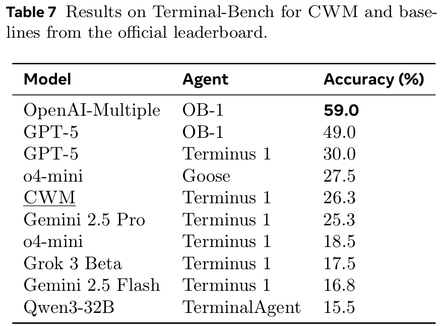

### 7.3 执行跟踪预测

接下来，我们分析CWM执行跟踪预测的能力，检查其预测，并探索这种预测程序终止的能力。

**作为执行跟踪预测的CruzEval-O。** 以下实验使用§2.2中介绍的格式评估CWM预测Python执行跟踪的能力。我们使用来自CruxEval测试集的函数和输入参数提示模型，要求它逐行预测函数执行跟踪，然后将其输出预测与真实值进行比较。为了引出跟踪预测，我们按照自定义跟踪格式构建提示，输入包含作为代码上下文的函数、作为状态的调用参数以及包含函数定义的行作为第一个操作。除了这种“完整”执行跟踪预测场景之外，我们还研究了一个单“步”场景，其中我们要求模型直接预测函数的返回值。这是通过将$<|line\_sep|>$ token替换为$<|return\_sep|>$来实现的。我们在图B.22中说明了这两种格式。我们将“步”场景与经典的CruxEval-output预测进行比较，后者少样本提示模型在给定函数定义和输入的情况下直接预测输出。因此，我们将“完整”跟踪预测模式与带有推理的CruxEval-output进行比较，后者允许CWM在使用§5.3中引入的推理后再预测函数输出。

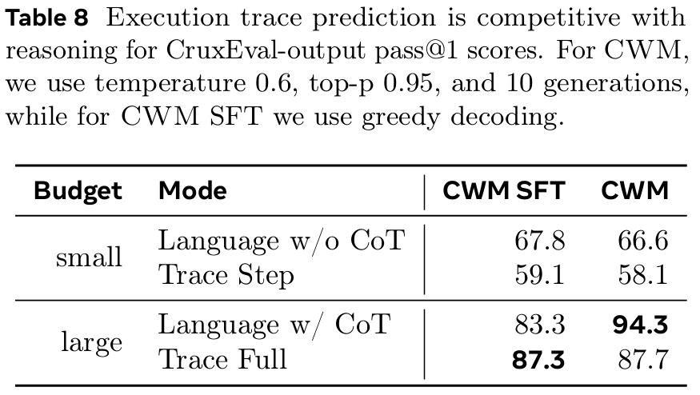

我们在表8中的结果显示，大的计算预算，无论是允许执行跟踪预测还是推理，都会产生更好的结果。CWM在自然语言推理模式下达到了$94.0\%$的最佳分数，而完整跟踪预测达到了$88\%$。请注意，语言推理跟踪明显更冗长，平均使用1164个token，而完整跟踪预测使用497个token。我们还报告了SFT后的CWM结果，其使用完整执行跟踪预测达到了$87.3\%$的最佳结果。对于任一CWM模型，单步跟踪预测与经典的少样本提示相比都不具有竞争力。

**执行跟踪预测分析。** 继上一段之后，我们对CWM为CruxEval和我们函数级数据的验证集预测的执行跟踪质量进行了详细评估。具体来说，我们测量了生成跟踪中遵循我们格式（有效跟踪格式）的比例以及观察（行动）精确匹配准确率（观察（行动）精确匹配），该指标测量了每个执行跟踪中与真实值完全匹配的观察（行动）数量相对于观察（行动）总数的比例。我们的跟踪格式将状态指定为包含局部变量的字典的JSON转储。我们报告了符合此格式的状态预测的比例（有效JSON格式）。此外，键（+值）匹配测量了每个状态预测中匹配的键（和值）的平均比例。

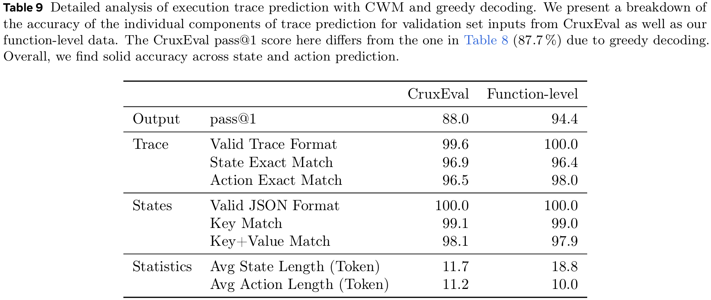

表9中的结果显示，CWM对所有数据源都遵循正确的跟踪和观察格式，实现了超过$99\%$的格式匹配。CWM能够准确预测执行跟踪以及中间观察和行动，这反映在观察/行动精确匹配分数大于$96\%$以及键（+值）匹配分数大于$97\%$上。

### 7.4 程序终止预测

程序是否会终止是一个推理问题，它超越了CWM训练中考虑的单个有限跟踪所能展示的内容：非终止无法通过有限时间内执行跟踪来观察，而所有输入上的终止无法通过枚举跟踪来可行地观察。附录中的图B.28说明了终止推理，其中CWM在泛化到所有输入终止的结论之前考虑了几个具体输入。

我们提出了HaltEval-prelim，这是一个通过使用LLaMA-3-70B通过少样本提示自动翻译带有终止注释的C程序到Python而获得的新基准。C程序来源于国际软件验证竞赛（SVCOMP）和终止问题数据库（TPDB）。每个原始问题都带有终止/非终止注释，我们在Python翻译阶段手动验证这些注释是否保留，否则丢弃。我们获得了一个包含115个终止（T）程序和115个非终止（NT）Python程序的平衡数据集。

我们查询LLMs来判断程序是终止（回答#T）还是发散（回答$f(n)$，其中$n$导致发散，后跟注释#NT）。如果$f(n)$在5秒后超时，我们奖励发散声明。然而，如果模型预测#NT，而真实情况是#T，则不会获得奖励，即使执行超过超时时间。例如，如果$f$的真实情况是#T，并且$f(42)$运行了750万年然后终止，我们的评分（pass@1）不会奖励对$f(42)$的#NT声明，即使它触发了超时。我们将超时用作发散的代理，类似于Alon和David（2022）在判断正确非终止声明时的做法，但不同之处在于超时不用于终止声明的真实情况。这导致了一种保守的评估，其给出的分数可能高于完美oracle给出的分数，但绝不会更低。值得探索用终止和非终止的逻辑证明（Cook et al., 2011; Gupta et al., 2008）替换真实值和输入验证。

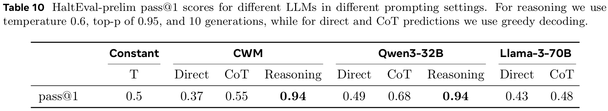

表10报告了CWM、Qwen3-32B和Llama3-70B在直接预测、提示链式思考（CoT）和推理（仅CWM和Qwen3-32B）下的结果。我们报告CoT提示数字以代表一种尝试近似推理的方法，该方法与Llama3-70B兼容。作为参考，我们还提供了一个常数分类器的分数，该分类器将所有程序标记为终止，这将获得0.5的pass@1。当比较CWM和Qwen3时，结果表明Qwen3达到了更好的直接和CoT性能，然而在推理设置下，两个模型都显著改进，达到了约0.94 pass@1的可比性能。

我们最初设计HaltEval-prelim时假设终止难以评估，鉴于其不可判定性。因此，CWM和Qwen3-32B在推理下取得的强劲结果是出乎意料的。尽管如此，这些发现应谨慎解释：该基准基于小的、自包含的程序，并不反映大型复杂代码库中必须检测错误的现实软件挑战。因此，在此初步数据集上的成功可能无法直接转化为实践。此外，真实系统中的终止是高度不平衡的——通常有数百或数千个终止循环对应每一个非终止循环——与我们数据集中的平衡分布不同。

### 7.5 算法复杂度预测

我们在BIGO(BENCH)的两个任务上评估CWM：复杂度预测，确定现有代码的大O时间/空间复杂度；以及复杂度生成，在遵守指定复杂度约束的同时解决编码问题。我们报告all@1分数，这要求LLM输出在给定问题的所有可能复杂度类上同时正确。对于复杂度生成，我们还报告有和没有复杂度要求（解决方案仍需正确）的pass@1分数，以及best@1分数，该分数对应于每个问题最低复杂度类上的pass@1，忽略次优类。

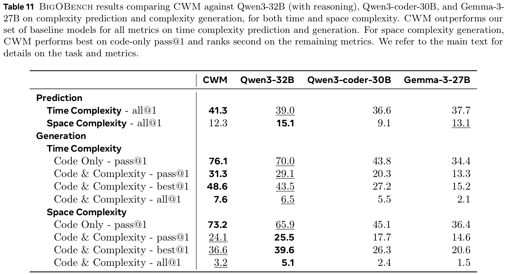

CWM、Qwen3-32B、Qwen3-coder-30B和Gemma-3-27B的结果均呈现在表11中。为了确保与外部模型的比较尽可能公平，我们选择在相同的评估设置中重新评估它们与CWM。对于这两个任务，我们使用BIGO(BENCH)的官方设置，在进行提示消融后，似乎没有进一步提升性能。在时间复杂度预测上，CWM在所有比较模型中实现了最佳的all@1分数，但在空间复杂度上表现较差。特别是，查看官方基准排行榜，$^{14}$ CWM在所有报告的所有规模模型中，在时间复杂度预测（all@1）上总体排名第二。对于时间复杂度生成，CWM在我们这组模型中实现了最佳的总体pass@1、best@1和all@1分数，并且在查看官方基准分数时总体排名第二。对于空间复杂度生成，我们的模型在仅代码pass@1上排名第一，在其余指标上仅次于Qwen3-32B排名第二。我们注意到CWM在时间复杂度推理方面尤其突出，在预测和生成变体的所有指标上系统地优于其他模型。此外，当忽略复杂度要求时，模型在仅代码pass@1上的性能下降远小于其他模型，表明CWM能够在有效处理额外约束的同时，保持对基本任务要求的关注。

### 7.6 代码与数学推理

我们在LiveCodeBench（LCB）上展示结果，具体是LCBv5和LCBv6日期范围01.10.2024-01.02.2025 $^{15}$ 和01.08.2024-01.05.2025，在表12中。$^{16}$ 我们在此将CWM与参数数量大致相同的相关基线模型进行比较。再次，我们观察到与Magistral-small-1.2-24B（Rastogi et al., 2025）、Qwen3-32B和gpt-oss-20B（Agarwal et al., 2025）相竞争的高性能。

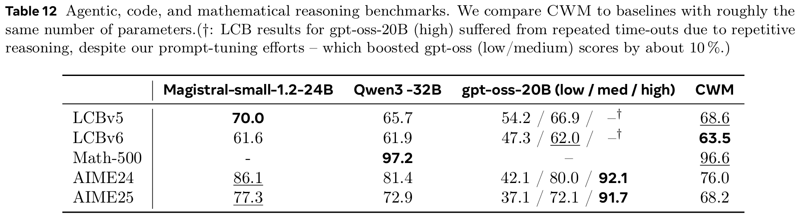

表12还包含了CWM在Math-500（Lightman et al., 2023）、AIME24（OpenAI, 2024）和AIME25上的pass@1结果——全部在$n=20$个样本上平均。CWM在所有方面表现稍差，与gpt-oss-20B（高）在AIME上存在显著差距。

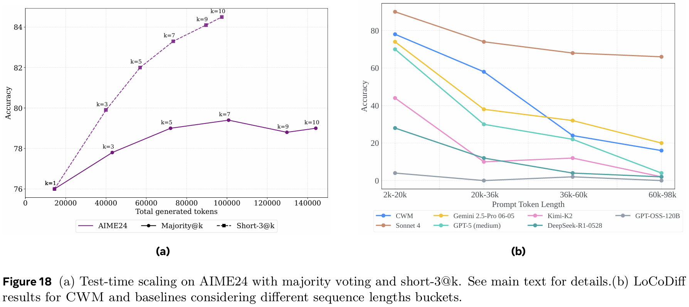

在图18a中，我们还报告了使用多数投票和short-3@k对CWM在AIME上进行测试时缩放的结果。Short-m@k（Hassid et al., 2025）并行采样$k$个答案，但一旦前$m$个生成完成就停止采样，然后选择三个中最常见的答案。CWM在AIME24上的性能通过多数投票在$k=10$时提高了最多$11\%$。Short-3@k实现了与多数投票相当的性能，同时显著降低了给定$k$的计算成本。

### 7.7 非推理评估

虽然我们对CWM的主要关注点是代码世界建模，但我们也提供了CWM在一组标准任务上的评估结果，这些任务涵盖代码、数学和常识，且未启用推理模式。我们在此将与参数数量相似的模型（如Qwen3-32B或Gemma-3-27B）作为基线进行比较，并且我们使用贪婪生成而不是非零温度采样。表13中的结果显示，CWM通常比Gemma-3-27B表现更好，与Qwen2.5-32B相似，但比Qwen3-32B差。一个有趣的例外是CruxEval-O（Gu et al., 2024），其中追踪数据的引入（见§2.2）可能帮助CWM获得了优势。请注意，当使用推理时，我们在CruxEval-Output上取得了更好的结果（见§7.3）。

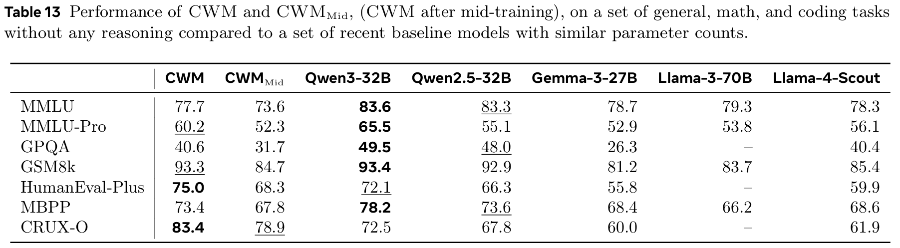

接下来，我们考虑两个长上下文评估基准：LoCoDiff（Mentat AI Team, 2025）和RULER（Hsieh et al., 2024）。在LoCoDiff中，模型会获得特定文件的提交历史，并被要求构建其最终版本。为了成功，模型必须跟踪文件的演变——从初始提交，经过多个分支上的差异，到合并冲突的解决。性能通过模型精确重现目标版本的文件比例来评估。我们将CWM与DeepSeek-R1 0528、Claude Sonnet 4（Anthropic, 2025）、Gemini 2.5 Pro 06-05（Comanici et al., 2025）、Kimi K2、GPT-5和gpt-oss-120B进行比较。Qwen3-32B不在排行榜上，并且其原生上下文长度较短。

对于LoCoDiff，图18b中的结果显示，虽然所有模型的性能都随着序列长度的增加而下降，但CWM提供了比DeepSeek-R1 0528和gpt-oss-120B更好的性能，并且在短序列和长序列上都与大规模商业模型（例如，GPT-5和Gemini 2.5 Pro）具有竞争力，仅与Claude Sonnet 4存在显著差距。我们在§J中展示了RULER的结果。

好的，这是第八章节“透明度、风险与限制”的逐字逐句全文翻译，格式已整理。

---

## 8 透明度、风险与限制

### 8.1 关于外部模型和数据的透明度

如先前相关章节所述，我们在四个上下文中使用了外部LLMs的数据：(i) ForagerAgent, (ii) 追踪到自然语言的转换, (iii) 函数追踪, 以及 (iv) SFT阶段。对于ForagerAgent，我们使用Llama3-70B-Instruct和Qwen3-235B-A22B（无思考）作为基础模型与计算环境交互。为了将原始Python追踪转换为自然语言，我们使用Qwen3-32B-FP8（无思考）。对于函数追踪，我们使用Llama3-70B-Instruct生成Python函数输入并为CodeContests数据生成解决方案。最后，在SFT期间，我们通过OpenMathReasoning和OpenCodeReasoning数据集合并了来自DeepSeek-R1的轨迹。我们使用了OpenCodeReasoning和OpenMathReasoning数据集的缓解版本，其中缓解措施包括算法偏见过滤和网络安全保护。在使用Qwen3-32B-FP8生成训练数据时，我们应用了类似的缓解措施。除了这四个上下文中明确提到的之外，没有使用外部LLM的tokens。

### 8.2 代码世界模型准备度报告

尽管其规模相对较小，仅为320亿参数，但CWM在类似大小的开源模型上表现出色，并且在经过验证的软件工程基准测试中与更大、更专有的模型相比具有竞争力。为了预测此次发布的风险，包括潜在的新风险，我们对CWM在与我们的前沿AI框架17中确定的可能带来潜在灾难性风险的领域相关的能力进行了自动化评估，即网络风险以及化学与生物风险。作为改进评估稳健性和模型可靠性持续工作的一部分，我们还进行了初步的倾向性评估，并计划在未来评估中扩展这一领域。

我们通过测试CWM相对于一组流行且强大的开源模型的相对性能来进行此评估，这些模型代表了开放生态系统中可用能力的基线：Qwen3-Coder-480B-A35B-Instruct、Llama 4 Maverick和gpt-oss-120B。

基于这些评估的结果，我们认为CWM的开源发布不太可能显著增加与网络安全或化学与生物威胁相关的风险，使其超出当前生态系统的基线水平。此外，我们的初步评估表明，CWM表现出不良倾向的比率与大多数开源模型相当，尽管有些模型（即gpt-oss-120B）的比率要低得多。

这些结果表明，CWM处于Meta前沿AI框架中定义的灾难性领域的“中等”风险阈值内。[17] 我们在代码世界模型准备度报告中分享了详细信息。[18]

### 8.3 局限性 & 未来研究

我们明确将CWM作为一个研究模型在非商业研究许可下发布，供社区探索世界建模和计算环境中的推理所带来的机遇。因此，我们的模型存在许多局限性，我们在下面概述这些局限性，以帮助研究界充分利用CWM，同时意识到其缺点并避免意外误用。

由于这些是仅供研究的模型，它们不适合生产用例。尽管我们进行了一些有限的评估，但我们没有对这些模型进行全方位的可能评估。Meta尚未评估CWM在生产和实际场景中的性能。这些模型尚未经过全面评估或训练以用于面向用户的交互，并且它们也不旨在用于此类用途。建议研究人员在部署或使用这些模型时谨慎行事。

同样，CWM不应被用作通用助手或聊天模型。虽然它在SFT期间接触了一定程度的指令遵循数据，但CWM没有经过任何针对通用聊天机器人用途的全面优化，例如RLHF。通用聊天使用不是CWM的预期用途，其生成内容可能会偏离预期和/或不适当或不准确。此外，CWM的训练 strongly 侧重于代码生成和代码推理。因此，我们的模型可能在其他领域有所欠缺，例如事实知识或经典的自然语言任务。

CWM没有经过训练用作通用助手或聊天模型，也没有针对内容风险进行对齐或全面评估。我们提供系统级保护——如Llama Guard、Prompt Guard和Code Shield——作为一种解决方案，帮助在研究环境中管理内容生成。[19] 然而，仅这些系统级保护可能不足以支持CWM的生产用途，可能需要进一步的评估和微调。CWM旨在仅用于英语。它不是多语言的，并且尚未对其他语言的性能进行评估或优化。

最后，虽然我们对世界建模带来的机遇感到兴奋，但这只是我们在这个方向上的第一步。我们的代码世界建模数据集收集工作侧重于显式的Python执行，而将这项工作扩展到包括其他编程语言或符号执行则留待未来工作。通过提示或微调来利用世界模型知识以提高各种任务性能的稳健方法是一个成熟的研究领域。类似地，使用代码世界模型进行规划，无论是在形式化推理框架内还是在推理过程中非正式地进行，都是一个令人兴奋的研究方向，也是我们构建CWM的核心动机。在某种意义上，人们可以将CwMs的现状与CoT之前的LLMs进行比较：能力已经存在，我们只需要找出如何最大限度地利用它们。
好的，这是第九章节“结论”的逐字逐句全文翻译，格式已整理。

## 9 结论

我们的愿景是让代码世界模型（Code World Models）弥合语言级推理和可执行语义之间的鸿沟。我们相信，LLMs的编码和代理用例将受益于拥有一个世界模型，一个以行动为条件的、在状态之间学习的转移函数。随着CWM的发布，我们呈现了这一愿景的第一步。我们的消融研究已经表明，世界建模数据、Python执行追踪和可执行的Docker环境可以直接有益于下游任务性能。但更广泛地说，CWM为未来在零样本规划、 grounded 思维链和具有稀疏、可验证奖励的强化学习方面的研究提供了一个强大的试验台。与我们早期关于执行追踪预测的结果类似，我们相信Python追踪世界模型能够推动关于代码生成、执行、正确性和验证的推理研究。世界模型应该改进强化学习，因为已经熟悉环境动态的代理可以专注于学习哪些行动会带来奖励。需要更多的研究来持续地将世界模型纳入LLMs预训练中在整个任务中带来的好处。最终，能够推理其行动后果的模型在其与环境交互时应更加高效，这应允许扩展其执行任务的复杂性。
