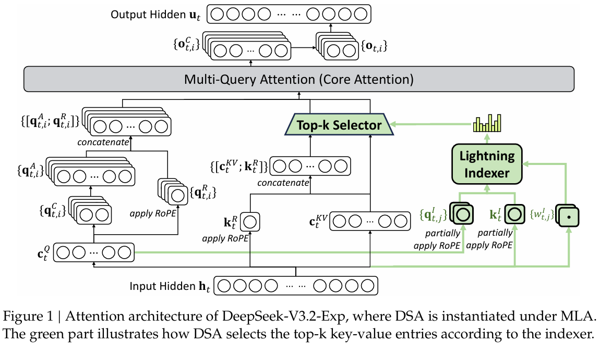
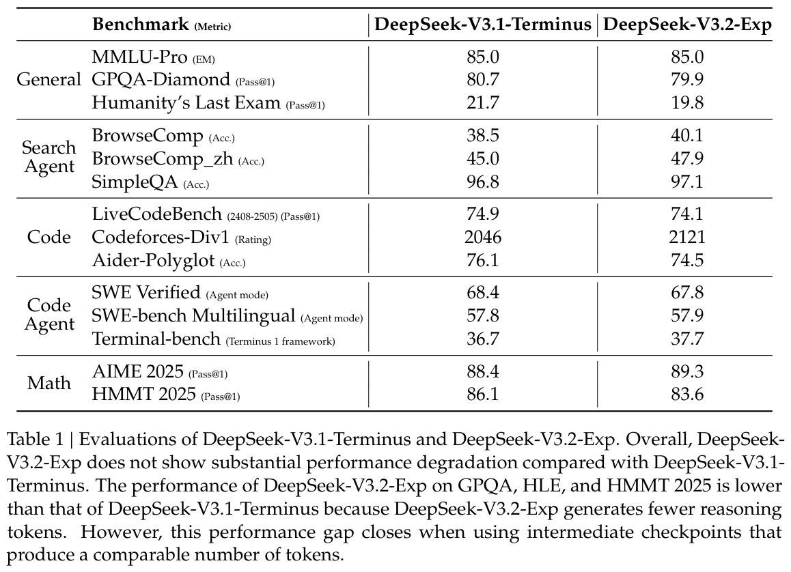
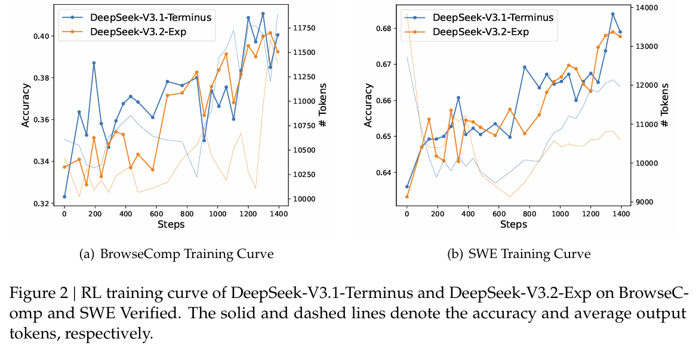
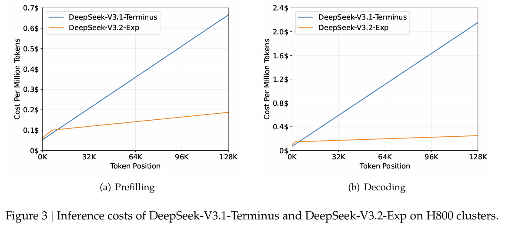
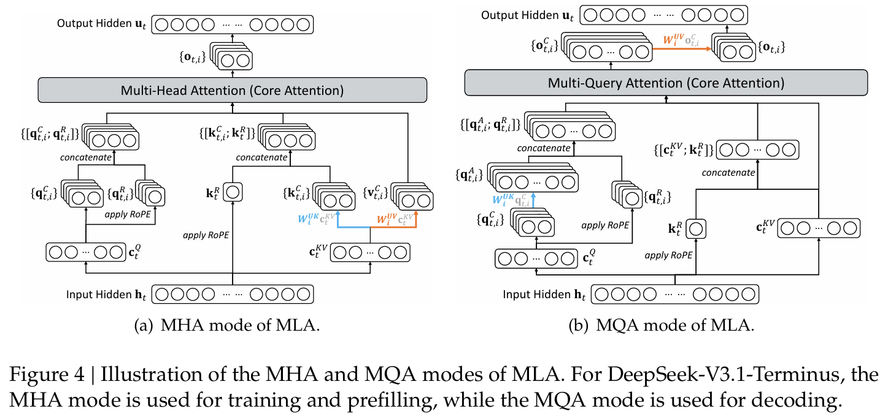

# DeepSeek-V3.2-Exp：通过 DeepSeek 稀疏注意力提升长上下文效率

DeepSeek-AI

## 摘要 (Abstract)

我们介绍了 DeepSeek-V3.2-Exp，一个实验性的稀疏注意力模型，它通过持续训练为 DeepSeek-V3.1-Terminus 配备了 DeepSeek 稀疏注意力（DSA）。借助 DSA（一种由闪电索引器（lightning indexer）驱动的细粒度稀疏注意力机制），DeepSeek-V3.2-Exp 在训练和推理效率上均实现了显著提升，尤其是在长上下文场景中。模型检查点可在 <https://huggingface.co/deepseek-ai/DeepSeek-V3.2-Exp> 获取。

## 1. 架构 (Architecture)

与 DeepSeek-V3.1 的最终版本 DeepSeek-V3.1-Terminus 相比，DeepSeek-V3.2-Exp 在架构上唯一的修改是通过持续训练引入了 DeepSeek 稀疏注意力（DeepSeek Sparse Attention, DSA）。

**DSA 的原型 (Prototype of DSA)。** DSA 的原型主要包括两个组件：一个闪电索引器 **lightning indexer** 和一个细粒度令牌选择机制 **fine-grained token selection mechanism**。

**闪电索引器**计算查询令牌 (query token) $h_{t}\in R^{d}$ 与前一个令牌 (preceding token) $h_{s}\in R^{d}$ 之间的索引分数 $I_{t, s}$，决定哪些令牌将被查询令牌选择：
$$ I_{t, s} = \sum_{j=1}^{H^{I}} w_{t, j}^{I} \operatorname{ReLU}\left(q_{t, j}^{I} \cdot k_{s}^{I}\right) $$
其中 $H^{I}$ 表示索引器头的数量；$q_{t, j}^{I}\in R^{d^{I}}$ 和 $w_{t, j}^{I}\in R$ 源自查询令牌 $h_{t}$；而 $k_{s}^{I}\in R^{d^{I}}$ 源自前一个令牌 $h_{s}$。出于吞吐量考虑，我们选择 ReLU 作为激活函数。鉴于闪电索引器具有少量头数且可以在 FP8 中实现，其计算效率非常显著。

给定每个查询令牌 $h_{t}$ 的索引分数 $\left\{I_{t, s}\right\}$，我们的细**粒度令牌选择机制**仅检索与 top-k 索引分数对应的键值条目 $\left\{c_{s}\right\}$。然后，通过应用查询令牌 $h_{t}$ 与稀疏选择的键值条目 $\left\{c_{s}\right\}$ 之间的注意力机制来计算注意力输出 $u_{t}$：
$$ u_{t} = \operatorname{Attention}\left(h_{t},\left\{c_{s} \mid I_{t, s} \in \operatorname{Top}-k\left(I_{t,:}\right)\right\}\right) $$

**在 MLA 下实例化 DSA (Instantiate DSA Under MLA)。** 出于从 DeepSeek-V3.1-Terminus 进行持续训练的考虑，我们基于 MLA (DeepSeek-AI, 2024) 为 DeepSeek-V3.2-Exp 实例化 DSA。在内核层面，每个键值条目必须在多个查询之间共享以实现计算效率 (Yuan et al., 2025)。因此，我们基于 MLA 的 MQA 模式 (Shazeer, 2019) 实现 DSA¹，其中每个潜在向量（MLA 的键值条目）将在查询令牌的所有查询头之间共享。基于 MLA 的 DSA 架构如图 1 所示。我们还提供了 DeepSeek-V3.2-Exp² 的开源实现，以明确细节。

## 2. 训练 (Training)

从一个上下文长度已扩展至 128K 的 DeepSeek-V3.1-Terminus 基础检查点开始，我们执行了持续预训练，随后进行后训练（post-training），以创建 DeepSeek-V3.2-Exp。

### 2.1. 持续预训练 (Continued Pre-Training)

DeepSeek-V3.2-Exp 的持续预训练包括两个训练阶段。对于这两个阶段，训练数据的分布与用于 DeepSeek-V3.1-Terminus 的 128K 长上下文扩展数据完全一致。

**密集预热阶段 (Dense Warm-up Stage)。** 我们首先使用一个短暂的预热阶段来初始化闪电索引器。在此阶段，我们保持密集注意力并冻结除闪电索引器之外的所有模型参数。为了使索引器输出与主注意力分布对齐，对于第 t 个查询令牌，我们首先通过对所有注意力头求和来聚合主注意力分数：
$$ A_{t, s} = \sum_{j=1}^{H} \operatorname{softmax}\left(\frac{q_{t, j} k_{s, j}^{\top}}{\sqrt{d}}\right)_s $$
然后将该和沿序列维度进行 L1 归一化，以产生目标分布 $p_{t,:}\in R^{t}$。基于 $p_{t,:}$，我们设置一个 KL 散度损失作为索引器的训练目标：
$$ \mathcal{L}^{I} = \sum_{t} \sum_{s} p_{t, s} \log \frac{p_{t, s}}{\operatorname{softmax}\left(I_{t,:}\right)_s} $$
对于预热，我们使用 $10^{-3}$ 的学习率。我们仅训练索引器 1000 步，每步包含 16 个 $128~K$ 令牌的序列，总共产生 $2.1~B$ 个令牌。

**稀疏训练阶段 (Sparse Training Stage)。** 索引器预热之后，我们引入细粒度令牌选择机制并优化所有模型参数，使模型适应 DSA 的稀疏模式。在此阶段，我们继续保持索引器输出与主注意力分布的对齐，但仅考虑选择的令牌集 $\mathcal{S}_{t}=\left\{s\mid I_{t, s}\in\operatorname{Top}-k\left(I_{t,:}\right)\right\}$：
$$ \mathcal{L}^{I} = \sum_{t} \sum_{s \in \mathcal{S}_{t}} p_{t, s} \log \frac{p_{t, s}}{\operatorname{softmax}\left(\left\{I_{t, s^{\prime}} \mid s^{\prime} \in \mathcal{S}_{t}\right\}\right)_s} $$
值得注意的是，我们将索引器输入从计算图中分离（detach）以进行单独优化。索引器的训练信号仅来自 $\mathcal{L}^{I}$，而主模型的优化仅根据语言建模损失。在此稀疏训练阶段，我们使用 $7.3\times 10^{-6}$ 的学习率，并为每个查询令牌选择 2048 个键值令牌。我们训练主模型和索引器 15000 步，每步包含 480 个 $128~K$ 令牌的序列，总共产生 943.7B 个令牌。

### 2.2. 后训练 (Post-Training)

持续预训练之后，我们执行后训练以创建最终的 DeepSeek-V3.2-Exp。DeepSeek-V3.2-Exp 的后训练也采用与稀疏持续预训练阶段相同的方式使用稀疏注意力。为了严格评估引入 DSA 的影响，对于 DeepSeek-V3.2-Exp，我们保持了与 DeepSeek-V3.1-Terminus 使用的相同的后训练流程、算法和数据，具体如下。

**专家蒸馏 (Specialist Distillation)。** 对于每项任务，我们最初开发一个专门专注于该特定领域的专家模型，所有专家模型都是从相同的预训练 DeepSeek-V3.2 基础检查点微调而来。除了写作任务和通用问答之外，我们的框架还涵盖五个专业领域：数学、竞争性编程、通用逻辑推理、智能体编码（agentic coding）和智能体搜索（agentic search）。每个专家都使用大规模强化学习（RL）计算进行训练。此外，我们采用不同的模型来生成长思维链推理（思维模式，thinking mode）和直接响应生成（非思维模式，non-thinking mode）的训练数据。一旦专家模型准备就绪，它们被用来为最终检查点生成特定领域的数据。实验结果表明，在蒸馏数据上训练的模型达到了仅略低于领域特定专家模型的性能水平，通过后续的 RL 训练，性能差距被有效消除。

**混合 RL 训练 (Mixed RL Training)。** 对于 DeepSeek-V3.2-Exp，我们仍然采用组相对策略优化（GRPO）(DeepSeek-AI, 2025; Shao et al., 2024) 作为 RL 训练算法。与之前使用多阶段强化学习训练的 DeepSeek 模型不同，我们将推理、智能体和人类对齐训练合并到一个 RL 阶段。这种方法有效平衡了不同领域的性能，同时避免了通常与多阶段训练范式相关的灾难性遗忘问题。对于推理和智能体任务，我们采用基于规则的结果奖励、长度惩罚和语言一致性奖励。对于通用任务，我们采用生成式奖励模型，其中每个提示（prompt）都有自己的评估标准（rubrics）。我们的奖励设计仔细平衡了两个关键权衡：（1）长度与准确性，以及（2）语言一致性与准确性。

## 3. 评估 (Evaluations)

**模型能力 (Model Capabilities)。** 我们在一系列专注于不同能力的基准测试上评估 DeepSeek-V3.2-Exp，并在表 1 中将其与 DeepSeek-V3.1-Terminus 进行比较。虽然 DeepSeek-V3.2-Exp 在长序列上显著提高了计算效率，但在短上下文和长上下文任务上，与 DeepSeek-V3.1-Terminus 相比，我们未观察到显著的性能下降。此外，我们还比较了 DeepSeek-V3.2-Exp 和 DeepSeek-V3.1-Terminus 的强化学习训练曲线，如图 2 所示。两种模型在 BrowseComp 和 SWE Verified 上的性能在整个训练过程中稳步提高，曲线紧密对齐，这反映了 DSA 的训练稳定性。

**推理成本 (Inference Costs)。** DSA 将主模型的核心注意力复杂度从 O(L²) 降低到 O(Lk)，其中 k(《 L) 是所选令牌的数量。尽管闪电索引器仍然具有 O(L²) 的复杂度，但与 DeepSeek-V3.1-Terminus 中的 MLA 相比，它所需的计算量要少得多。结合我们优化的实现，DSA 在长上下文场景中实现了显著的端到端加速。图 3 展示了 DeepSeek-V3.1-Terminus 和 DeepSeek-V3.2-Exp 的令牌成本如何随序列中令牌位置的变化而变化。这些成本是根据部署在 H800 GPU 上的实际服务进行基准测试估算的，GPU 租赁价格为每小时 2 美元。请注意，对于短序列预填充（prefilling），我们专门实现了一种掩码 MHA 模式来模拟 DSA，这可以在短上下文条件下实现更高的效率。

**未来的实际验证 (Future Validation in Real World)。** 尽管我们的内部评估显示了 DeepSeek-V3.2-Exp 的良好结果，我们仍在积极寻求在真实场景中进行进一步的大规模测试，以发现稀疏注意力架构的潜在局限性。

## 附录 (Appendices)

图 4 展示了 MLA 的两个方面——MHA 和 MQA 模式——以及它们之间的转换。

